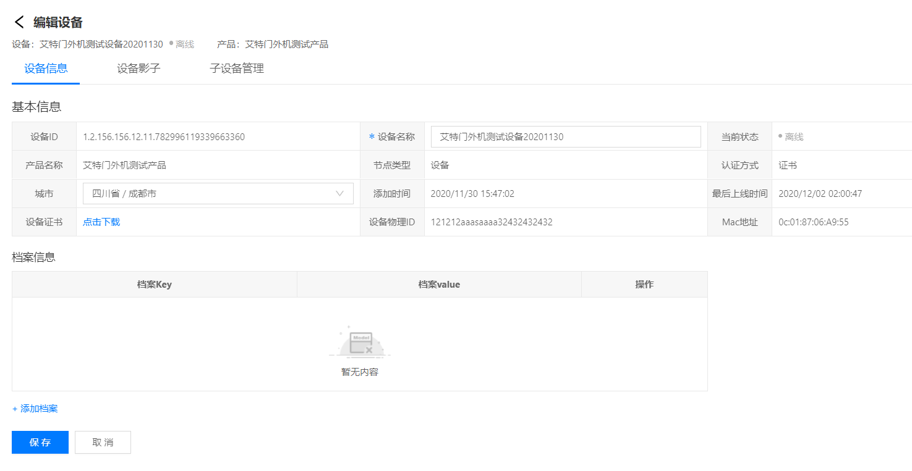
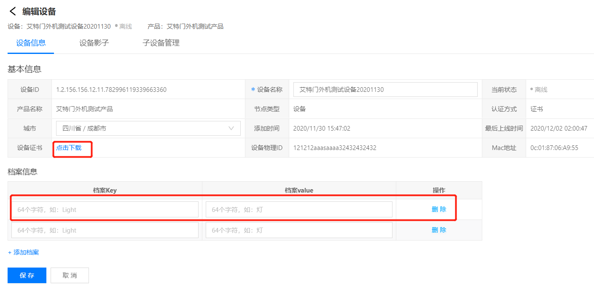
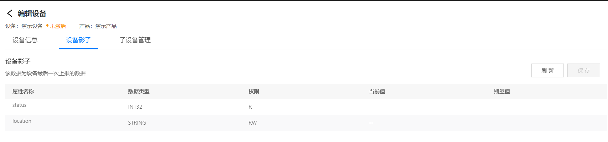
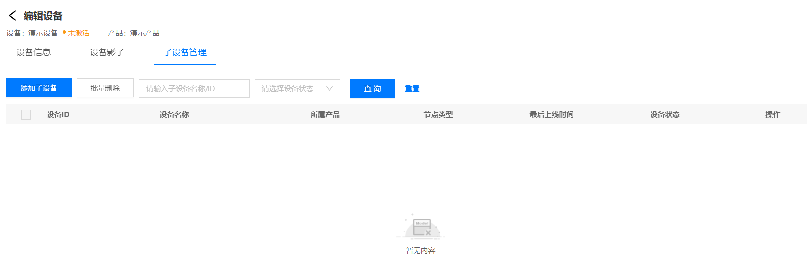

# 设备信息

设备信息页可以编辑设备的信息，管理查看设备的影子。

## 编辑设备信息

1. 在设备列表页面点击列表操作栏的**编辑**按钮。
2. 在打开的页面默认选中**设备信息**
3. 选择要编辑的设备信息进行修改。

### 编辑设备基本信息

可编辑设备的城市、名称等基本信息。

### 证书下载

在设备信息页面点击 **设备证书**后的下载链接进行设备证书下载。

### 档案编辑
在档案信息中对设备档案数据进行编辑管理。

## 管理设备影子

1. 在设备列表页面点击列表操作栏的**编辑**按钮。
2. 在打开的页面选中**设备影子**选项卡可查看设备影子数据
3. 选择要修改的设备属性，进行下发。

## 子设备管理

1. 在设备列表页面点击列表操作栏的**编辑**按钮。
2. 在打开的页面选中**子设备管理**选项卡可查看当前设备下的子设备
3. 点击**添加子设备**按钮进行子设备添加（仅网关设备可添加子设备）。

