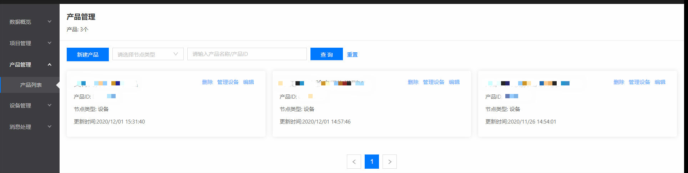
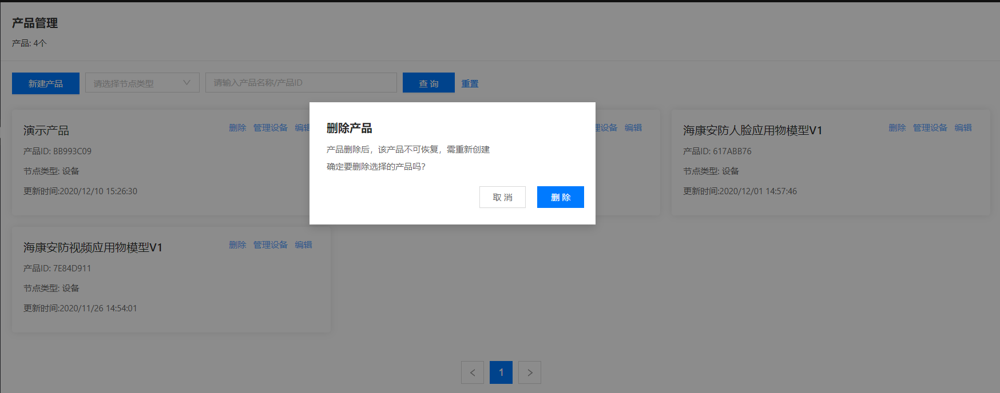

# 创建产品

 ## 管理产品

1.登录智能生活物联网平台

2.左侧导航栏选择 **产品管理** -> **产品列表**

3.产品管理页可根据节点类型、产品名称、产品ID来进行搜索

 ## 创建产品

1.点击 **新建产品** 按钮打开产品创建页

2.填写 **产品名称**

3.选择 **标准物模型**或**自定义物模型**，其中，选择标准物模型需要用户在标准物模型列表中选择一个与当前产品接近的标准物模型作为模板；选择自定义物模型则在产品创建完成后，在产品编辑页面进行自定义创建

4.选择产品的：节点类型、接入方式、联网方式、认证方式等，点击**创建**按钮完成产品创建

 ## 删除产品

在产品管理卡片列表页， 点击卡片右上角的删除按钮，点击**删除**按钮后删除产品

