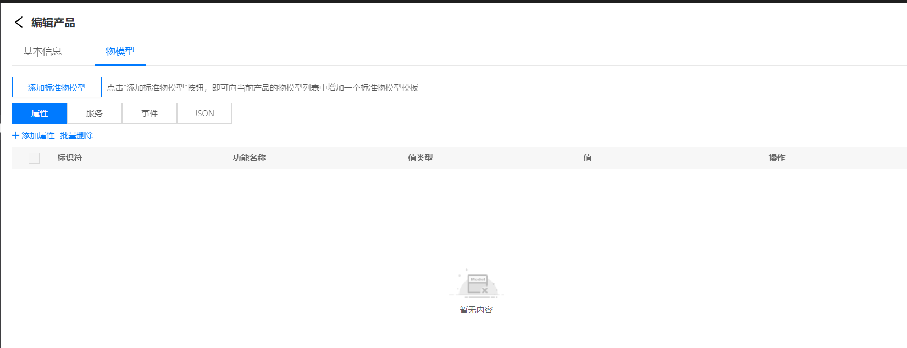
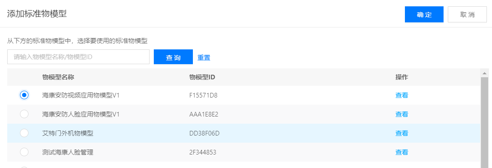
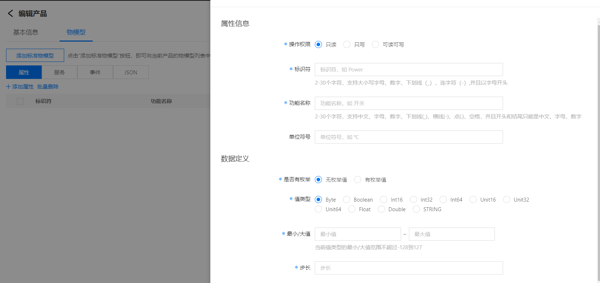
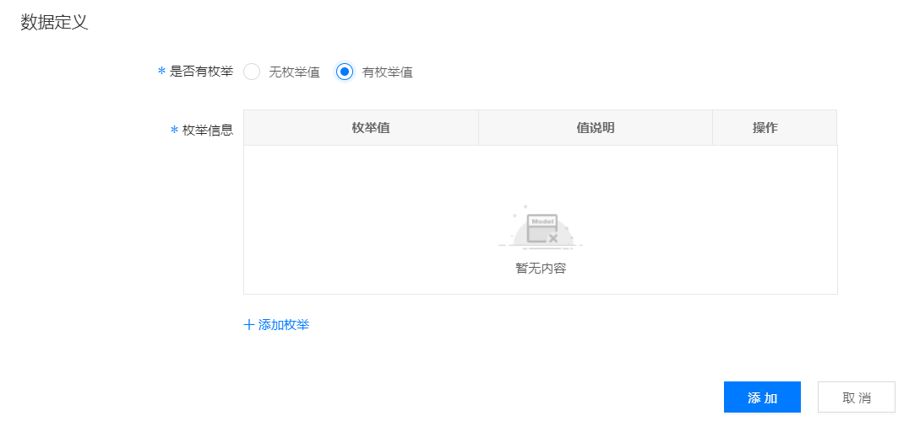
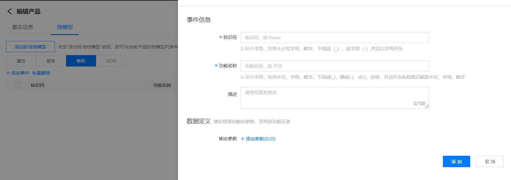
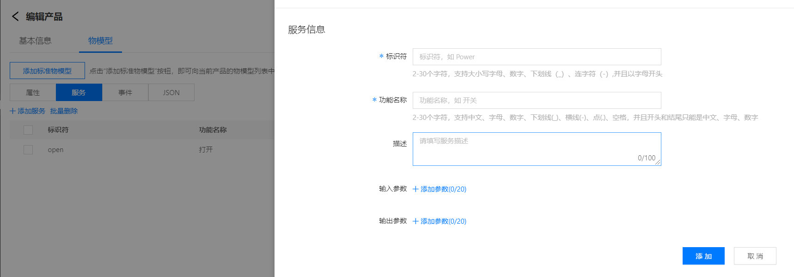
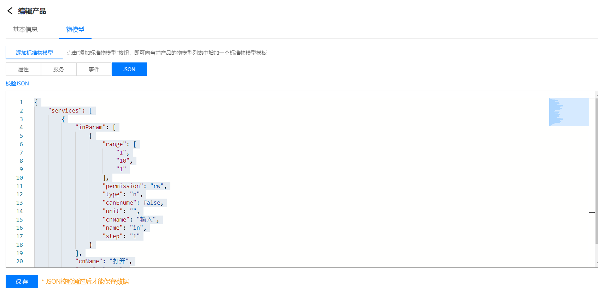

# 编辑物模型

1.登录智能生活物联网平台

2.左侧导航栏选择 **产品管理** -> **产品列表**

3.在产品卡片列表页，点击卡片右上角的**编辑**按钮，在打开的页面中选择**物模型**选项卡

 ## 添加标准物模型

1.在编辑产品页，点击**物模型tab**

2.点击**添加标准物模型**按钮，查看标准物模型列表

3.选择要添加的物模型，点击**确定**按钮完成向当前产品添加一个物模型的操作

## 属性

在属性tab，点击添加属性按钮，在弹窗中完成为一个产品增加一个属性的操作

### 属性参数设置如下：

| 参数                  | 描述                 |
| :------------------- | :------------------- |
|功能名称 | 定义属性的名称，支持30个字符内的中文、英文字母、数字、中划线、下划线，且以中、英文、数字开头和结尾 |
|标识符  | 定义属性的唯一标识，不可重复，支持30个字符内的中文、英文字母、数字、中划线、下划线，且以中、英文、数字开头和结尾，不可更改 |
|操作权限 | 定义属性值的读写性。支持只读 / 只写 / 读写三种  |
|值类型 | 定义该属性的数据类型，目前支持下面几种类型。- **字符串（String）**  长度(length)：允许传入字符串的最大长度（输入值为1 - 1024范围内的正整数），不可为空  - **布尔值（Boolean）**  - **枚举值（Enum）**   **注：至少添加一个枚举值** 枚举值(key)：支持30个字符内的中文、英文字母、数字、中划线、下划线，且以中、英文、数字开头和结尾或介于0~63（含0和63）之间的数字 值说明(value)：支持30个字符内的中文、英文字母、数字、中划线、下划线，且以中、英文、数字开头和结尾   **二进制（Binary)** 长度（length）：binary经过base64转换之后的最大长度（输入值为1 - 1024范围内的正整数），需要注意binary在传输时需要转成base64字符串 1.标识符：支持30个字符内的英文字母、数字、中划线、下划线，且以英文、数字开头和结尾参考属性的值类型 2.值类型：仅支持字符串，单精度浮点，双精度浮点，无符号整型，有符号整型，数据格式与属性值类型相同    **单精度浮点（Float）**  需定义最小值、最大值、步长、单位和单位描述        **双精度浮点（Double）**  需定义最小值、最大值、步长、单位和单位描述       **无符号整型（Unit8/Unit32/Unit64）**  需定义最小值、最大值、步长、单位和单位描述   **有符号整型（Int8/Int32/Int64）**  需定义最小值、最大值、步长、单位和单位描述  **注意** ：最大/最小值以及步长的范围应在该数据类型的标准范围内   最大值（max）：该数值允许的最大值	   最小值（min）：该数值允许的最小值	   步长(step)：数值变化的最小粒度  单位（unit）：该数值对应的单位，非必选项  单位名称（unitname）：该数值对应的单位名称，长度限制为0-200个字符。非必填项 |
|描述 | 用于进行属性功能的说明。无输入字符类型限制，长度限制为0-200个字符。非必填项 |

## 事件

在事件tab，点击添加事件按钮，在弹窗中完成为一个产品增加一个事件的操作

### 事件参数设置如下：

| 参数             | 描述                 |
| :------------------------- | :--------- |
|事件名称  | 定义事件的名称，支持30个字符内的中文、英文字母、数字、中划线、下划线，且以中、英文、数字开头和结尾 |
|标识符  | 定义事件的唯一标识，不可重复，支持30个字符内的中文、英文字母、数字、中划线、下划线，且以中、英文、数字开头和结尾，不可更改 |
|输出参数 | 一个事件最多支持定义64个输出参数。可新增、删除参数 点击 **添加参数**，在弹出的对话框中添加事件输出参数 1. 功能名称：支持30个字符内的中文、英文字母、数字、中划线、下划线，且以中、英文、数字开头和结尾 2. 标识符：定义属性的唯一标识，支持30个字符内的中文、英文字母、数字、中划线、下划线，且以中、英文、数字开头和结尾，不可更改 3. 读写权限：支持只读 / 只写 / 读写三种 4. 值类型：参数的值类型，参考属性定义里的数据类型 5. 数据定义：参数的数值定义，参考属性定义里的属性值定义 |
|描述 | 用于进行事件功能的说明。无输入字符类型限制，长度限制为0-200个字符。非必填 |

## 服务

在服务tab，点击添加服务按钮，在弹窗中完成为一个产品增加一个服务的操作

### 服务参数设置如下：

| 参数                  | 描述                 |
| :------------------- | :------------------- |
|功能名称  | 定义服务的名称，支持30个字符内的中文、英文字母、数字、中划线、下划线，且以中、英文、数字开头和结尾 |
|标识符  | 定义服务的唯一标识，不可重复，支持30个字符内的中文、英文字母、数字、中划线、下划线，且以中、英文、数字开头和结尾，不可更改 |
|输入参数 | 定义调用该服务时，需要提供的输入参数，一个方法最多支持定义64个输入参数。可新增、删除参数 点击 **添加参数**，在弹出的对话框中添加服务输入参数 1. 功能名称：支持30个字符内的中文、英文字母、数字、中划线、下划线，且以中、英文、数字开头和结尾 2. 标识符：定义属性的唯一标识，支持30个字符内的中文、英文字母、数字、中划线、下划线，且以中、英文、数字开头和结尾，不可更改 3. 读写权限：支持只读 / 只写 / 读写三种 4. 值类型：参数的值类型，参考属性定义里的数据类型 5. 数据定义：参数的数值定义，参考属性定义里的属性值定义 |
|输出参数 | 定义调用该服务后，服务输出的数据，一个方法最多支持定义64个输出参数。可新增、删除参数 点击 **添加参数**，在弹出的对话框中添加服务输出参数 1. 功能名称：支持30个字符内的中文、英文字母、数字、中划线、下划线，且以中、英文、数字开头和结尾 2. 标识符：定义属性的唯一标识，支持30个字符内的中文、英文字母、数字、中划线、下划线，且以中、英文、数字开头和结尾，不可更改 3. 读写权限：支持只读 / 只写 / 读写三种 4. 值类型：参数的值类型，参考属性定义里的数据类型 5. 数据定义：参数的数值定义，参考属性定义里的属性值定义 |
|描述 | 用于进行服务功能的说明。无输入字符类型限制，长度限制为0-200个字符。非必填 |

## JSON数据

在编辑产品页，点击**JSON tab**可查看该产品物模型的JSON描述，该页面提供JOSN格式化、格式校验的功能

