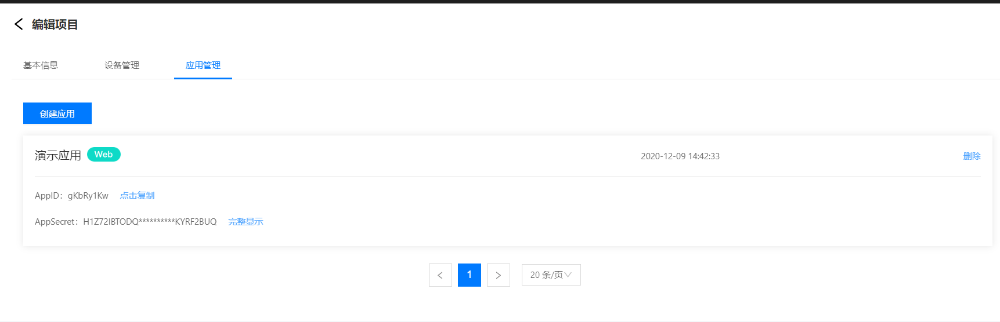
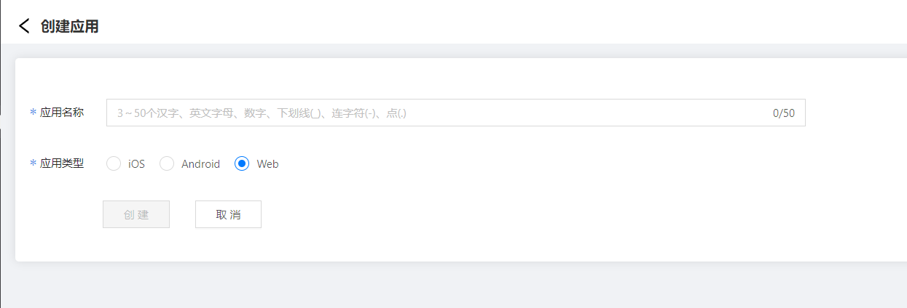
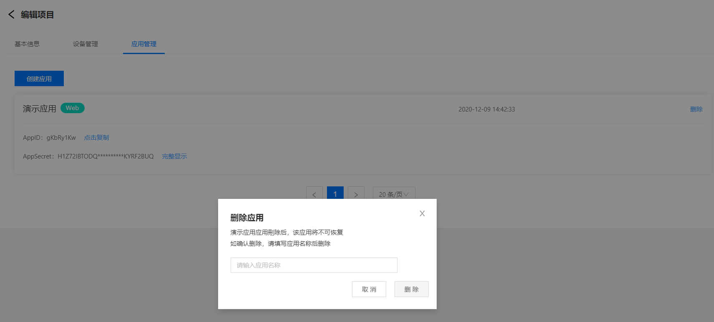

# 创建应用

1.登录智能生活物联网平台

2.左侧导航栏选择 **项目管理** -> **项目管理**

3.在项目列表页面，点击卡片进入项目编辑页面，选择 **应用管理**选项卡

 ## 创建应用

1.在编辑项目页， **应用管理tab**中点击创建应用 按钮

2.填写应用的名称、选择应用的类型，点击**创建**按钮

 ## 删除应用

在编辑项目页， **应用管理tab**中点击项目卡片右上角的删除按钮，输入**应用名称**进行确认，点击**删除**按钮后删除应用

