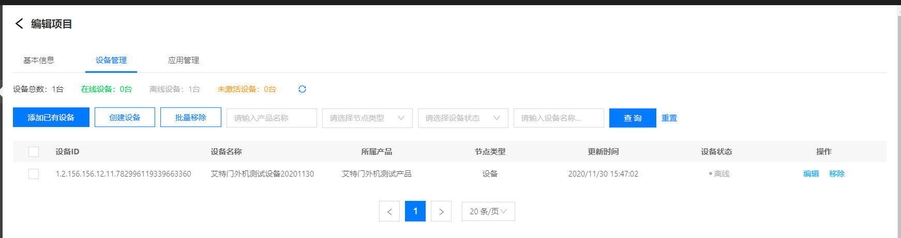
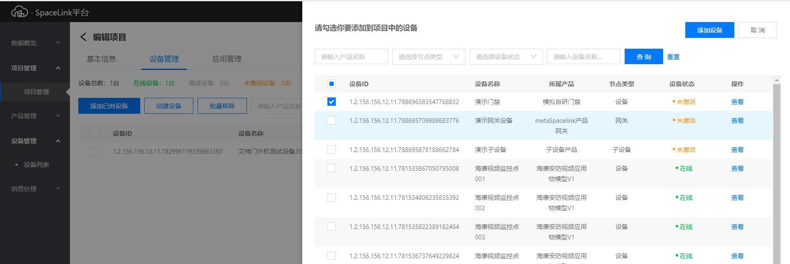

# 设备管理

 ## 添加设备

1. 在项目卡片列表页面，点击卡片进入项目编辑页面，选择 **设备管理**选项卡
2. 点击页面 **添加已有设备** 按钮
3. 在右侧弹窗中选择已经注册的设备信息，点击**添加设备**按钮将设备关联添加到项目中。
4. 在搜索框中指定查询条件可查询**项目下**符合条件的设备

 ## 移除设备

 在项目设备列表页， 点击设备列表后的**移除**按钮，可解除设备和项目的关联，移除设备。或选中设备后点击 **批量移除**按钮。

