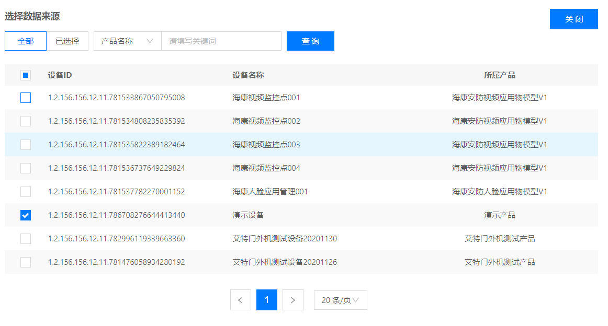

# 创建规则引擎

1. 登录智能生活物联网平台
2. 左侧导航栏选择**消息处理** -> **规则引擎**
3. 点击页面右上方**新建规则**，输入规则名称，点击**创建**来建立规则


# 规则配置
规则创建后自动跳转配置页面，或在规则列表页面点击 **编辑按钮**


**基本信息** 

- 规则名称：规则引擎唯一标识，支持2-30个字符内的中文、英文、数字、下划线（_）和中划线（-）。

- 数据来源：这里选择要转发数据的来源设备。

- 数据类型：选择转发消息的数据类型：上下线、上报数据、上报事件。

- 上报数据示例：说明设备上报的数据字段以及字段类型。

```
{ 
  "messageId":"1234567898765432",
  "event":"connected",
  "deviceId":"1.2.156.156.11.11.962",
  "timestamp":1573696479
}
```

- 转发条件：定义数据过滤时执行的SQL语句，所有上报的数据都会经过SQL语句进行处理，然后进行数据转发。表名可以随意写，没有实际意义。

```
目前仅支持以下几种格式：

1. SELECT * FROM Orders
2. SELECT a, c AS d FROM Orders
3. SELECT * FROM Orders WHERE b = 'red'
4. SELECT * FROM Orders WHERE a> 0
```

**数据转发**

通过规则过滤后的数据可以转发至三种消息存储：Kafka、MySQL、JCQ。

- 注意：Kafka和MySQL必须和当前平台实例处于相同的VPC下。

1. 转发到Kafka
填写转发到kafka需填写名称、地址、Topic。


2. 转发到MySQL
转发到MySQL需要填写名称、数据库地址、库名、表名、列名、批量（数据入库阀值）、账号、密码。


3. 转发到Http
转发到Http需填写Http接口地址、密钥等信息，其中密钥用于在请求转发是对参数进行签名。


## 启停规则
1. 进入规则引擎-规则列表页面，点击运行/停止按钮。
2. 运行成功后，状态变为运行，在规则列表中操作中运行按钮变成停止按钮。停止成功后状态变为运行，在规则列表中操作中运行按钮变成停止按钮。


## 删除规则

进入规则引擎-规则列表页面，点击删除按钮。如果规则处于运行状态，则不可以删除；如果规则处于停止状态，则可以删除；删除成功后，在规则列表中查询不到。


