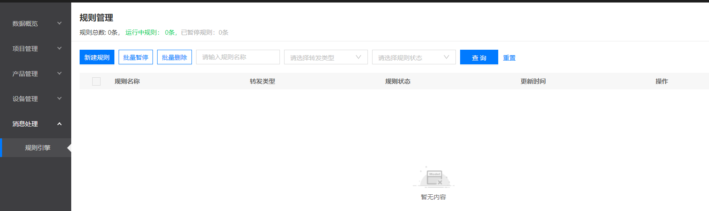
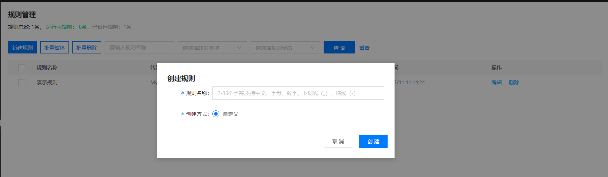
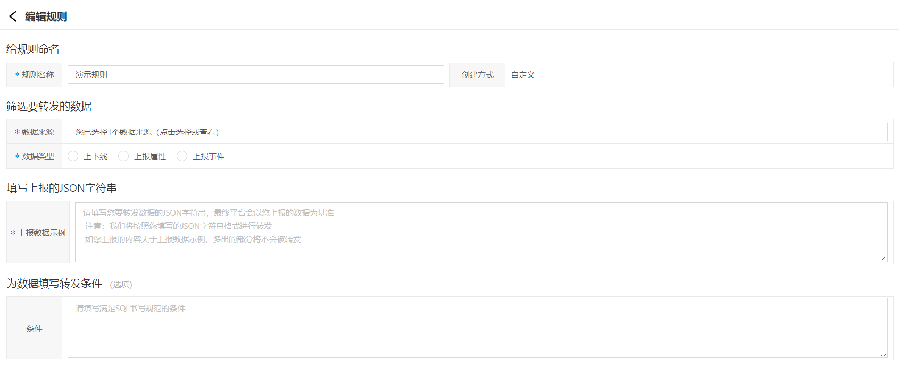
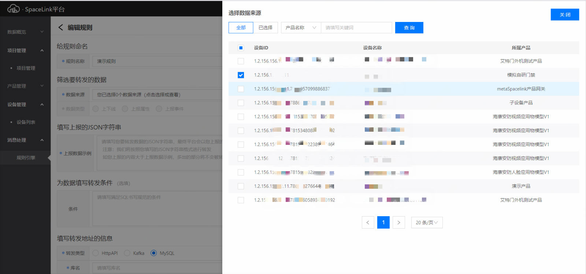
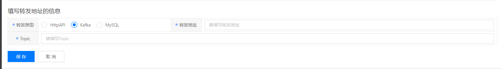
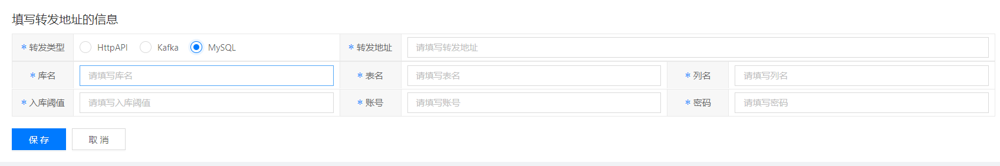
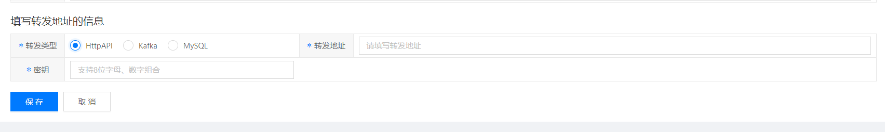
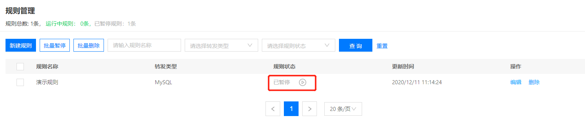
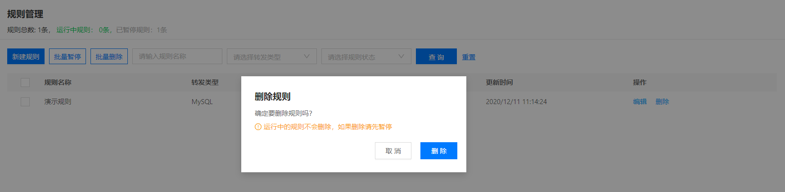

# 创建规则引擎

1.登录智能生活物联网平台，左侧导航栏点击**消息处理** -> **规则引擎**

2.点击**新建规则**按钮，输入规则名称，点击**创建**按钮来新建规则







# 编辑规则
1.在编辑规则页，用户可以为规则填写规则命名、筛选要转发的数据、填写要上报的JSON字符串、为数据填写转发条件



2.填写规则：

* 规则名称：支持2-30个字符内的中文、英文、数字、下划线（_）和中划线（-）
* 数据来源：点击**数据来源**按钮，在右滑弹窗里勾选想要转发的设备，被勾选的设备代表其上报到平台的数据将被转发到对应的地址


* 上报数据示例：说明设备上报的数据字段以及字段类型

```
{ 
  "messageId":"1234567898765432",
  "event":"connected",
  "deviceId":"1.2.156.156.11.11.962",
  "timestamp":1573696479
}
```

* 转发条件：定义数据过滤时执行的SQL语句，所有上报的数据都会经过SQL语句进行处理，然后进行转发。其中，表名可以任意填写，无实际意义

```
目前仅支持以下几种格式：

1. SELECT * FROM Orders
2. SELECT a, c AS d FROM Orders
3. SELECT * FROM Orders WHERE b = 'red'
4. SELECT * FROM Orders WHERE a> 0
```

* 数据转发
通过规则过滤后的数据可以转发至三种消息存储：Kafka、MySQL、HTTP接口
注意：Kafka和MySQL必须提供网络访问权限

* 转发到Kafka 填写转发到Kafka需填写名称、地址、Topic



* 转发到MySQL 转发到MySQL需要填写名称、数据库地址、库名、表名、列名、批量（数据入库阀值）、账号、密码



* 转发到Http 转发到Http需填写Http接口地址、密钥等信息，其中密钥用于在请求转发是对参数进行签名



## 启停规则
在规则管理页，点击**运行/停止**按钮



## 删除规则

在规则管理页，点击**删除**按钮。如果规则处于运行状态，则无法删除；如果规则处于停止状态，则将弹窗提示是否确定删除，如果点击**删除**按钮则对应规则将从列表中被删除


