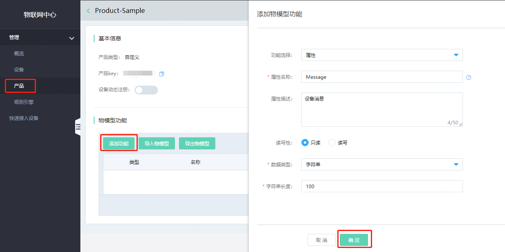
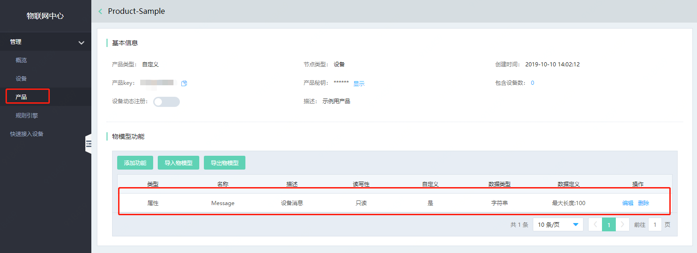

# 定义产品物模型

产品物模型由属性、服务、事件所组成，用于设备管理和数据交互。在物联网中心中，定义物模型即定义产品功能。

# 创建步骤

1. 产品列表中，选中创建的产品，单击 **产品名称** ，进入产品详情页
2. 点击 **添加功能**
3. 定义一个名为Message的属性，类型为字符串，长度为100。完成后单击确认。

​       

4. 属性创建成功后，可在下方物模型功能列表里看到刚刚添加的属性。

   

