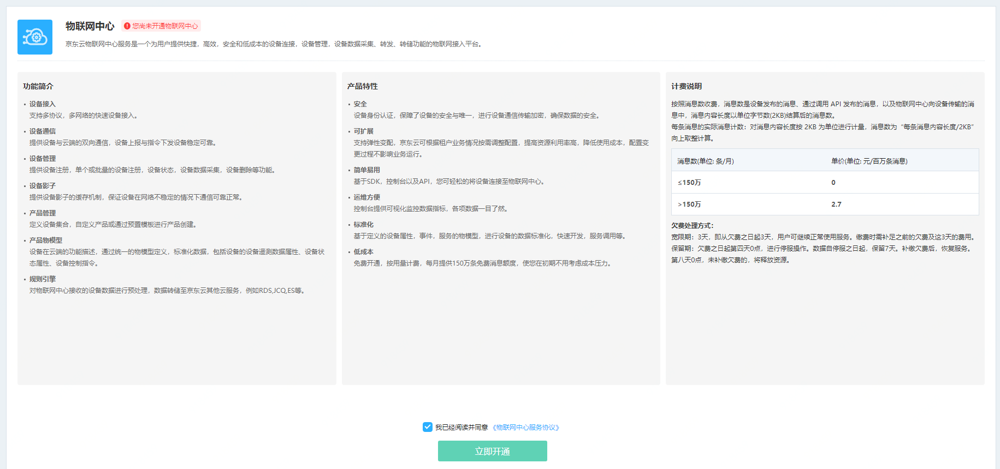

# 购买流程

本文介绍物联网中心服务购买入口及流程。

## 入口：[产品介绍页](https://www.jdcloud.com/cn/products/iot-core)
1. 登录京东云官网[https://www.jdcloud.com/](https://www.jdcloud.com/)。
2. 选择“产品>企业应用>物联网>物联网中心”。
3. 弹出物联网中心的产品介绍页，点击**立即开通**。

4. 登录物联网引擎控制台, 进入服务开通页，阅读相关产品信息与服务协议后，点击“立即开通”

5. 开通成功后，您就可以开始使用物联网中心服务了。

相关参考：

- [创建产品](../Operation-Guide/Create-Product.md)
- [定义产品物模型](../Operation-Guide/Thing-Model/Create-Thing-Model.md)
- [添加设备](../Operation-Guide/Create-Device/Create-Single-Device.md)

