快速开始
--------

### 安装 RT-Thread Studio

#### 下载 RT-Thread Studio 安装包

访问官网 [RT-Thread Studio
下载地址](https://www.rt-thread.org/page/studio.html)，在官网下载最新的
RT-Thread Studio 软件安装包。

#### 安装 RT-Thread Studio

双击安装包的 `.exe` 文件进行安装，安装界面如下图所示：

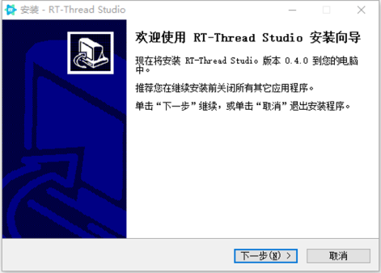

install-studio

安装前需要接受许可协议，如下图所示：

license

指定安装路径时不要带有空格和中文字符，如下图所示：

path-install

指定开始菜单文件夹名，如下图所示：

start-name

开始安装

start-install

一直点击`下一步`直到最后点击`安装`按钮可开始进行安装，待安装完成后可直接点击`确定`即可启动
RT-Thread Studio，如下图所示：

start-studio

或者取消`运行RT-Thread Studio`勾选，点击完成后，从桌面快捷方式启动 RT-Thread
Studio。桌面快捷方式如下图所示：

studio-pic

第一次启动 RT-Thread Studio
需要进行账户登录，登录一次后会自动记住账号，后续不需要再登录，登录支持第三方账号登陆，登录界面如下：

sign-in

### 新建项目

在`项目资源管理器`窗口内点击右键，选择`新建`子菜单`项目`，如下图所示：

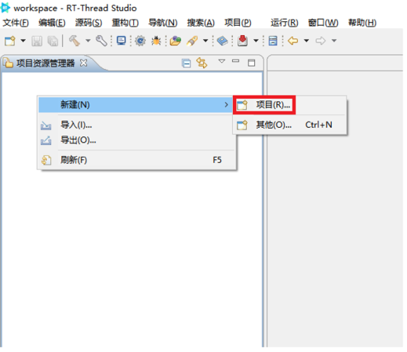

new-pro

在弹出的新建项目向导对话框中选择`RT-Thread项目`类型，然后点击`下一步`如下图所示：

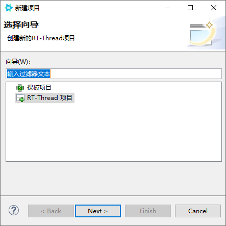

rtthread-pro

填写工程名，选择 RT-Thread 源码版本，选择对应的
BSP，然后点击`完成`按钮，如下图所示：

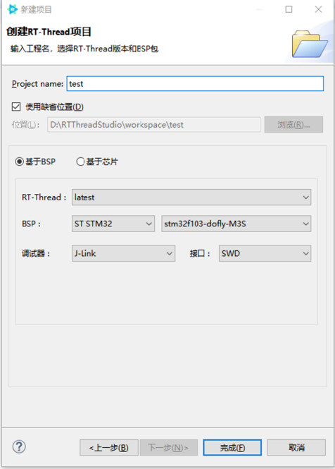

done-pro

点击`完成`后，等待工程创建过程如下图所示：

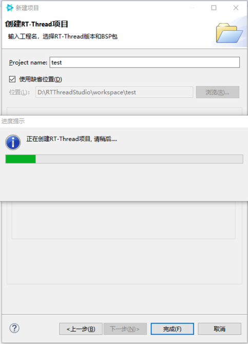

waitting

工程创建成功后`项目资源管理器`窗口会出现刚创建的工程`test`，如下图所示：

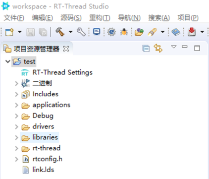

test-pro

### 配置项目

双击`RT-Thread Settings`文件，打开 RT-Thread
项目配置界面，配置界面默认显示软件包以及组件和服务层的架构配置图界面，如下图所示：

setting

点击架构图配置界面右侧侧栏按钮，即可打开配置树配置界面，如下图所示：

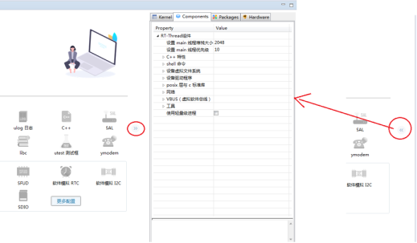

tree-set

配置完成后，保存配置退出配置界面后，RT-Thread Studio
会自动将配置应用到项目中，比如会自动下载相关资源文件到项目中并设置好项目配置，确保项目配置后能够构建成功，如下图所示：

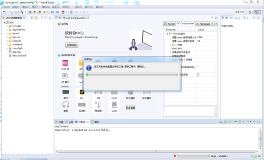

set-ok

### 构建项目

点击工具栏上的`构建`按钮对项目进行构建。如下图所示：

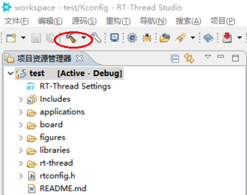

build-pro

构建的过程日志在控制台进行打印，如下图所示：

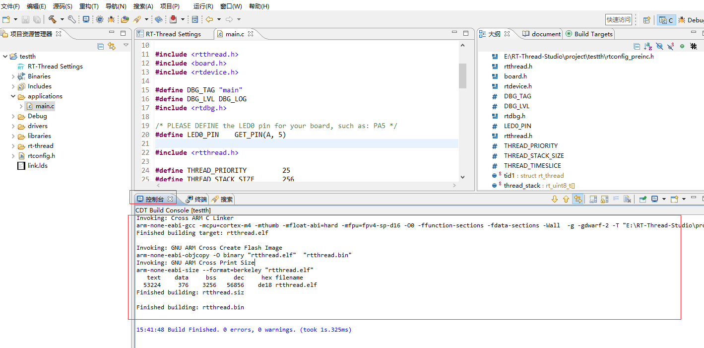

build-info

### 下载程序

当项目构建成功后，点击工具栏`下载程序`按钮旁的三角下拉框选择相应的烧写器，以`J-Link`烧写器为例，如下图所示：

download-pro

选择完烧写器后可直接点击`下载程序`按钮进行程序下载，下载日志会在控制台窗口打印，如下图所示：

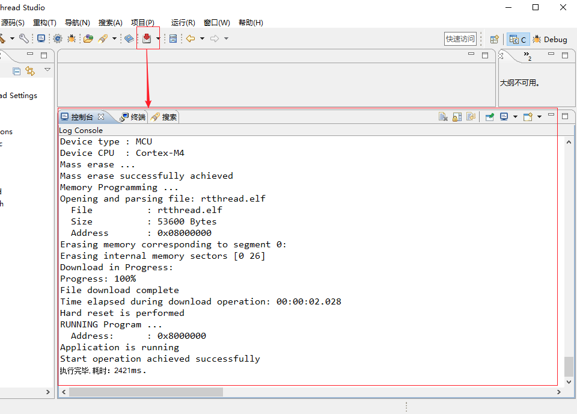

download-info

### 启动调试

选中`test`工程,然后点击工具栏`调试`按钮，如下图所示：

debug-pro

当成功启动调试后，RT-Thread Studio
会自动跳转到调试透视图，在调试透视图可以进行各种调试功能操作。当停止调试后会自动跳转会
C 透视图，如下图所示：

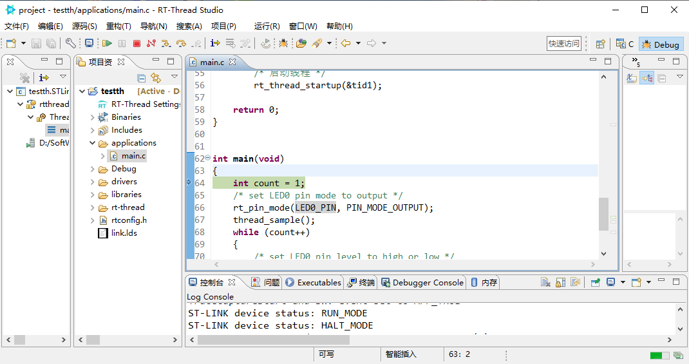

debug-see

### 视频教程

访问官网 [RT-Thread Studio
视频教程](https://www.rt-thread.org/page/video.html)，在官网观看视频教程。
