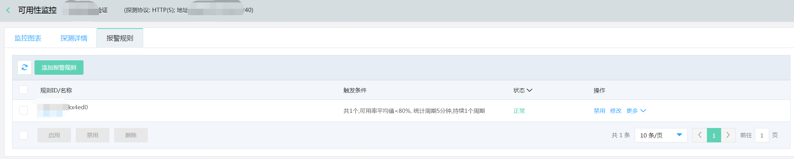
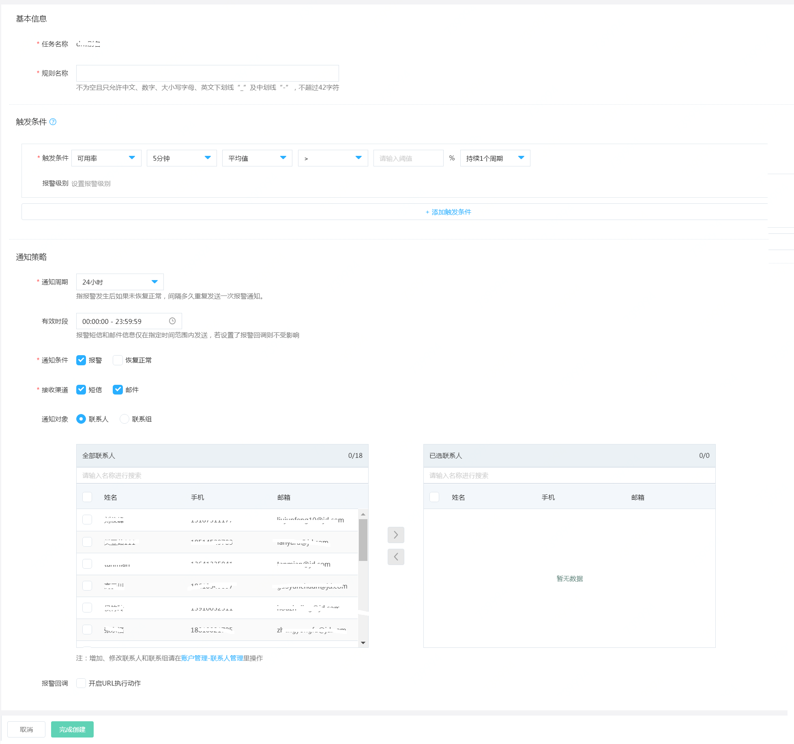
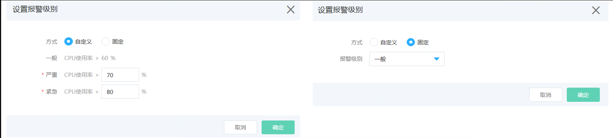
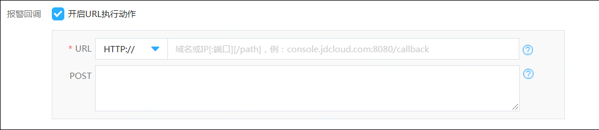
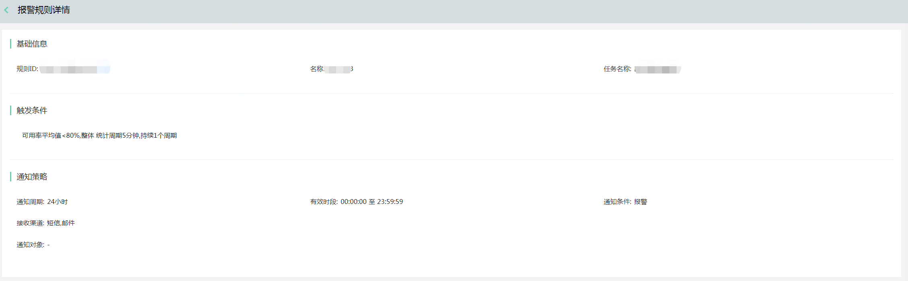

# 查看报警规则  
1. 登录京东云云拨测控制台，点击“管理->云拨测->可用性监控”，进入监控任务列表页面。  
  
2. 选中监控任务，点击操作列下“报警规则”，进入到“报警规则”页面，可以查看到已设置的报警规则及其状态信息。  
  
# 设置报警规则  
1. 登录京东云云拨测控制台，点击“管理->云拨测->可用性监控”，进入监控任务列表页面。  
 
2. 选中监控任务，点击操作列下“报警规则”，进入到“报警规则”页面。  
  
3. 点击“新增报警规则”，打开设置报警规则页面。  
 
4. 按照以下步骤配置信息  
   1）基本信息：设置规则名称，确认是对配置的监控任务是否正确。  
   2）触发条件：  
     探测节点选择整体或指定城市-运营商， 配置监控项、统计周期、统计方法、计算方式、阈值、持续周期，同时可根据需求设置报警级别。若需配置多个触发条件，点击“添加触发条件”按钮即可配置。
 
   3）通知策略：  
   - 通知周期：表示如果资源一直处于告警状态，未恢复正常，间隔多久发送下一次通知。提供5分钟、10分钟、15分钟、30分钟、1小时、3小时、6小时、12小时和24小时几种选项。
   - 有效时段：报警短信和邮件信息仅在指定时间范围内发送，默认是全天都发送。
   - 通知条件：提供“报警”和“恢复正常”两种场景，默认仅报警状态发送，必须要指定通知条件。
   - 接收渠道：提供“短信”和“邮件”两种选型，默认都发送，可根据需要选择。  
   - 通知对象：支持选择联系人或联系组。添加联系人和联系组击选择框底部的“账户管理-联系人管理”进入用户中心进行配置。  
   - 报警回调：当资源发生告警时，京东云主动按照您配置的URL地址和POST参数进行回调。  
  

# 修改报警规则  
1. 登录京东云云拨测控制台，点击“管理->云拨测->可用性监控”，进入监控任务列表页面。  
 
2. 选中监控任务，点击操作列下“报警规则”，进入到“报警规则”页面。  
  
3. 选中需要修改的报警规则，点击“修改”按钮，进入修改报警规则页面。   
4. 可更改规则名称、触发条件和通知策略可根据需要进行修改（可参考创建报规则页面）。  

# 禁用/启用报警规则  
1. 登录京东云云拨测控制台，点击“管理->云拨测->可用性监控”，进入监控任务列表页面。  

2. 选中监控任务，点击操作列下“报警规则”，进入到“报警规则”页面。  
  
3. 选中需要禁用/启用的的报警规则， 点击“禁用”/“启用”按钮，即可。

# 查看规则详情  
1. 登录京东云云拨测控制台，点击“管理->云拨测->可用性监控”，进入监控任务列表页面。  

2. 选中监控任务，点击操作列下“报警规则”，进入到“报警规则”页面。  

3. 选择需要查看的报警规则，点击“查看详情”，可以查看到该条规则配置的触发条件及通知策略等信息。 

# 报警历史  
1. 登录京东云云拨测控制台，点击“管理->云拨测->可用性监控”，进入监控任务列表页面。  

2. 选中监控任务，点击操作列下“报警规则”，进入到“报警规则”页面，选择需要查看的报警规则，点击“报警历史”。   

3. 可以查看到该条规则历史报警情况。默认展示最近3天的报警历史，支持自定义时间段查看对应告警历史。  

# 删除报警规则  
1. 登录京东云云拨测控制台，点击“管理->云拨测->可用性监控”，进入监控任务列表页面。  

2. 选中监控任务，点击操作列下“报警规则”，进入到“报警规则”页面。  

3. 选择需要删除的报警规则，点击“删除”按钮，或选择报警规则前的复选框，点击批量“删除”按钮。  
4. 在弹出的确认删除提示框中，点击“确定”按钮，即可进行删除。
