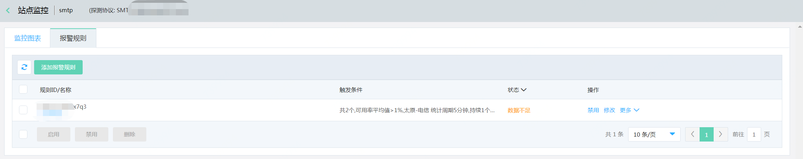
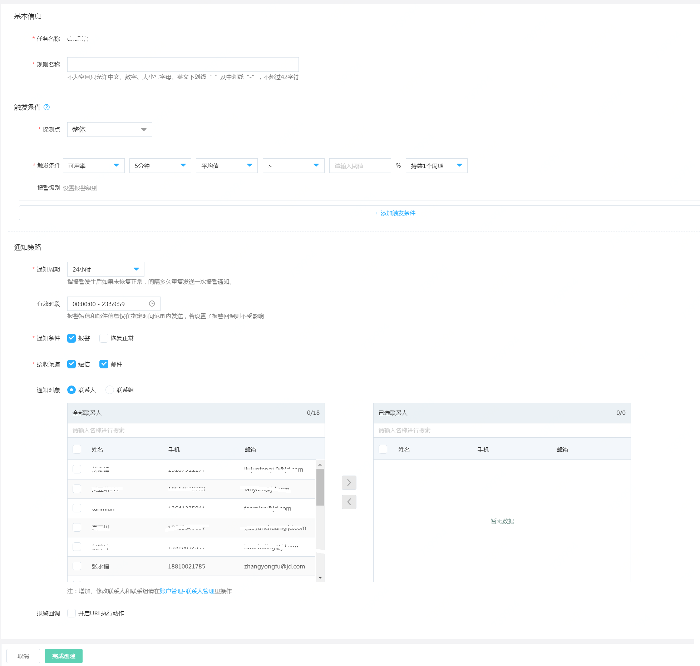

# 查看报警规则  
1. 登录京东云云拨测控制台，点击“管理->云拨测->站点监控”，进入监控任务列表页面。  
 
2. 选中监控任务，点击操作列下“报警规则”，进入到“报警规则”页面，可以查看到已设置的报警规则及其状态信息   
 

# 设置报警规则  
1. 登录京东云云拨测控制台，点击“管理->云拨测->站点监控”，进入监控任务列表页面。  
 
2. 选中监控任务，点击操作列下“报警规则”，进入到“报警规则”页面，点击“新增报警规则”，打开设置报警规则页面。  
 
3. 设置报警规则名称，选择地域、监控项、统计周期、统计方法、计算方法，阈值和持续周期，也可配置报警级别和通知方式。  
4. 点击“下一步”设置通知方式，选择需要通知的联系人或者联系组，点击下一步即可完成报警配置。  

# 修改报警规则  
1. 登录京东云云拨测控制台，点击“管理->云拨测->站点监控”，进入监控任务列表页面。  
 
2. 选中监控任务，点击操作列下“报警规则”，进入到“报警规则”页面，选中需要修改的报警规则，点击“修改”按钮，进入修改报警规则页面。  

3. 按照以下步骤配置信息  
   1）基本信息：设置规则名称，确认是对配置的监控任务是否正确。  
   2）触发条件：选择监控项、统计周期、统计方法、计算方式、阈值、持续周期，同时可根据需求配置报警级别。若需配置多个触发条件，点击“添加触发条件”按钮即可配置。
 

   3）通知策略：  
   - 通知周期：表示如果资源一直处于告警状态，未恢复正常，间隔多久发送下一次通知。提供5分钟、10分钟、15分钟、30分钟、1小时、3小时、6小时、12小时和24小时几种选项。
   - 有效时段：报警短信和邮件信息仅在指定时间范围内发送，默认是全天都发送。
   - 通知条件：提供“报警”和“恢复正常”两种场景，默认仅报警状态发送，必须要指定通知条件。
   - 接收渠道：提供“短信”和“邮件”两种选型，默认都发送，可根据需要选择。  
   - 通知对象：支持选择联系人或联系组。添加联系人和联系组击选择框底部的“账户管理-联系人管理”进入用户中心进行配置。  
   - 报警回调：当资源发生告警时，京东云主动按照您配置的URL地址和POST参数进行回调。  
  

4. 点击页面底部的“完成创建”，则支持添加报警规则，点击“取消”按钮， 放弃本次操作。  

