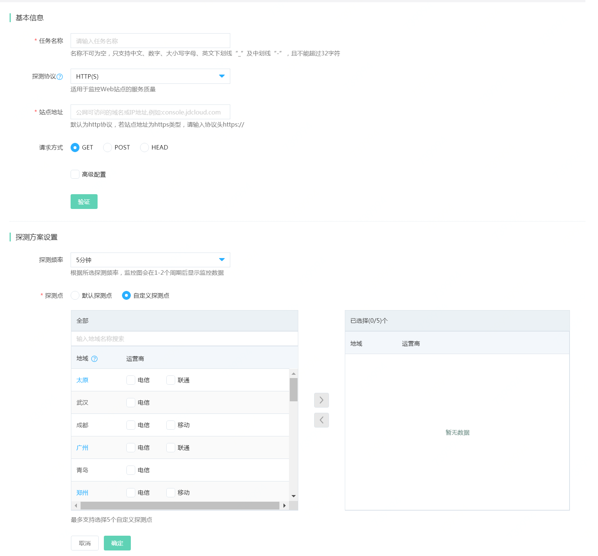

# 新建监控任务
1. 登录京东云云拨测控制台，点击“管理->云拨测->站点监控”，进入监控任务列表页面。点击左上角的“新建任务”按钮。  
  
2. 添加基本信息
- 任务名称：监控任务名称，便于任务的标识，例如：XXX网站服务
- 探测协议：支持HTTP(S)、TCP、UDP、PING、FTP、DNS、SMTP和POP3这几种协议。其中HTTP(S)、PING和DNS协议支持IPv6的地址的探测，几种协议的应用场景如下，根据需要进行选择和设置。  

协议类型 |	适用场景
----| ----
HTTP(S)	| 监控Web站点的服务质量
TCP	| 监控服务器的TCP端口
UDP	| 监控服务器的UDP端口
PING|监控服务是否能ping通
FTP	|适用于提供文件服务的站点监控
DNS |适用于监控站点的域名解析服务
SMTP|适用于提供收邮件服务的站点监控
POP3|适用于提供邮件服务的站点监控

- 站点地址：输入公网可访问的域名或IP地址，不同的协议需设置内容如下：  

  a.HTTP(S)：也可以需选择请求方式，勾选“高级配置”，GET方式可以添加“HTTP(S)请求头”和Cookie信息；POST方式可添加“提交内容”，即：body部分请求内容；HEAD方式可以添加“HTTP(S)请求头”和“Cookie”信息；若需要对返回信息校验，则可配置响应内容。
  ```
  注意：  
  1. 匹配响应的方式，默认为“包含匹配内容”，即请求返回的结果中需要包含填写的相应内容，则探测成功，否则失败，站点可用率为0;若选择“不包含匹配内容”，即：探测返回的内容则不含填写的响应内容，则探测成功，否则失败，站点可用率为0。
  2. 探测站点地址时，若返回的状态码非200，则判定站点地址不可用，站点可用率为0.
  ```
  b.ping： 增加了丢包率指标，可以定义每次探测发送的包数目。
  
  c.TCP和UDP：需要填写端口号；同时高级设置中可配置TCP请求格式、请求内容、响应格式和响应内容。 
  
  c.SMTP和POP3：需要填写端口号，支持选择是否“使用安全链接SSL”，同时需要填写访问所需的用户名和密码。
  
  d.FTP：需要填写端口号，若选择需要身份认证时，需要填写所需的用户名和密码。
  
  e.DNS: 查询类型默认为A,提供MX/NS/CNAME/TXT/ANY/AAAA选项；DNS服务器支持指定，若不填写则使用拨测点本地的DNS服务器。 若为A或AAAA记录类型时，可以指定期望解析的IP；若为CNAME类型时，支持填写期望解析的别名。
  ```
  注： 若填写了期望解析的IP或者别名时，探测任务会对域名解析的结果进行验证，若包含输入的IP地址或别名，则探测成功，否则失败可用率为0.
  ```
- 提供“验证”操作，可以临时发起一次探测，验证输入的信息是否有效。 

3. 设置探测方案
- 探测频率：隔多久发起一次探测，可选择1分钟、5分钟、10分钟和30分钟。
- 探测点：提供默认探测点和自定义探测点选项，自定义探测点最多可选择5个探测点。
  ```
  注： 若对IPv6的站点地址或域名进行监控， 则探测节点需要选择支持IPv6的节点， 地域标注为蓝色的城市暂不支持IPv6地址的探测任务。
  ```

4. 点击“确定”按钮，保存监控任务。  
   


# 修改监控任务  
1. 登录京东云云拨测控制台，点击“管理->云拨测->站点监控”，进入监控任务列表页面。  
2. 选中需要修改的任务，点击“修改”按钮，进入修改任务页面。
- 基本信息中可更改任务名称、站点地址及高级配置（可参考新建任务）
- 探测方案中可修改“探测频率”和“探测节点”。（可参考新建任务）

3. 点击“确定”按钮，保存监控任务。

# 报警历史   
1. 登录京东云云拨测控制台，点击“管理->云拨测->站点监控”，进入监控任务列表页面。  
 
2. 选中需要查看报警的监控任务，点击操作列下的“更多->报警历史”按钮。  
3. 跳转至全部报警历史-站点监控页面，展示该监控任务近1天的报警情况，若需要查看其它时间段的报警历史，修改日期范围即可。  


# 删除监控任务 
1. 登录京东云云拨测控制台，点击“管理->云拨测->站点监控”，进入监控任务列表页面。  
2. 选中要删除的监控任务，点击操作列下的“更多->删除”按钮，或者选择任务前边的复选框，点击批量“删除”按钮。  
3. 在确认删除提示框中，点击“确定”按钮即可。
