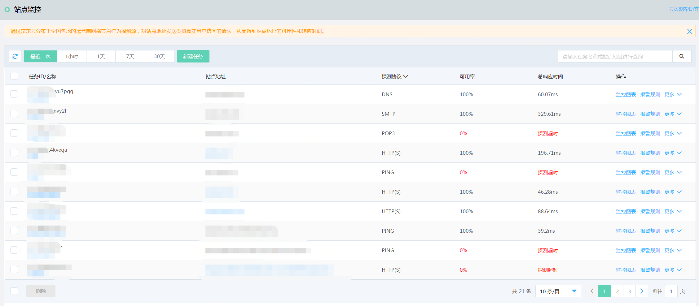
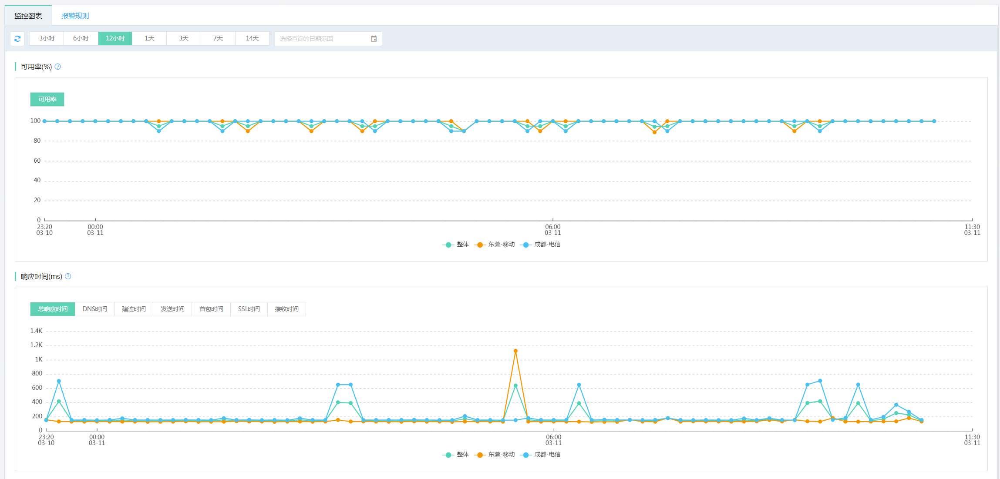

# 查看监控图表
1. 登录京东云云拨测控制台，点击“管理->云拨测->站点监控”，进入监控任务列表页面。  
 
2. 选中监控任务，点击操作列下的“监控图表”按钮，进入监控信息页面。  
 
3. 可以查看该监控任务的整体、不同探测节点的可用率、响应时间，ping协议还支持查看丢包率指标。 
响应时间新增的指标含义如下：

指标 |含义 | 适用协议
----| ---- | ----
DNS时间	 | DNS域名解析时间| HTTP(S)、SMTP、TCP、UDP和FTP协议
建连时间 | 从发起建立连接请求，到连接建立完成所用时间|HTTP(S)、SMTP、POP3、TCP、UDP和FTP协议
发送时间 | 从发起建立连接请求，到请求写入完成所用时间|HTTP(S)、SMTP、POP3、TCP、UDP和FTP协议
首包时间 | 从发起建立连接请求，到收到首字节响应所用时间|HTTP(S)协议
SSL时间  | 从发起建立连接请求，到完成SSL认证所用时间|HTTP(S)、SMTP 和POP3协议
接收时间 | 从发起建立连接请求，到完成响应内容接收所用时间|HTTP(S)、SMTP、POP3、TCP、UDP和FTP协议
