# 跨账户访问授权

您的团队在京东云上启用了多种云服务，您是京东云账号 A（主账号）的管理者。您的外部合作伙伴在京东云注册了账号 B（同样为主账号）。

现在，您需要该合作伙伴为您托管 Kubernetes 集群；但他不能访问账户下的其他资源（如云主机、数据库等），您也不想对他共享京东云账号 A 的密码。

本文将介绍如何通过角色授权的方式实现跨账户访问，解决上述问题。操作流程如下图所示：

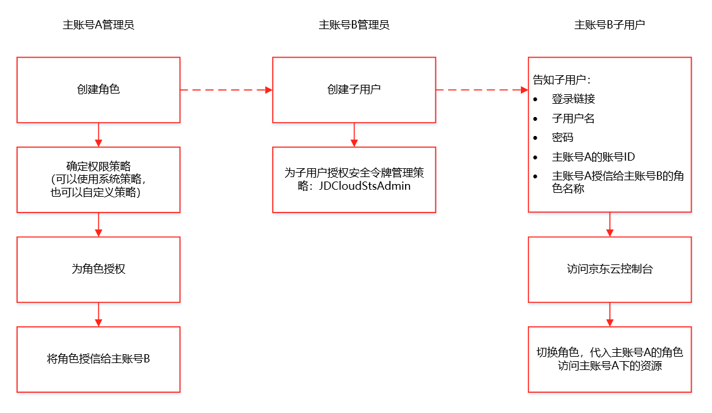

本文涉及到的操作包括：

- 创建角色
- 创建子用户
- 子用户访问控制台
- 子用户代入角色

## 创建角色

主账号 A 登录控制台，在顶栏菜单 “云服务” 搜索 “访问控制”，进入 IAM 控制台。

1、在如下页面中点击角色的【创建】按钮。

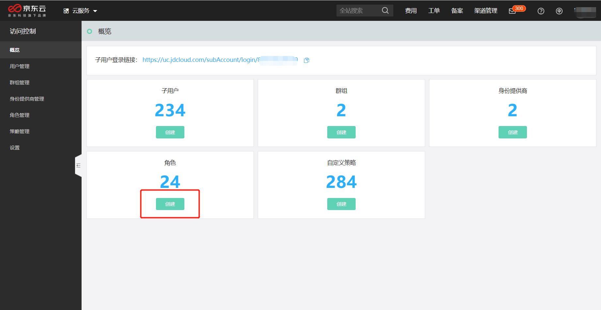

2、选择创建【用户角色】。

针对不同角色类型的介绍，请参考[角色概览](../../../../documentation/Management/IAM/Operation-manual/Role-management/role-overview.md)。

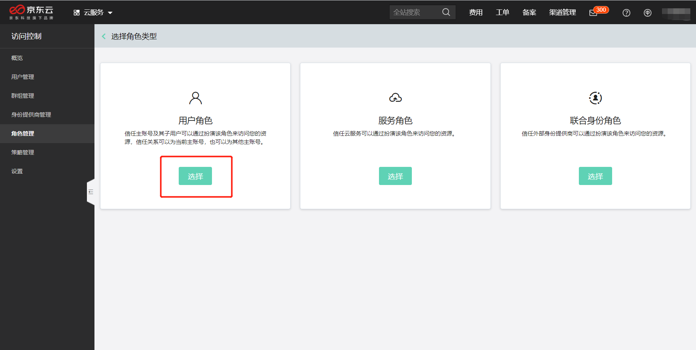

3、填写角色信息，选择建立【跨账号】信任关系，并填写要信任的第三方账号 ID。然后点击【确定】。

第三方账号 ID，可以请合作伙伴在[账户中心](https://uc.jdcloud.com/account/basic-info)查看告知。

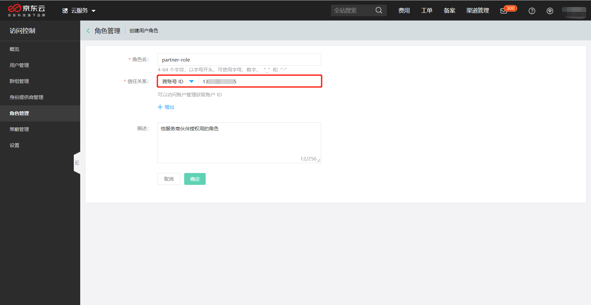

4、角色创建成功后，为角色授权。点击【立即授权】。

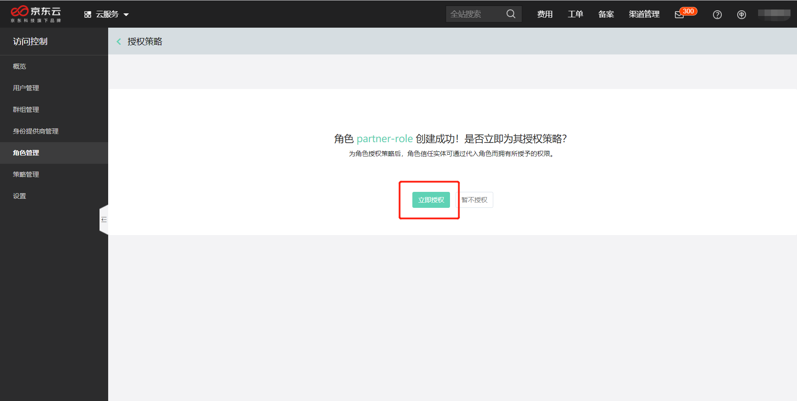

5、为角色添加权限策略 JDCloudKubernetesAdmin。

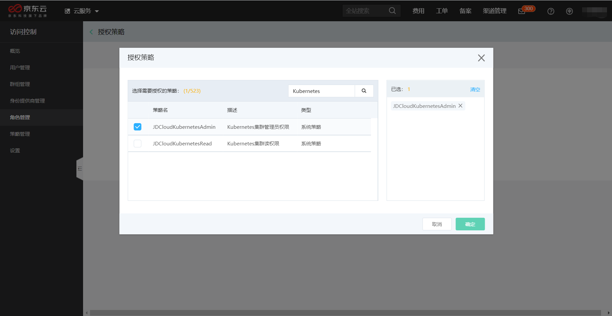

此时，您已经完成了角色创建、角色权限设置，并已经将角色授信给了合作伙伴账号 B。

请将您的账号 ID（查看[账号基本信息](https://uc.jdcloud.com/account/basic-info)）、角色名称（在本文的示例中，角色名称为 “partner-role”）告知账号 B 的管理员。

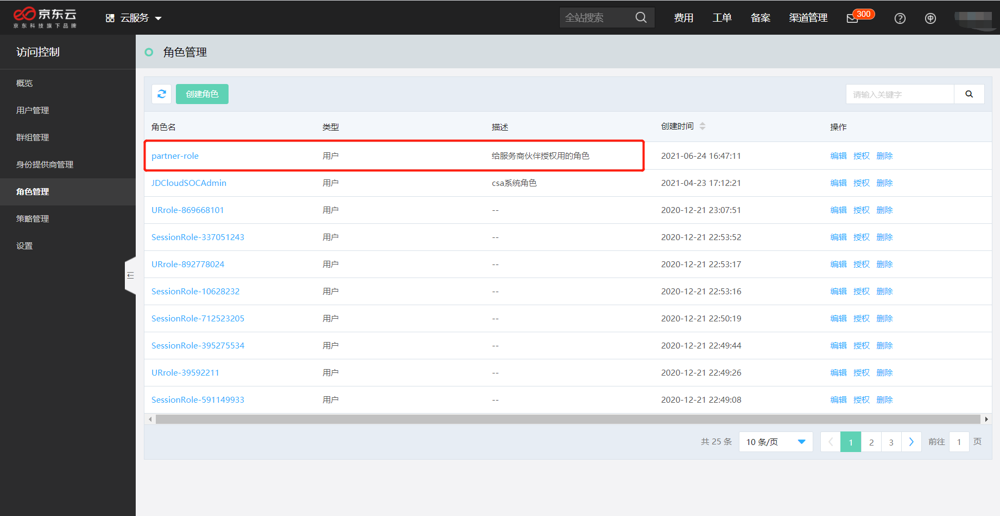

## 创建子用户

主账号 B 登录控制台，在顶栏菜单 “云服务” 搜索 “访问控制”，进入 IAM 控制台。

1、在账号 B 的 IAM 控制台点击子用户的【创建】按钮。

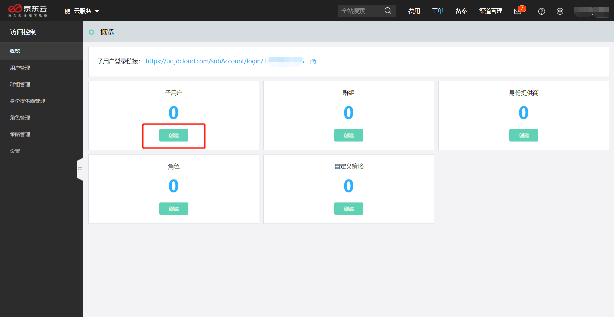

2、设置子用户名及其他必填信息，并在【访问类型】上勾选【控制台访问】；点击【确定】按钮即可创建子用户。

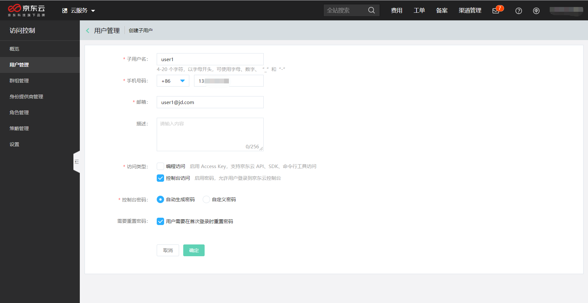

“子用户创建成功” 的弹窗中，包含了该子用户的初始登录密码和登录链接 —— 子用户必须通过该链接登录。

请将以下信息提供给您的团队成员 user1：

- 子用户登录链接
- 子用户名
- 密码
- 账号 A 的账号 ID
- 账号 A 提供给您的角色名称

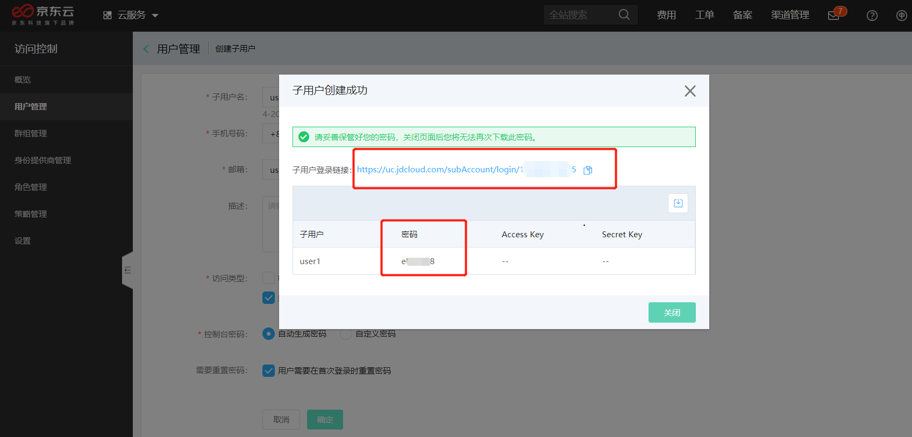

## 子用户访问控制台

合作伙伴账号 B 的子用户 user1 需要先正常登录，再切换角色身份访问账号 A 的资源。

1、子用户登录 

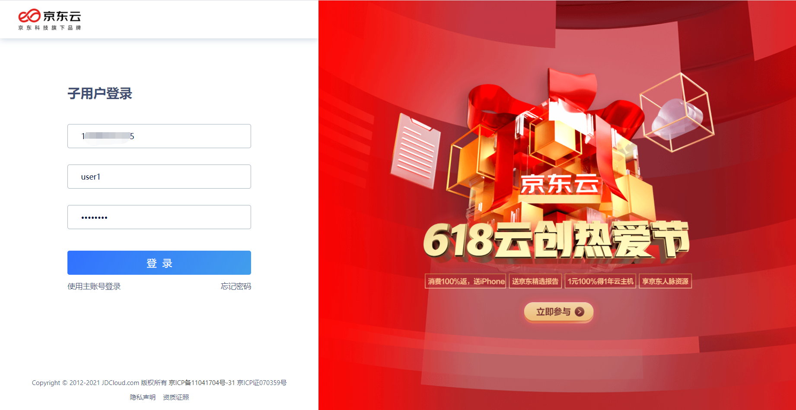

2、首次登录时，重新设置密码。

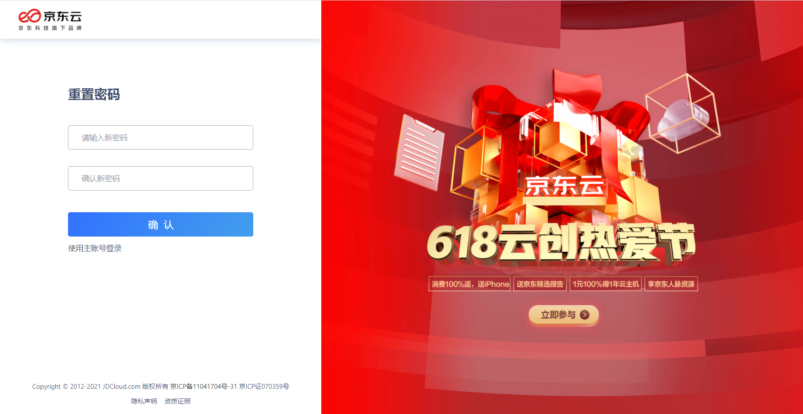

## 子用户代入角色

在子用户账户菜单中，选择【切换角色】。

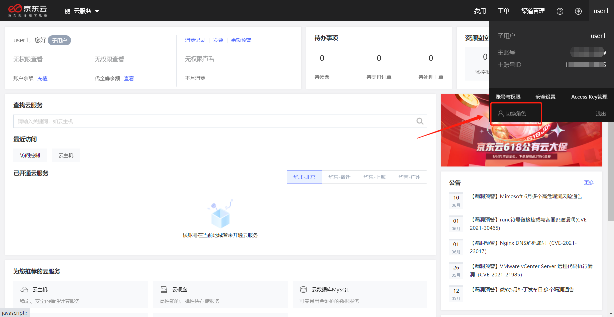

将账号 A 的账号 ID 和角色名（partner-role）填入后，点击【切换】按钮。此时，user1 将以 partner-role 的身份访问账号 A 的资源，并拥有 partner-role 上所设置的权限。

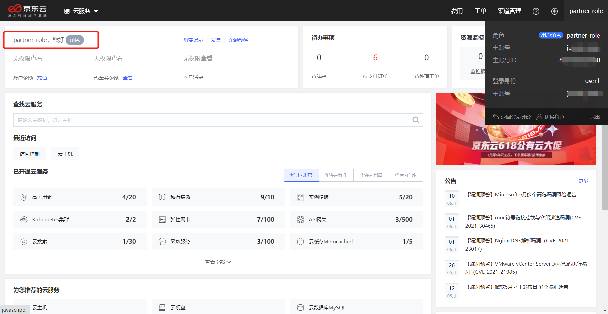

user1 可以访问账号 A 的 Kubernetes 资源，而在访问账号 A 的云主机时，将由于无权限而被系统拒绝。

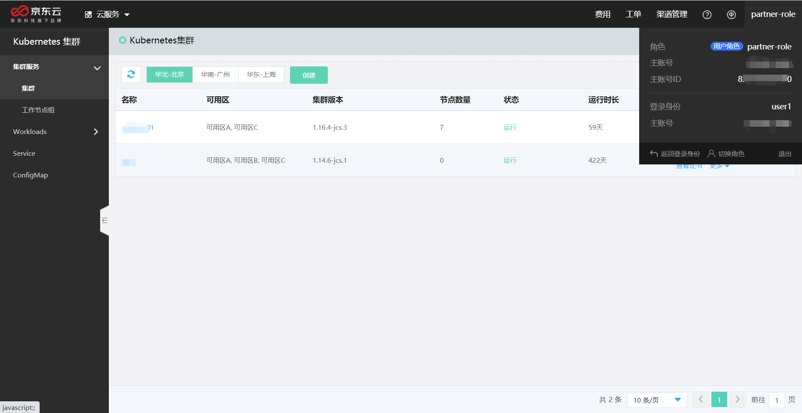

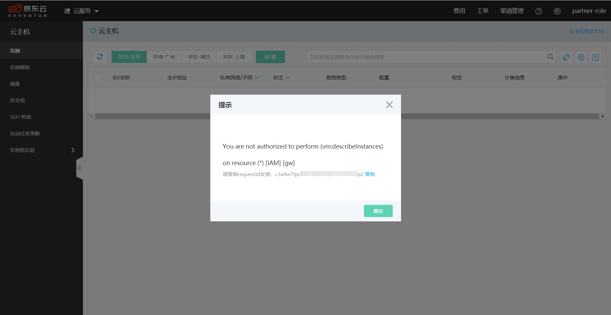

