# 为团队成员授权

您的团队在京东云上启用了多台云主机，您是京东云账号（主账号）的管理者。现在，团队中的一名成员需要管理1台云主机，实例ID为 i-1ie94h1x2t；但他不能访问其他的云主机，您也不想对他共享京东云主账号。

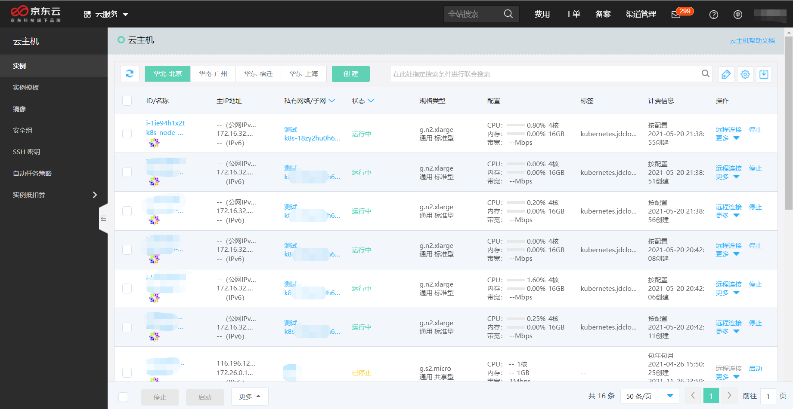

本文将介绍如何通过子用户授权的方式，解决上述问题。子用户授权的操作流程如下：

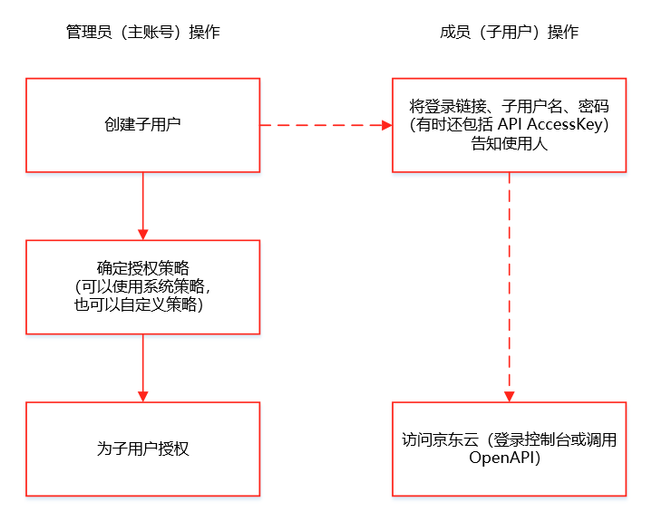

本文涉及到的操作包括：

- 创建子用户
- 创建权限策略
- 为子用户授权
- 子用户访问控制台

## 创建子用户

在控制台顶栏菜单 “云服务” 搜索 “访问控制”，进入 IAM 控制台。

1、在如下页面中点击子用户的【创建】按钮。

2、设置子用户名及其他必填信息，并在【访问类型】上勾选【控制台访问】；点击【确定】按钮即可创建子用户。

您需要对 “子用户创建成功” 弹窗上的信息格外注意，上面包含了该用户的初始登录密码和登录链接 —— 子用户必须通过该链接登录。

请将子用户登录链接、子用户名、密码提供给您的团队成员 user1。

此时，您的子用户列表里就有 user1 这个成员了。

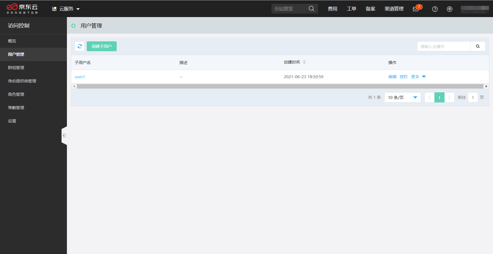

## 创建权限策略

现在，您还要创建权限策略，对应 i-1ie94h1x2t 这台云主机的管理权限。

1、在 IAM 控制台选择【创建】自定义策略。

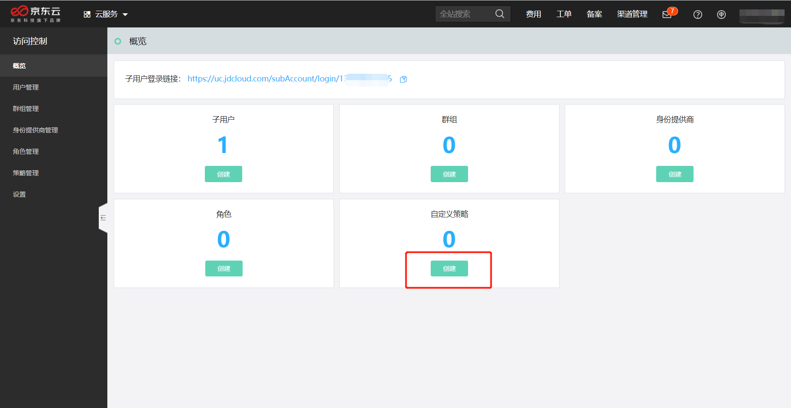

2、选择【可视化策略生成器】。

针对策略的不同创建方式的说明，请参考[策略管理](../../../../documentation/Management/IAM/Operation-manual/Policy-management/policy-overview.md)。

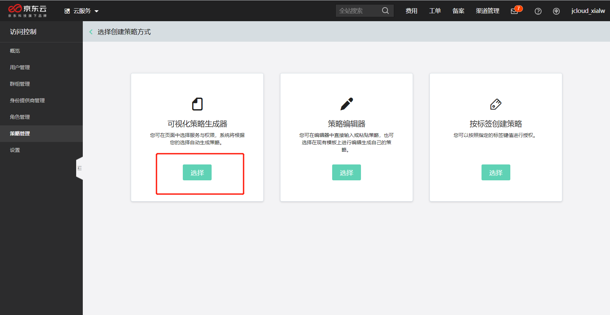

3、设置权限策略内容。

针对云主机进行授权，请选择【云主机】权限类型。对于管理权限，请勾选【全部操作】；如果是只读操作，请只勾选【读取】。

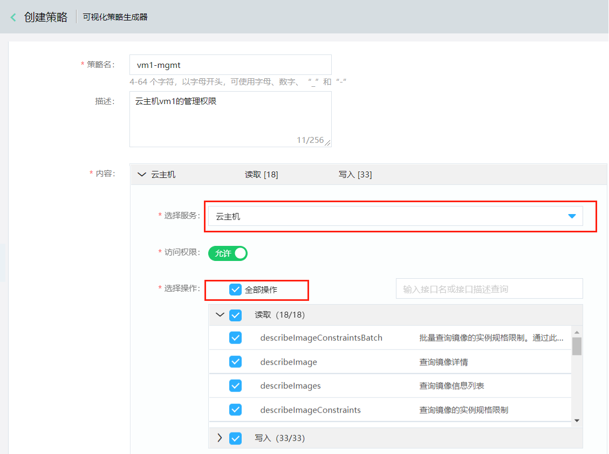

在 “选择资源” 时，请点击【添加全部资源】，然后编辑云主机实例（instances）的资源ID。

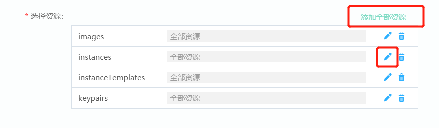

在【资源唯一标识】处，输入要授权的云主机实例的 ID：i-1ie94h1x2t。如果授权指定的多台云主机实例，请在 ID 之间用英文逗号分隔。

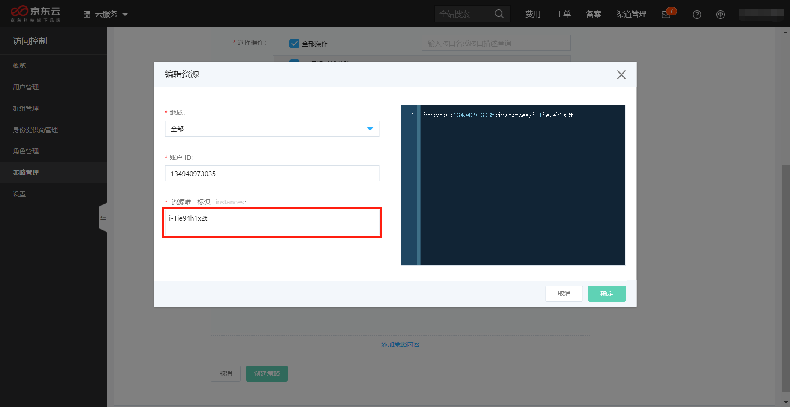

添加完成后，资源信息如下。

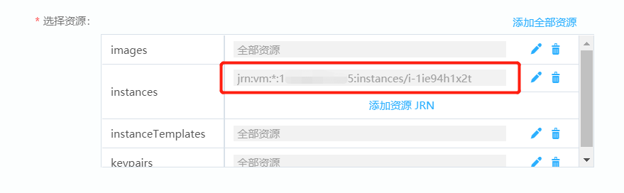

4、点击【创建策略】按钮后，进入如下页面。这是管理云主机时，需要执行的相关操作，也需要一并授权。

针对各依赖服务，依次勾选全部操作，并【添加全部资源】后，点击【完成创建】按钮。

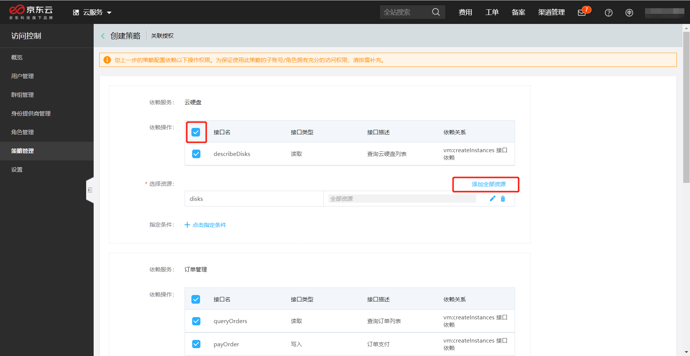

您的自定义权限策略就创建好了。

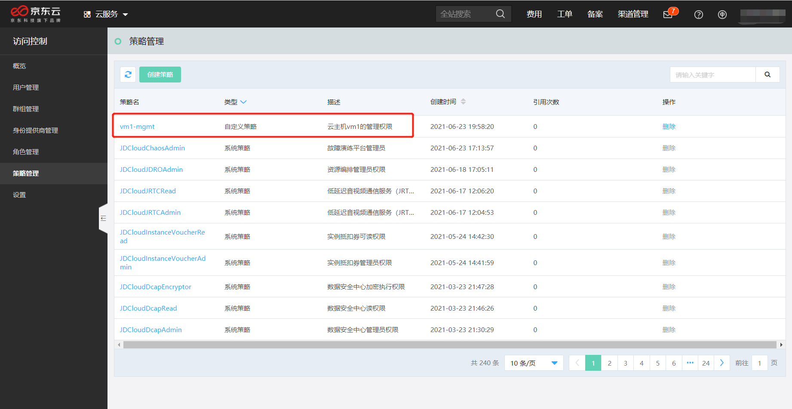

## 为子用户授权

现在，回到子用户管理页面。点击用户操作【授权】。

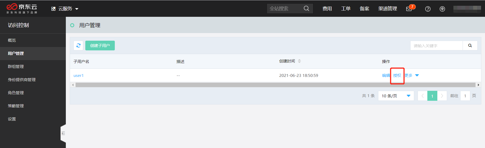

勾选刚才创建的策略 vm1-mgmt 对子用户 user1 授权。

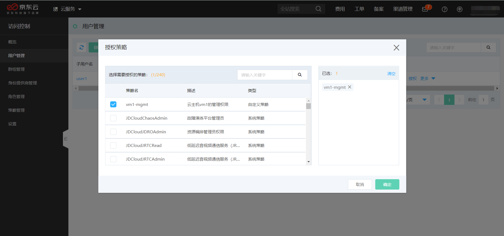

## 子用户访问控制台

您已经给团队成员 user1 发送了登录链接、子用户名和密码。现在，user1 可以尝试登录。

首次登录时，重新设置密码。

登录成功后，可以看到当前为子用户 user1 在访问。

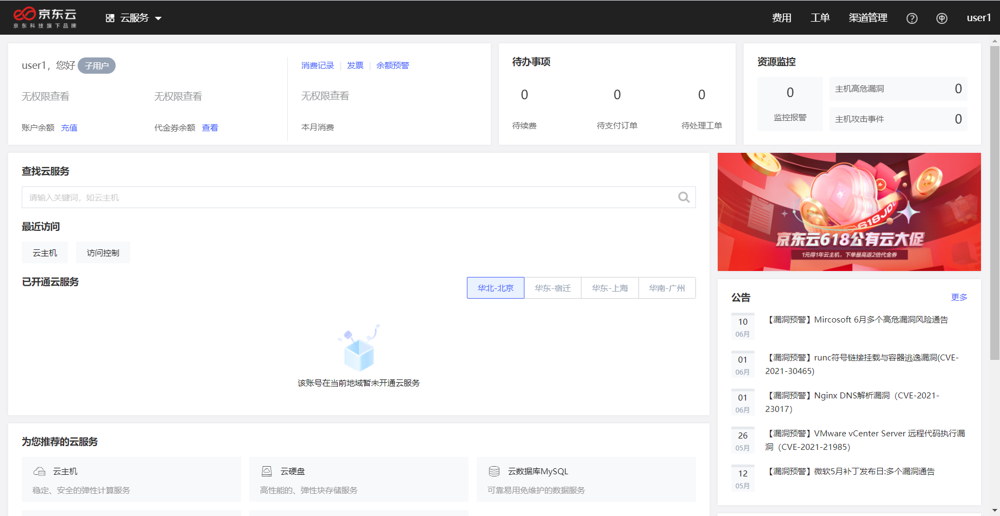

访问云主机控制台，user1 只能访问刚才授权的 i-1ie94h1x2t 这台云主机，而看不到账户下其他的云主机。

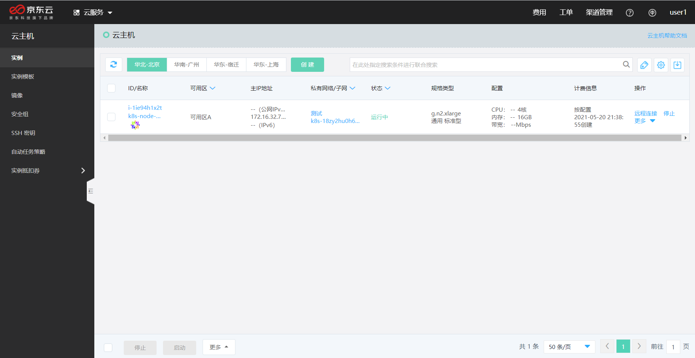
