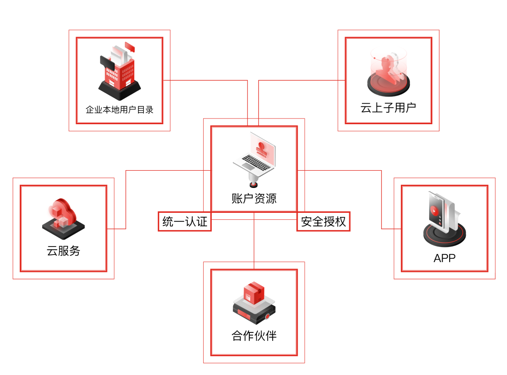

# 概述

访问控制（Identity and Access Management, IAM）是京东云提供的一项用户身份管理与资源访问控制服务。使用 IAM，主账号不必共享密码或访问秘钥，即可授权他人管理账户中的资源，按需为用户分配所需的最小权限，降低企业信息安全风险。

- 为企业人员创建子用户并分配适当的权限，使员工能通过子用户账号访问企业资源，请参考[为团队成员授权](../../../../documentation/Management/IAM/Getting-Started/Empower-the-Team.md)。
- 为企业的外部合作伙伴分配适当的权限，使合作伙伴能够访问企业资源，请参考[跨账户访问授权](../../../../documentation/Management/IAM/Getting-Started/Authorize-3P-Partners.md)。

## 相关概念

了解京东云 IAM 产品时，通常会涉及到的概念请参见 [核心概念](../../../../documentation/Management/IAM/Introduction/Core-Concepts.md)

## 相关服务

- 在购买云服务前，企业注册账号、完成实名认证，请参考[账户管理产品文档](../../../../documentation/User-Service/Account-Management/Sign-In-And-Sign-Up.md)。
- 记录所有子用户、合作伙伴的来访记录和资源操作记录，追踪资源的操作历史，请参考[操作审计产品文档](../../../../documentation/Management/Audit-Trail/Introduction/Product-Overview.md)。
- 删除、停止或变更重要的服务时，企业希望对操作人的身份进行二次确认，请参考[操作保护产品文档](../../../../documentation/User-Service/Security-Operation-Protection/Introduction/Product-Overview.md)。
- 给云资源打标签，并通过标签批量管理云资源，请参考[标签管理产品文档](../../../../documentation/Management/Tag-Service/Introduction/Product-Overview.md)。

## 使用IAM

京东云提供 Web 控制台界面，对企业的人员及服务权限进行管理。请登录[访问控制控制台](https://iam-console.jdcloud.com/summary)查看。

京东云也提供了 IAM 的相关 [API 接口](../../../../API/Common-Declaration/Introduction.md)。您可以使用 SDK（支持 Java/Python/Go/Node.js/PHP/.Net/C++）编程或使用京东云命令行工具（CLI）调用 IAM API，具体请参考：[SDK文档](https://docs.jdcloud.com/?act=3)及[CLI文档](../../../../CLI/Introduction.md)。
