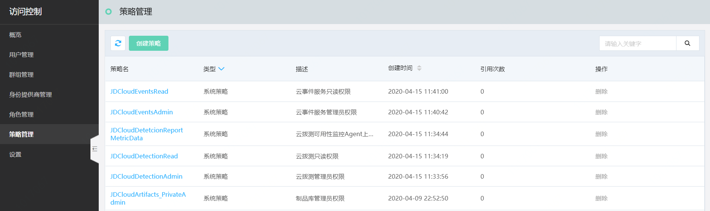
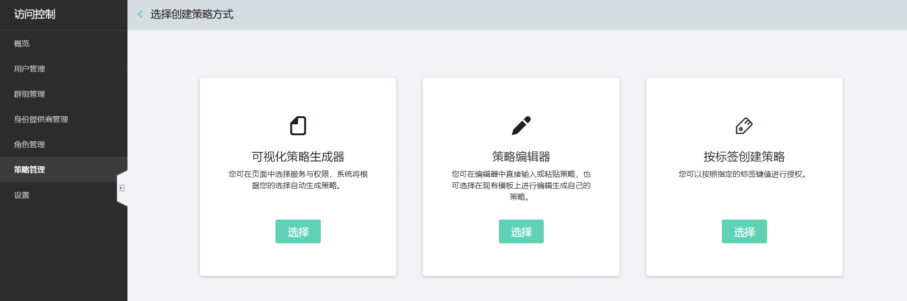
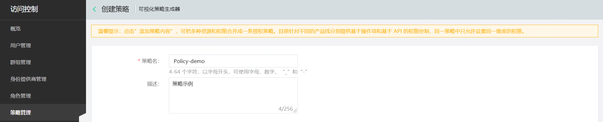
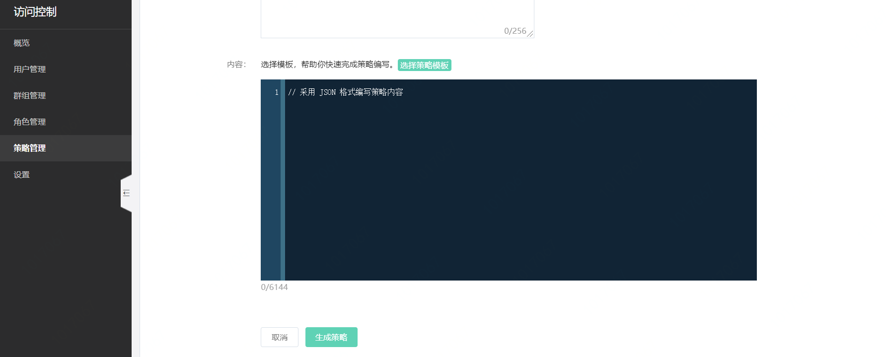
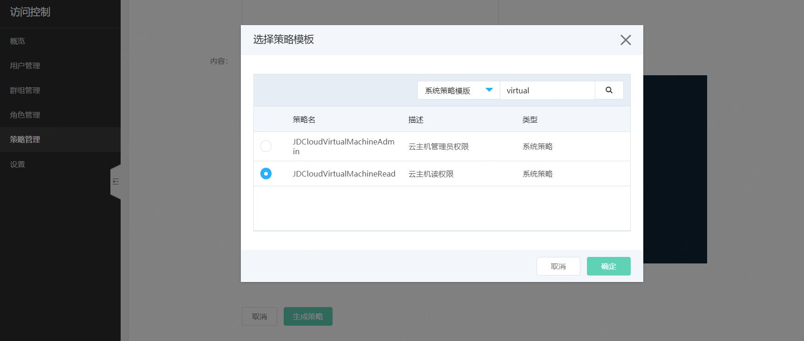
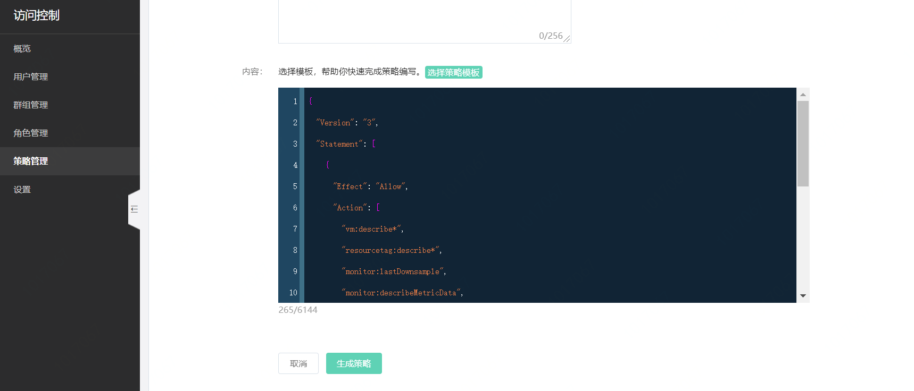

# Json 方式创建策略

京东智联云提供了三种自定义策略的创建方式，分别为：
- 可视化创建
- Json 创建
- 按标签创建

本页介绍 Json 方式创建策略流程。

## 1. 添加策略基本信息

在策略列表页点击“创建策略”。

> 为便利用户使用，京东智联云预置了多个系统策略，绝大多数为各个产品线的管理员策略或只读策略。系统策略会显示在您的策略列表里，可以通过为子账号/角色直接附加系统策略来使用。

选择策略编辑器，直接撰写 Json 文档来创建策略。

添加自定义策略名称与描述。

> 策略名称与描述需符合字符长度与格式规则。

## 2. 通过 JSON 编写授权信息

您可以在策略编辑框内直接撰写符合京东智联云策略语法的 JSON 文档，也可以通过选择策略模板直接导入现有策略，并按需在现有策略的基础上修改效力类型、操作接口、指定资源、指定条件等。

