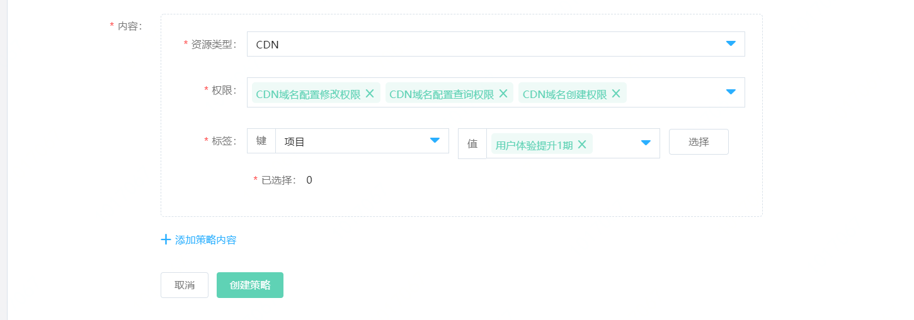

# 按标签创建策略

京东云提供了三种自定义策略的创建方式，分别为：

- 可视化创建
- Json 创建
- 按标签创建

本页介绍按标签创建策略流程。

## 1. 添加策略基本信息

在策略列表页点击“创建策略”。

> 为便利用户使用，京东云预置了多个系统策略，绝大多数为各个产品线的管理员策略或只读策略。系统策略会显示在您的策略列表里，可以通过为子账号/角色直接附加系统策略来使用。

选择按标签创建策略。

自定义策略名称与描述。

> 策略名称与描述需符合字符长度与格式规则。

## 2. 添加授权信息

目前支持按标签创建策略的产品线有： 云主机，CDN

### 选择权限

权限列表展示各个权限合集，支持选择多个权限合集，支持全选。如图，选择了 CDN 域名配置查询权限、CDN 域名配置创建权限、CDN 域名配置修改权限。

### 指定标签

标签键值列表支持指定标签。一个标签键支持选择多个标签值；一条策略里支持指定多个标签键值对。同一个标签键下的不同标签值之间是“或”的关系；不同标签键之间是“且”的关系。如同时指定标签“部门”=“研发” + “运维”，“环境”=“生产”，则其共同作用的结果是筛选研发部门生产环境的资源以及运维部门生产环境的资源。

