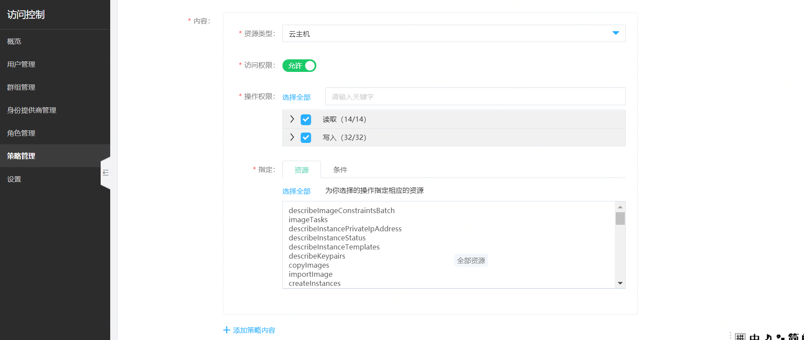
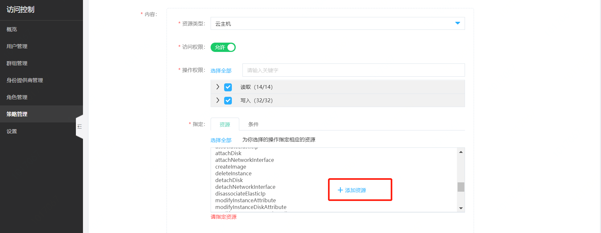
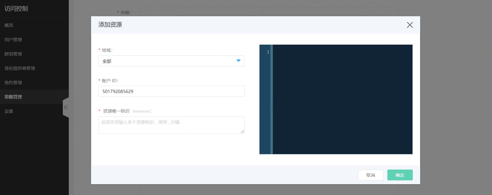
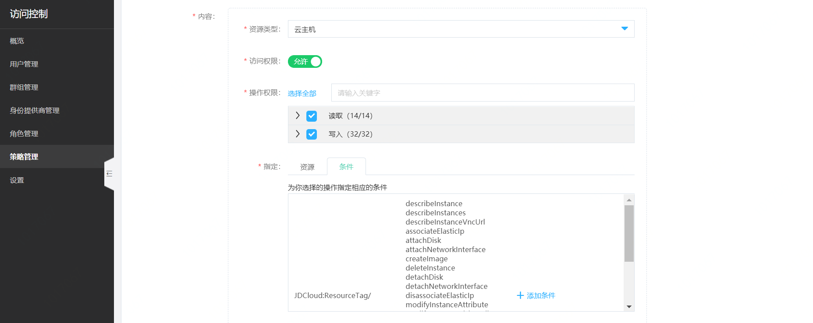
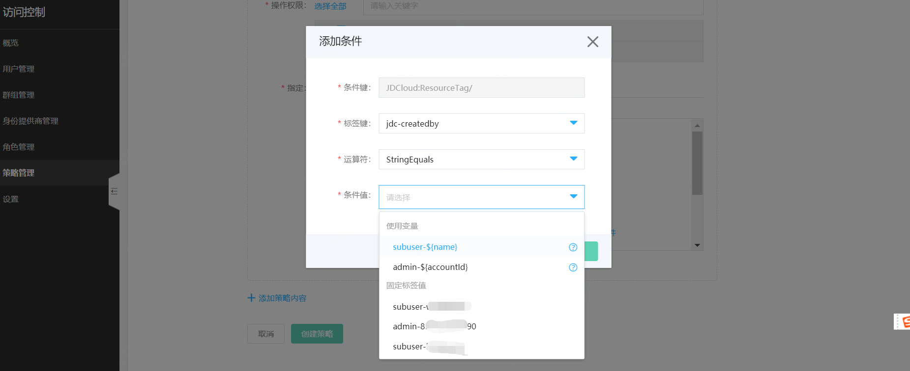

# 可视化创建策略

京东云提供了三种自定义策略的创建方式，分别为：
- 可视化创建
- Json 创建
- 按标签创建

本页介绍可视化创建策略流程。

## 1. 添加策略基本信息

在策略列表页点击“创建策略”。
> 为便利用户使用，京东云预置了多个系统策略，绝大多数为各个产品线的管理员策略或只读策略。系统策略会显示在您的策略列表里，可以通过为子账号/角色直接附加系统策略来使用。

选择可视化策略生成器。

自定义策略名称与描述。

> 策略名称与描述需符合字符长度与格式规则。

## 2. 添加授权信息

### 指定授权服务类型

在资源类型列表里指定京东云服务，列表支持模糊搜索；例如，输入“云”后列表里匹配出所有中文名称里带“云”字的产品线，从中选择“云主机”。

### 指定效力类型（允许或拒绝）

指定效力类型（Effect），即当前策略是对指定的操作允许访问还是拒绝访问

### 指定操作接口

在操作权限区指定本条策略需要覆盖的接口。京东云将所有接口分为读取接口与写入接口，您可以通过接口类型进行快速定位或区分接口类型执行全选。
如需指定所选产品线的全部接口，点击“选择全部”即可。

### 指定授权资源明细

如需将操作权限控制到资源级别，如仅允许某子用户访问指定的几台云主机时，需要在策略里指定资源。如不需要指定资源，点击“选择全部”即可。
点击添加资源，在添加资源弹窗里指定资源所属地域、主账号accountId、资源唯一标识（实例id）；存在多级资源的，需指定各级资源的唯一标识。

### 指定生效条件

京东云支持设置策略的生效条件 Condition，目前的 Condition 元素支持指定资源标签作为判断条件。

点击添加条件，在添加条件弹窗里指定资源标签键值对。IAM Condition 支持使用用户自定义的标签以及京东云系统标签（创建人标签）。您也可以在条件值里使用变量来概括策略，不必为每个 IAM 用户分别创建策略副本。

您可以重复以上步骤，添加多个服务的多个授权内容。

如果您授权的操作不需要关联授权，则此时点击【创建策略】即可完成策略创建。

## 3. 确定关联授权

在京东云上，要执行某些服务的操作，需要依赖其他协同服务操作共同完成。因此，除了指定的服务授权外，可能您还需要进行关联授权。

举个例子，当您需要授权子用户创建云主机时，不能仅仅授权 vm:createInstances 操作，仅有这一个接口的操作权限是无法完成云主机创建动作的。您可能还需要关联对云硬盘、主机镜像、私有网络的查询权限，才能在创建云主机时完成必要的设置。

当然，您不用过多考虑是否漏掉了某一个操作权限，系统会通过【关联授权】功能为您推荐可能需要关联授权的服务和操作信息，您只需要根据提示进行确认即可。如果您的业务不需要额外的授权，您可以忽略关联授权提示。

以下是当授权 vm:createInstances 后系统提示关联授权的示例：

