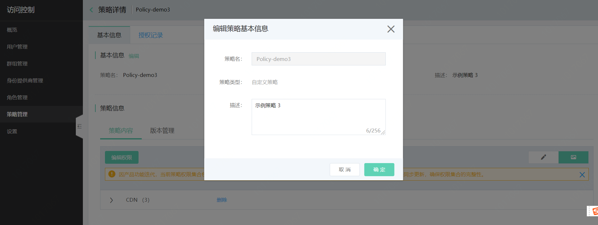
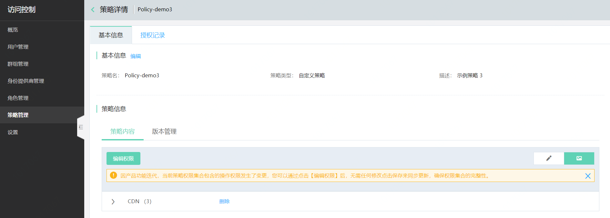
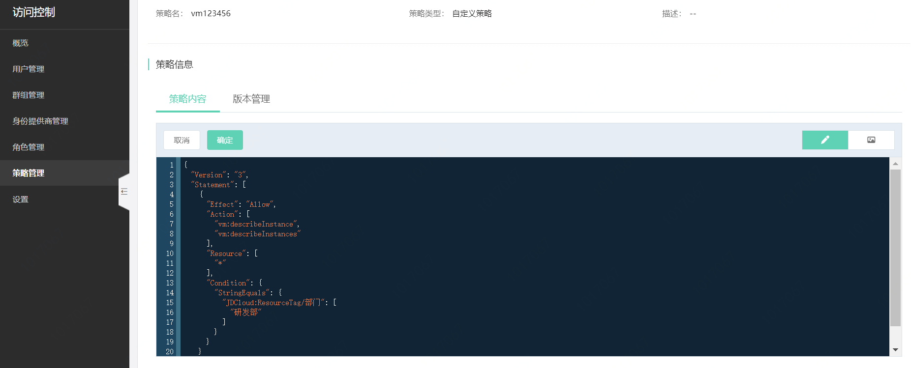
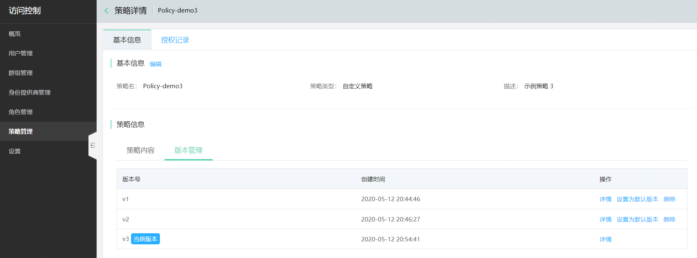

# 编辑策略

本页介绍京东云策略的编辑流程。

> 用户仅能编辑自定义策略，无法编辑系统策略。

## 1. 编辑策略描述

在策略详情页基本信息模块，点击编辑，可以编辑策略描述。

## 2. 编辑策略权限

在策略详情页策略信息模块，点击编辑权限，可以修改策略内容。编辑策略时支持切换编辑方式：可视化编辑策略、Json 方式编辑策略。

## 3. 编辑策略版本

每成功修改一次策略，都会生成一个新的策略版本。同一条策略（以策略名为标识），最多可拥有 5 个策略版本。最新编辑的策略默认为策略的当前版本，您可以通过点击“设置为默认版本”将其他版本策略设置为生效版本。

