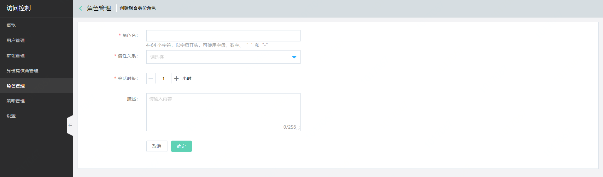

# 创建联合身份角色

本文介绍京东智联云联合身份角色的创建流程

## 1. 创建角色
在角色管理列表页点击“创建角色”

## 2. 选择角色类型
选择“联合身份角色”

## 3. 设置角色信息

- 自定义角色名称
> 必填，4-64 个字符，以字母开头，可使用字母、数字、“_”和“-”；
同一主账号下的角色名称不可重复。

- 自定义角色的信任关系

> 必填，点击列表选择当前角色要信任的身份提供商。                 

- 自定义角色描述
> 非必填，按需为角色添加描述信息。

- 提交
> 点击提交，即可成功创建联合身份角色。

