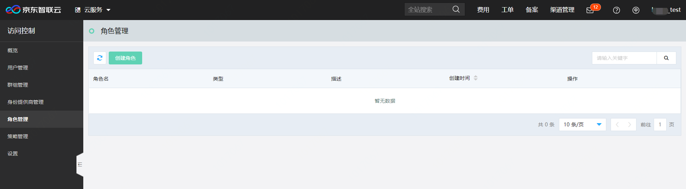
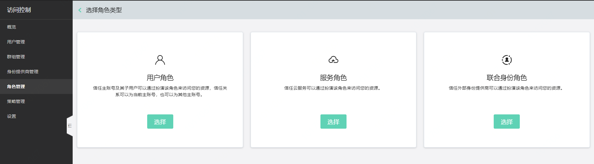
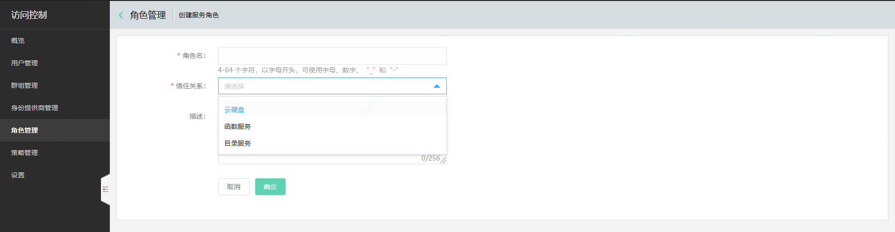

# 创建服务角色

本页介绍京东云服务角色的创建流程。

## 1.创建角色
在角色管理列表页点击“创建角色”

## 2. 选择角色类型
选择“服务角色”

## 3. 设置角色信息

- 自定义角色名称
> 必填，4-64 个字符，以字母开头，可使用字母、数字、“_”和“-”；
同一主账号下的角色名称不可重复。

- 自定义角色的信任关系

> 必填，京东云目前支持创建服务角色的产品线如下

| 产品线        | service_code   | 
| :--------   | :-----  | 
| 云硬盘      | disk   | 
| 批量计算        |   batch   | 
| 目录服务        |    directoryservice    |
                    

- 自定义角色描述
> 非必填，按需为角色添加描述信息。

- 提交
> 点击提交，即可成功创建服务角色。
