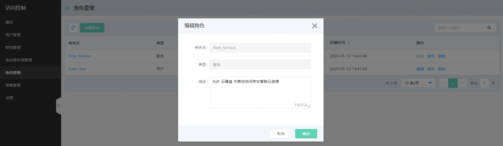
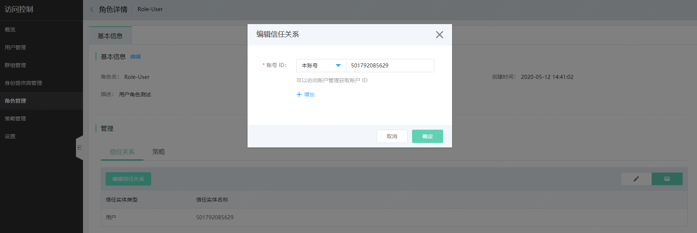

# 管理角色

本页介绍京东智联云角色的编辑和删除流程。

## 修改角色

- 用户角色允许修改角色描述、角色信任关系和角色附加策略
- 服务角色允许修改角色描述和角色附加策略
- 服务相关角色不支持用户修改

修改角色所附加的策略，请参考：[为角色授权](../../../../../documentation/Management/IAM/Operation-manual/Role-management/attach-policy.md)

**（1）修改角色描述**

在角色列表里点击“编辑”或在角色详情页里点击“编辑”，可快捷修改角色的描述信息。

**（2）修改角色信任关系**

在角色详情页，点击“编辑信任关系”，可管理当前角色的信任实体。

## 删除角色

您的角色列表中包含您自定义创建的用户角色、服务角色、联合身份角色以及您在使用某京东智联云服务时，服务为您创建的服务相关角色。

其中，自定义角色支持用户自行删除；服务相关角色不支持用户删除。

删除角色后，角色所附加的策略也会自动解除，请谨慎操作。
