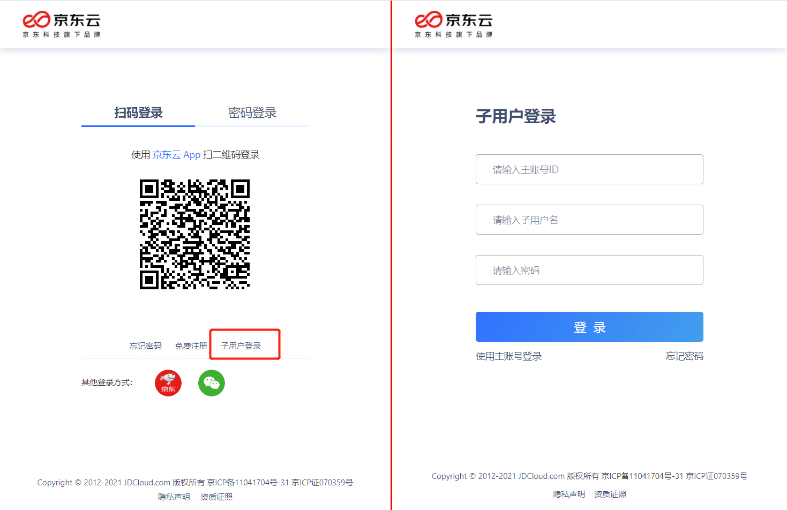
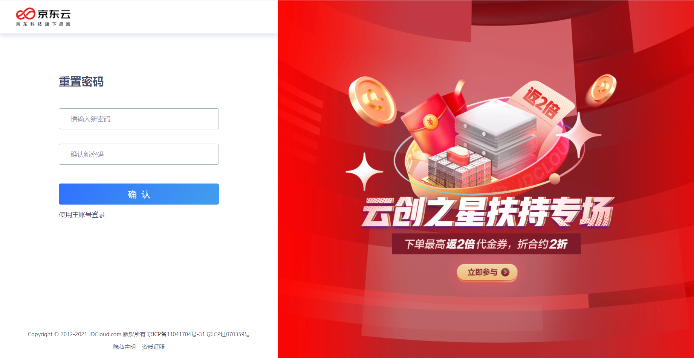
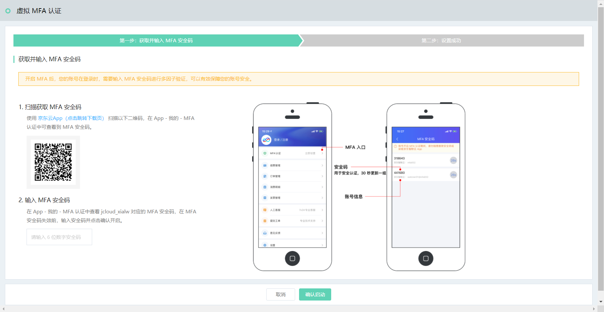
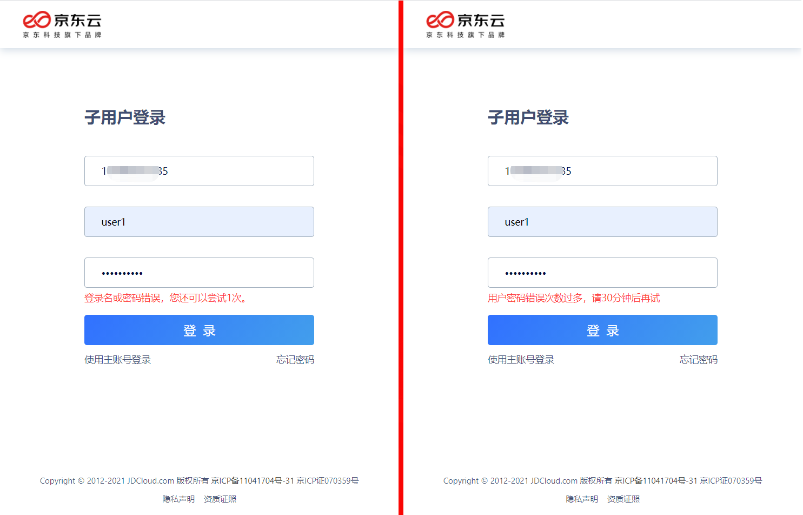

# 子用户访问控制台

子用户登录访问控制台时，需要指定主账号的账号 ID、输入子用户名和密码。请和账户管理员[确认账号 ID](https://uc.jdcloud.com/account/basic-info)、子用户名等信息。

## 子用户登录过程中的各种情况应对

子用户在登录过程中，可能出现以下情况：

（1）子用户创建 / 密码重置后首次登录，管理员指定必须重置密码的情况：

出现此情况，需要设置新密码，且新密码应符合密码策略设置的规则。

（2）启用了 MFA 但暂未完成虚拟 MFA 设备绑定的情况：

出现此情况，需要子用户使用[京东云 APP](https://console.jdcloud.com/download) 完成虚拟 MFA 设备绑定。绑定的方式，请参考页面提示完成。

（3）启用了 MFA 并完成了虚拟 MFA 设备绑定的情况：需要进行 MFA 验证

出现此情况，需要使用子用户绑定的京东云 APP 进行 MFA 验证。

a. 如果您是在可信设备（受您信任的设备和浏览器）上访问京东云，可以勾选 7 天免验选项；

b. 您可以选择扫码验证，或者输入安全码验证：

- 扫码验证：打开京东云 APP，直接点击左上角 “扫一扫”，扫描屏幕二维码后确认登录即可；
- 安全码验证：打开京东云 APP，访问 “控制台” 页面（在 APP 左下方），选择 “MFA认证”（在控制台页面 “常用云产品” 的右上方），并在 MFA 安全码页面找到您的子用户账号（每一个安全码下方，都标注了对应的京东云账号）对应的安全码进行填写。

（4）登录密码过期的情况：

出现此情况，需要联系您的账号管理员（通常是主账号），为您重置密码。

（5）输入错误造成子用户登录锁定的情况：

出现此情况，请等待 30 分钟后重试。允许输入错误的次数是由您的管理员[设置](../../../../../documentation/Management/IAM/Operation-manual/User-management/setting-up-credential-policies.md)的。

