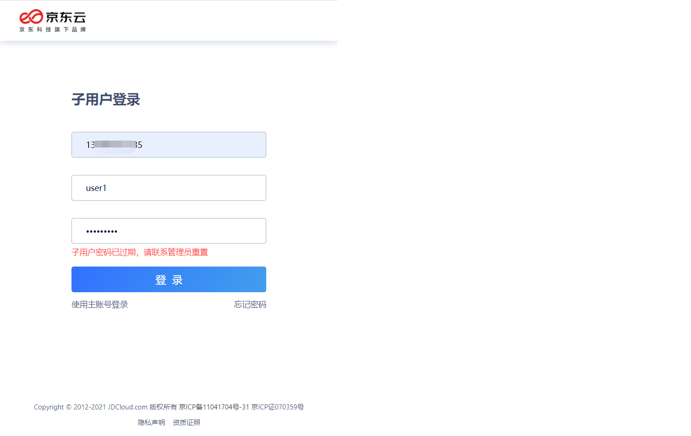
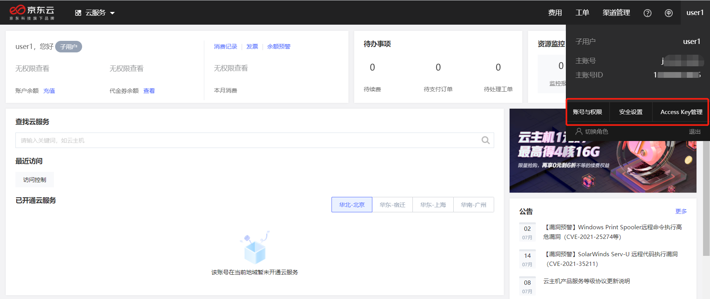
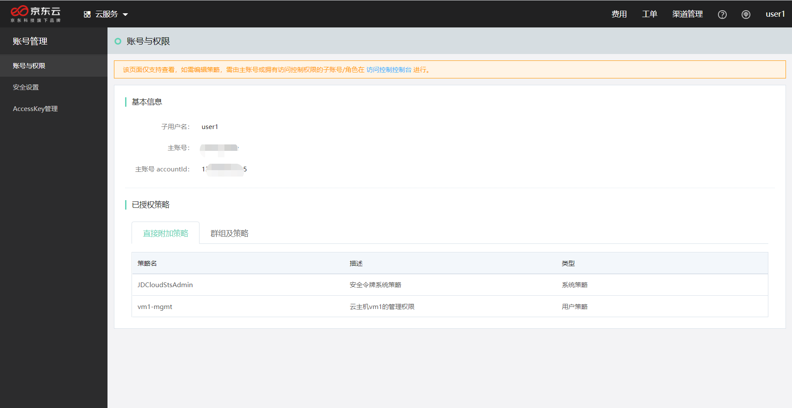
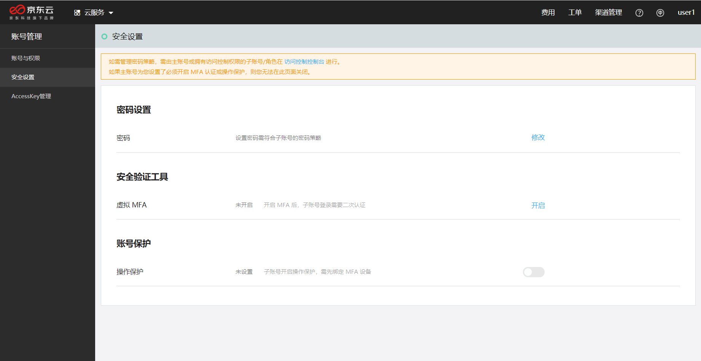
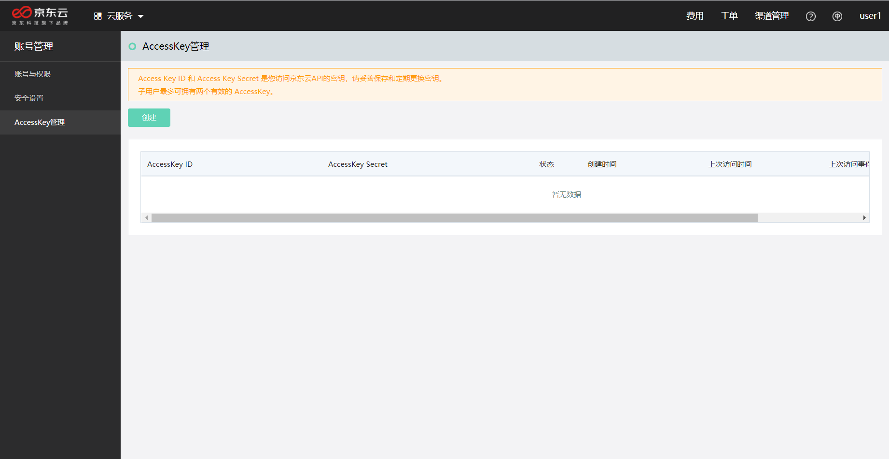
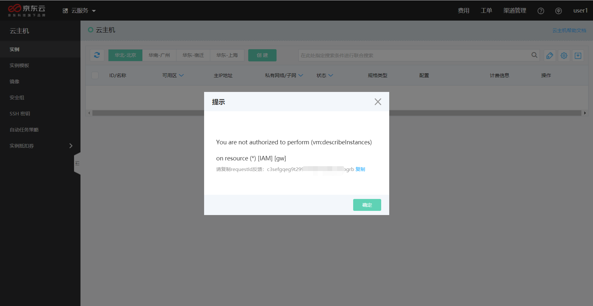
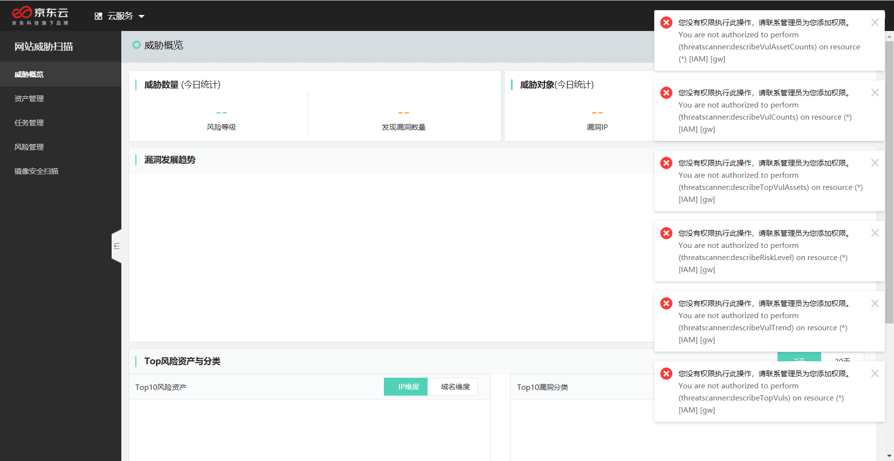
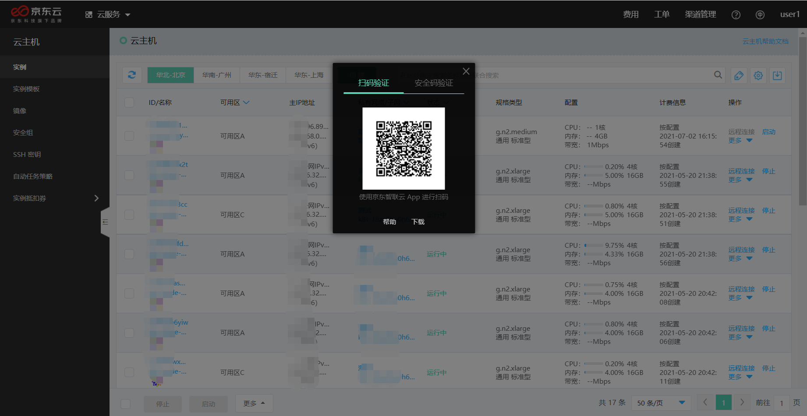

# 子用户访问控制台

子用户可以登录控制台，查看自己的账号与权限信息、管理账号安全凭证及设置，并访问资源。

## 子用户登录

子用户登录访问控制台时，需要指定主账号的账号 ID、输入子用户名和密码。请和账户管理员[确认账号 ID](https://uc.jdcloud.com/account/basic-info)、子用户名等信息。

子用户在登录过程中，可能出现以下情况：

（1）子用户创建 / 密码重置后首次登录，管理员指定必须重置密码的情况：

出现此情况，需要设置新密码，且新密码应符合密码策略设置的规则。

（2）启用了 MFA 但暂未完成虚拟 MFA 设备绑定的情况：

出现此情况，需要子用户使用[京东云 APP](https://console.jdcloud.com/download) 完成虚拟 MFA 设备绑定。绑定的方式，请参考页面提示完成。

（3）启用了 MFA 并完成了虚拟 MFA 设备绑定的情况：需要进行 MFA 验证

出现此情况，需要使用子用户绑定的京东云 APP 进行 MFA 验证。

a. 如果您是在可信设备（受您信任的设备和浏览器）上访问京东云，可以勾选 7 天免验选项；

b. 您可以选择扫码验证，或者输入安全码验证：

- 扫码验证：打开京东云 APP，直接点击左上角 “扫一扫”，扫描屏幕二维码后确认登录即可；
- 安全码验证：打开京东云 APP，访问 “控制台” 页面（在 APP 左下方），选择 “MFA认证”（在控制台页面 “常用云产品” 的右上方），并在 MFA 安全码页面找到您的子用户账号（每一个安全码下方，都标注了对应的京东云账号）对应的安全码进行填写。

（4）登录密码过期的情况：

出现此情况，需要联系您的账号管理员（通常是主账号），为您重置密码。

（5）输入错误造成子用户登录锁定的情况：

出现此情况，请等待 30 分钟后重试。允许输入错误的次数是由您的管理员[设置](../../../../../documentation/Management/IAM/Operation-manual/User-management/setting-up-credential-policies.md)的。

## 账号管理

通过【账号与权限】、【安全设置】或【Access Key管理】，子用户都可以进入账号中心，管理自己的基本账号信息。

### 账号与权限

在此页面，可以查看子用户及所属主账号的基本信息，以及子用户当前的授权情况。子用户所获得的直接授权，和子用户所属群组的授权均可以查看，但不能直接修改。子用户的权限是其直接授权和所属群组授权的合集。

### 安全设置

子用户可以在此页面修改登录密码，修改密码时必须符合管理员指定的密码安全策略。

如果管理员未强制启用 MFA，则子用户可以自行管理是否启用【MFA】和【操作保护】功能。如果管理员已强制启用 MFA，则子用户无法自行关闭该功能。如您需要修改设置，请与您的管理员确认账户的安全规范。

相关操作请参考：[设置子用户的安全凭证](../../../../../documentation/Management/IAM/Operation-manual/User-management/setting-up-credential-policies.md)

### AccessKey管理

子用户可以启用 AccessKey 以访问京东云 OpenAPI。每个子用户可以启用最多两个 AccessKey 以支持秘钥轮换。

相关操作请参考：[子用户编程访问OpenAPI](../../../../../documentation/Management/IAM/Operation-manual/User-management/User-visit-openapi.md)

## 访问资源

### 访问授权

子用户通过控制台访问资源，需要经由管理员授权。如果没有访问权限，则访问页面或执行操作时，将提示：

You are not authorized to perform (**具体未授权的OpenAPI名称**) on resource (**具体未授权的资源ID**) [IAM] [gw]

请与您的管理员确认您是否获得了足够的授权。

无授权导致的错误提示示例1：

无授权导致的错误提示示例2：

### 操作保护

另外，当子用户启用了【操作保护】时（无论是由管理员启用，还是子用户自主启用），对资源进行敏感操作时，即使有操作授权也需要进行多因子认证。请使用绑定虚拟 MFA 设备的京东云 APP 扫码确认是您本人执行操作。

敏感操作请参考：[各产品线支持的敏感操作列表](../../../../../documentation/User-Service/Security-Operation-Protection/Introduction/Support-Services.md)

例如，在启用操作保护的情况下，当具有 JDCloudVirtualMachineAdmin 权限的子用户试图删除一台云主机时，系统需要获得 MFA 认证授权。

