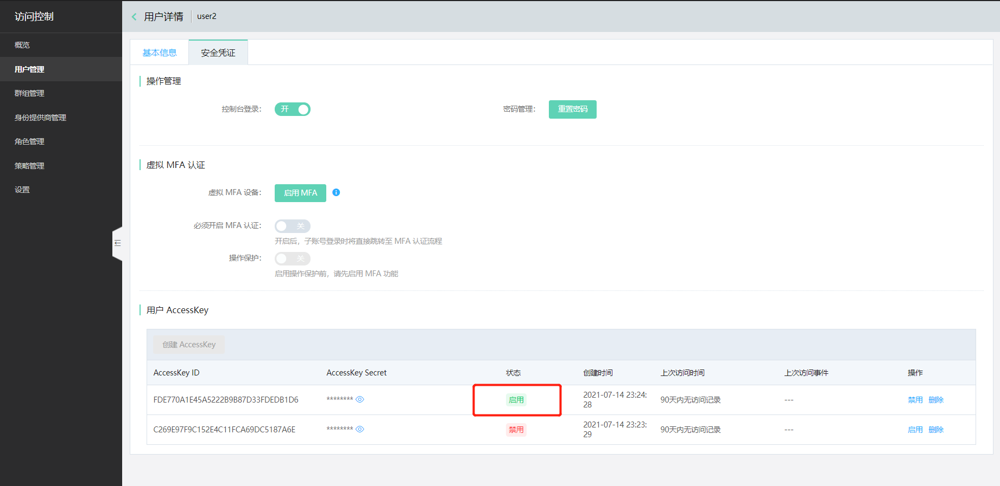

# 子用户编程访问OpenAPI

在有【启用】状态下的 AccessKey 的前提下，子用户可以编程访问京东云 OpenAPI。

## 京东云OpenAPI介绍

京东云 OpenAPI 是将京东云所有资源的管理能力通过API的方式提供出来，以支持用户更灵活地管理云资源。

调用 OpenAPI，需要使用 AccessKey 和 AccessKey Secret 密钥对（简称 AK/SK）。AK/SK 等同于用户名/密码，可以使 OpenAPI 网关识别调用方的身份。

如何调用京东云 OpenAPI，请参考：[OpenAPI & SDK 调用方法](https://docs.jdcloud.com/cn/common-declaration/api/introduction)

## 子用户调用OpenAPI的限制

### 权限限制

使用子用户的 AK/SK 调用 OpenAPI，等同于子用户直接访问资源，所有操作都受到子用户的授权限制，与子用户在控制台访问的权限一致。

对于子用户无权访问的操作或资源，调用 OpenAPI 将返回 403 HTTP_FORBIDDEN 没有权限。

调用 OpenAPI 的其他错误情况，请参考：[OpenAPI & SDK 常见错误](https://docs.jdcloud.com/cn/common-declaration/api/error-codes)

### MFA限制

如果子用户开启了【操作保护】，则需要在调用敏感操作接口时进行多因子身份验证（MFA 验证）。方法是在传参时代入 x-jdcloud-security-token 头参数。

OpenAPI 公共请求头说明，请参考：[OpenAPI & SDK 调用方法](https://docs.jdcloud.com/cn/common-declaration/api/introduction) 以及各语言 SDK 的调用详情。

