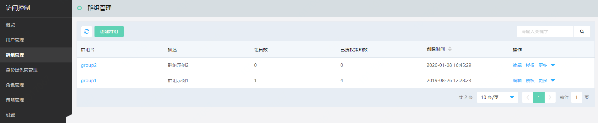
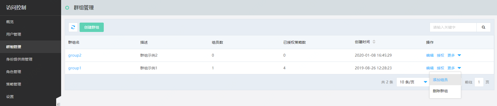
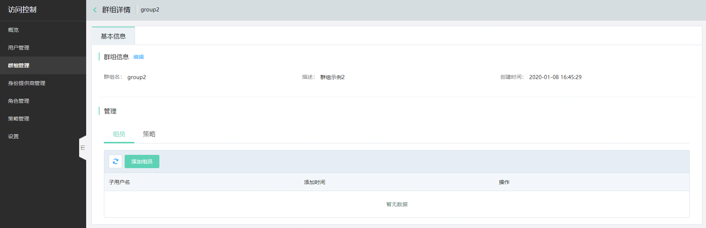
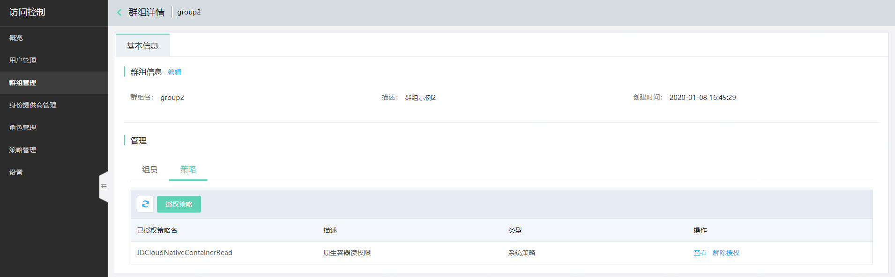

# 群组管理

本页介绍 IAM 群组概念、如何创建和管理群组以及如何为群组授权策略。

- 创建群组
- 编辑群组
- 删除群组
- 为群组添加/移除子用户
- 为群组授权/解除授权

## 群组的概念

群组即子用户组，是一组子用户的集合。利用群组，主账号可以批量管理多个权限相同的子用户，也可以通过将子用户加入或移出群组，来变更子用户的权限。
子用户实际拥有的权限是其自身绑定的策略和所在群组绑定的策略所定义的权限的合集。

## 创建群组

登录京东云控制台，进入访问控制 > 群组管理，点击“创建群组”，在创建群组窗口定义群组名与描述信息。同一个主账号下的群组名称不可重复。

## 编辑群组

访问群组列表，点击“编辑”，可快捷编辑群组的描述信息；在群组详情页也可以对群组描述进行编辑。

## 删除群组

访问群组列表，在选项“更多”里点击“删除群组”，即可删除群组。群组删除后，群组原先所绑定的策略也自动解除。群组内的子用户不再拥有群组的策略权限。

## 为群组添加子用户

访问群组列表，在选项“更多”里点击“添加组员”，可为群组添加子用户；也可以在群组详情页里为群组添加子用户。

## 为群组移除子用户

点击群组名称，进入群组详情页面，选定对应子用户后，点击【移除】即可把子用户移除群组。

## 为群组授权

访问群组列表，点击【授权】按钮，可快捷的授予群组相应的策略。

## 为群组解除授权

点击群组名称，进入相应的群组详情页面；选定对应策略后，点击“解除”即可为群组解绑策略。
