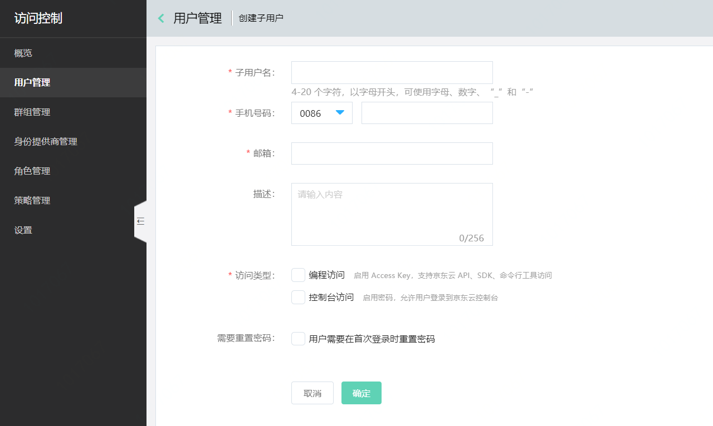
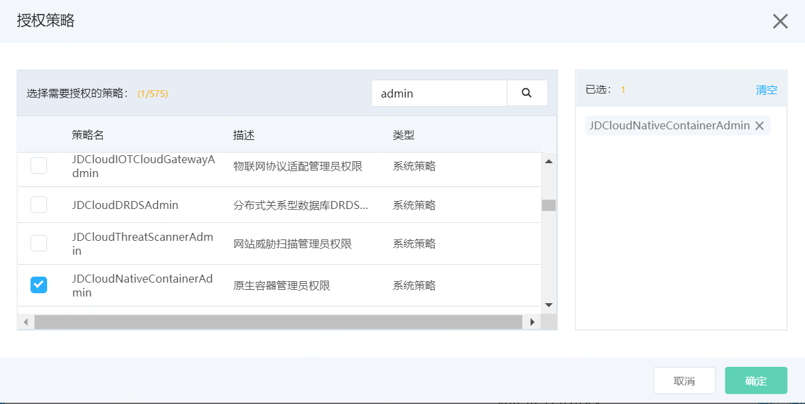
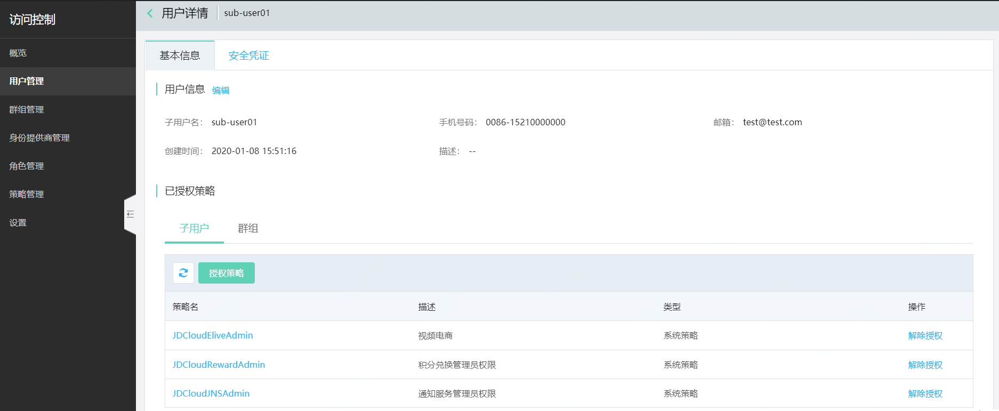
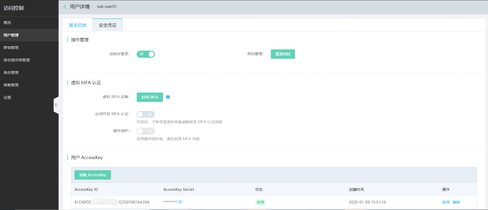

# 子用户管理

本页介绍子用户的概念、如何创建子用户，以及如何为子用户授权。

- 创建子用户
- 编辑子用户
- 删除子用户
- 为子用户授权
- 为子用户解除授权
- 设置子用户安全凭证

## 子用户的概念

子用户是只在主账号空间下可见的实体身份，有确定的用户名、密码和 AK/SK。

子用户不是独立的京东云账号，它由主账号创建，也只在主账号的空间下可见。子用户必须得到主账号的授权，才能登录控制台或使用 OpenAPI 操作主账号授权的资源。子用户没有独立的计量计费，其对资源的使用费用将统一计入主账号的账单。

## 创建子用户

主账号登录京东云控制台，进入访问控制 > 用户管理，点击“创建子用户”。在子用户创建页面定义子用户信息和访问限制等；子账号创建成功后，可以在弹窗内下载子用户的密码和 AKSK 信息。

## 编辑子用户

访问子用户列表，点击“编辑”，可快捷编辑子用户的联系电话、邮箱和描述信息；在子用户详情页的基本信息分页，也可以编辑子用户的联系电话、邮箱和描述信息。

## 删除子用户

访问子用户列表，点击“删除”，即可删除子用户。

## 为子用户授权

访问子用户列表，点击“授权”，可快捷地为子用户授予相应的策略；也可以在子用户详情页的已授权策略模块为子用户授权策略。最多可同时为一个子用户直接附加十条策略。

## 为子用户解除授权

点击子用户名称，进入子用户详情；在已授权策略列表可点击“解除授权”来为子用户解除策略。

## 子用户安全凭证设置

子用户安全凭证管理页面可以：

- 为子用户重置密码
- 为子用户开启MFA
- 要求子用户必须开启MFA，而不是直接帮子用户完成MFA的绑定。子用户将在下次登录时，跳转到MFA的绑定页面，绑定成功后才能进入控制台
- 为子用户开启操作保护，当子用户的虚拟MFA启用后，主账号可以为子用户开启操作保护。这样子用户在操作主账号授予的敏感操作时将需要进行虚拟MFA验证
- 为子用户管理 AKSK

 

