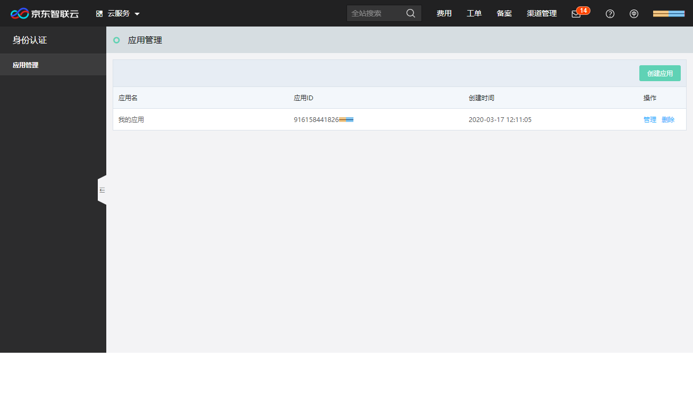
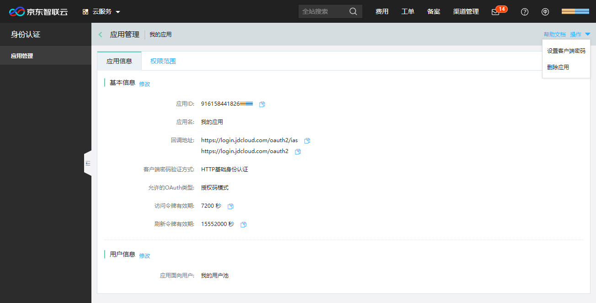

# 创建和管理应用

应用开发者使用京东智联云的身份服务，如用户池托管或京东智联云账号联合登录，首先需要创建应用。

## 创建应用
支持创建20个应用。点击 “创建应用”，注册应用信息，完成后可以查看应用ID（client_id）：

| 应用信息 | 填写说明 |
|---------|---------|
| 应用名 | 应用名称，长度不超过255个字符 |
| 客户端密码验证方式 | 1) HTTP基础身份验证：client_id和client_secret必须通过header base64编码传输；2) 通过请求参数验证：client_id和client_secret必须通过POST参数传输；3) 不验证客户端密码：client_id必须通过POST参数传输 |
| 客户端密码 | 8-20位任意字符，请尽量设置随机长密码，并在设置后牢记该密码。密码不支持找回，如果忘记该密码，需要重新设置 |
| 回调地址 | 应用处理用户认证信息的完整URI地址，URI地址中不支持#符号，每个地址最大长度为999。支持设置最多四个回调地址，如需设置多个请进行添加 |
| 允许的OAuth类型 | 1) 授权码模式：需要通过用户授权码code换取用户身份令牌token；2) 隐式授权模式：如果纯浏览器或纯客户端应用没有后端服务可以处理授权码，则可以使用隐式授权模式直接请求用户令牌token |
| 访问令牌有效期 | 默认为60分钟，可根据应用的需要设置，支持10分钟至6小时 |
| 刷新令牌有效期 | 访问令牌到期后，如果需要获取新的访问令牌，又不希望用户重新登录授权，请设置刷新令牌并在访问令牌到期前将访问令牌刷新。支持设置30天到365天 |
| 应用面向用户 | 应用的用户来源，1) 我的子用户：允许当前京东智联云租户下的所有IAM子用户登录访问；2) 我的用户池：允许当前京东智联云租户下，与该应用关联的用户池内的用户登录访问；3) 其他京东智联云租户：允许京东智联云的其他租户主账号登录访问 |

## 管理应用
在应用列表中，可以查看应用ID（client_id）。点击应用对应的 “管理” 操作，查看应用信息，可以进行修改、设置客户端密码和删除应用等操作。

目前京东智联云支持的授权范围（scope）仅为openid，如果需要，开发者可以进行添加，并在后续OAuth2.0服务对接中增加scope请求。
