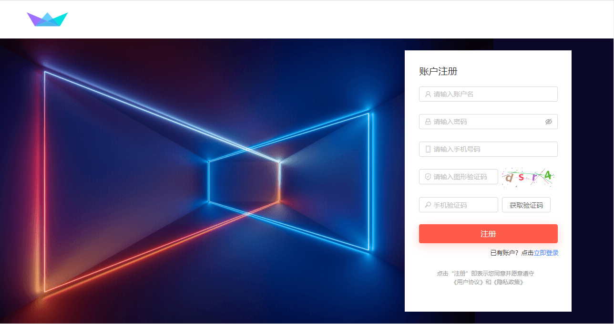
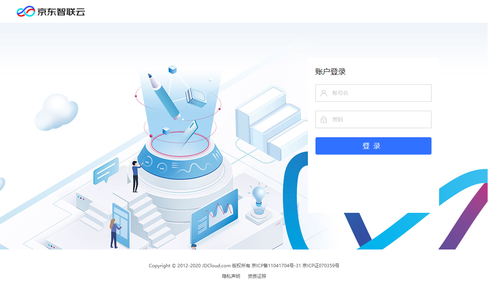
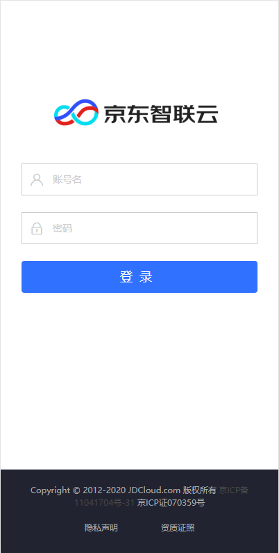
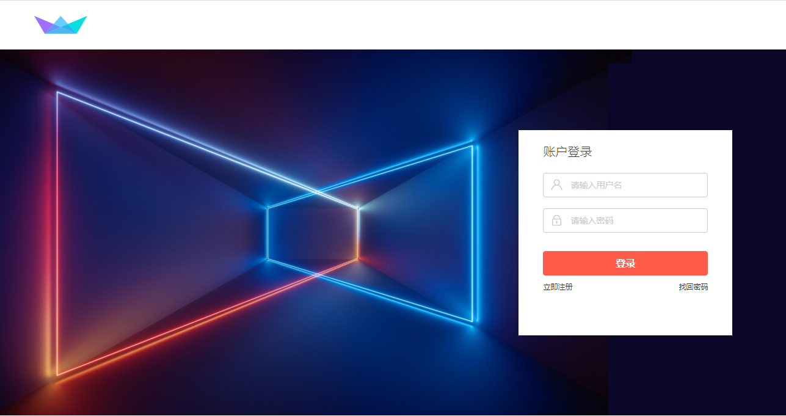
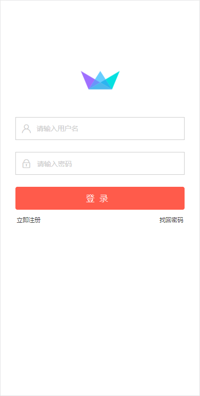
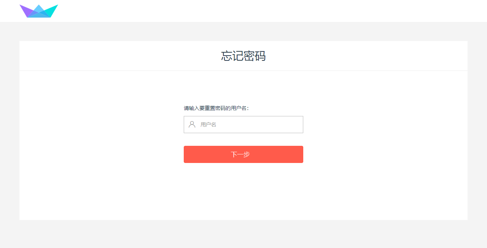

# 自定义页面样式

本文将说明如何定制注册、登录、忘记密码页面样式。

## 注册

开发者通过调用adminCreateUser创建用户接口，自定义注册流程和开发注册页面。下图为一个示例。

## 登录

如果不进行任何配置，默认登录页样式如下图。

手机端自适应页面样式：

开发者可以通过工单提交下述信息，替换登录页面元素。提交后将于3-5个工作日进行处理。
1. 池UID
2. 应用ID
3. 应用Logo：.png或.jpg图片，height=32px, size<10K
2. 登录页底图：.png或.jpg图片，height=600px, size<1M
3. 登录按钮色值: #FFFFFF格式
4. 输入框内提示文案：如“请输入用户名或手机”，“请输入密码”
5. 注册页面URL：如果登录页上需要放出立即注册入口，请提供注册页面URL

替换参考效果：

手机端自适应页面样式：

## 忘记密码

根据登录页提交的应用Logo，按钮色值和输入框文案，忘记密码页面样式如下图所示。

