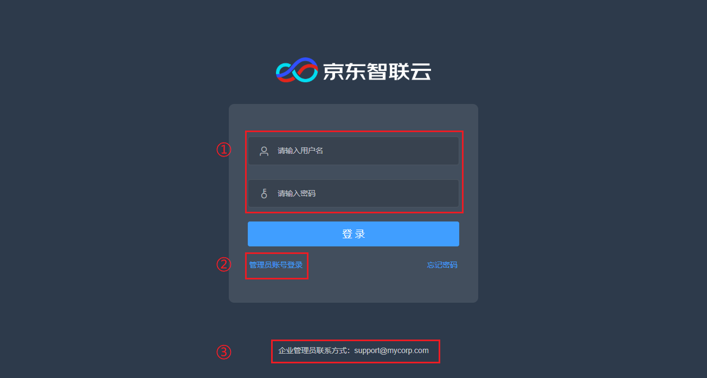

# 开通和使用身份通

## 开通身份通账户

访问身份通控制台（入口在京东智联云控制台菜单 “管理 - 身份通”），点击 “立即开通” 按钮即可开通身份通账户。开通后，页面将跳转至身份通企业门户URL。

## 使用企业门户

身份通企业门户独立于京东智联云控制台。在 “企业设置” 页面，可以查看企业门户URL。每个企业都有独立的门户URL，请将这个地址分享给你的用户。

当用户访问企业门户URL时，将进入企业登录页。
* ① 是身份通用户账号的登录区域，企业用户需要使用管理员在身份通创建的用户账号登录访问企业应用
* ② 是管理员登录入口，身份通管理员使用京东智联云账号进行访问
* ③ 是管理员设置的企业联系信息，用户登录时可以依赖此信息获得管理员的技术支持

## 使用身份通接口

身份通的部分功能以公网接口方式提供，如需使用这些功能，请参考相关文档。
