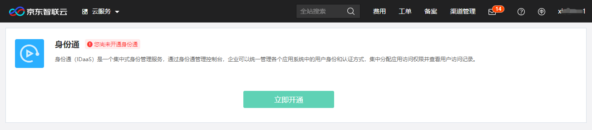
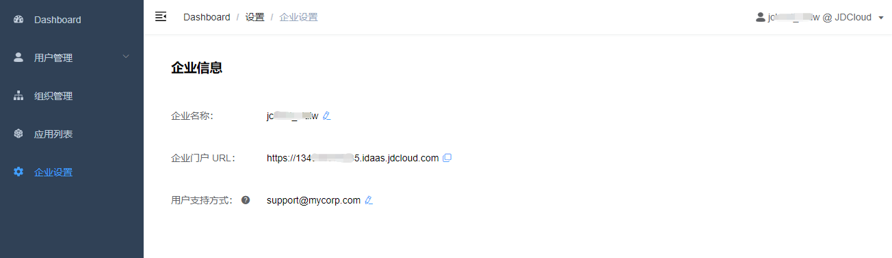
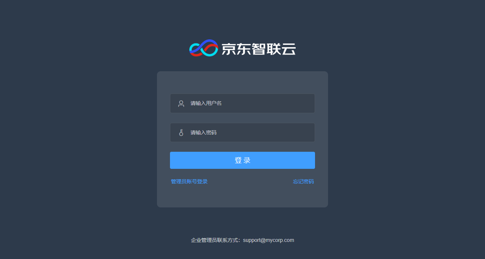

# 开通和使用身份通

## 开通身份通账户

访问身份通控制台（入口在京东智联云控制台菜单 “管理 - 身份通”），点击 “立即开通” 按钮即可开通身份通账户。开通后，页面将跳转至身份通企业门户URL。

## 使用企业门户

身份通企业门户独立于京东智联云控制台。在 “企业设置” 页面，可以查看企业门户URL。每个企业都有独立的门户URL，请将这个地址分享给你的用户。

每个企业门户也有独立的登录页面。

### 管理员登录门户

管理员有两种登录门户的方式：
* 通过京东智联云控制台 “管理 - 身份通” 菜单进入身份通企业门户
* 访问企业门户URL，进入企业门户登录页，选择 “管理员账号登录”

管理员登录后，将进入企业门户管理视图。

### 用户登录门户

用户账号由管理员创建。用户可以访问企业门户URL，输入身份通账号密码进行登录。如果用户在登录过程中遇到问题，可以从登录页面下方由管理员设置的 “企业联系方式” 获取支持。

用户登录后，将进入我的应用视图。“我的应用” 中是用户已获得授权的应用列表。如果用户没有获得应用授权，则没有应用显示。

