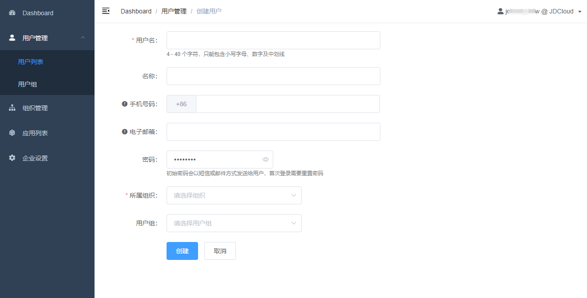
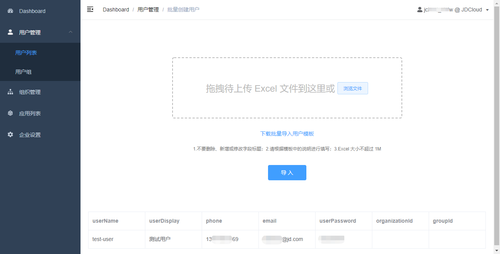

# 管理用户

管理员可以对身份通用户、用户组或组织架构进行管理。

## 用户

用户是一个身份通账号，该账号独立于京东智联云账号。身份通支持直接创建或批量导入用户。

直接创建用户时，手机号和邮箱需要填写至少一项，表单中随机生成的用户密码支持修改，同时需要为用户指定归属的组织单元。

批量导入用户模板中，必须填写用户名以及手机号和邮箱中至少一项。如果不填写密码，系统将为用户随机生成密码。组织单元ID为选填项，如果不填，默认将用户归属为组织根节点。用户组ID为选填项，如果不填，用户不属于任何用户组。组织单元ID和用户组ID，可以在组织管理和用户组管理页面查看。模板导入后，可以在页面查看导入信息，确认后即可点击 “导入” 按钮开始导入。

## 用户组

管理员可以创建任意多个组，用户和组之间的关系为多对多，即用户可以不属于任何组，也可以属于多个组。向一个用户组授权应用后，组内的每一个用户都将继承该授权。

## 组织架构

组织架构是一个树状结构，树上的每一个节点是一个组织单元。用户必须属于且仅属于一个组织单元，如果不进行指定，用户默认归属于企业组织架构的根节点。组织单元的根节点名称即 “企业名称”，可以在 “企业设置” 页面修改。

将鼠标移入组织架构，可以新建或删除组织单元。身份通支持创建最多三级组织架构。当有下级组织单元时，不允许删除作为父节点的组织单元。当没有下级组织单元时，删除组织单元后，组织内的所有用户将被自动移入其上级组织单元，即删除 “子部门” 后，“子部门” 的用户将自动移入 “部门”。

向一个组织单元授权应用后，授权仅对当前组织单元内的用户生效，每一个该组织单元内的用户都将继承该授权，但下级组织单元内的用户不会获得该授权。

在组织单元间，可以移动用户。当在一个组织单元 “添加成员” 后，被添加的成员将从原归属组织单元移动到新的组织单元，移动后用户从原组织单元继承的应用授权也将失效，并自动获得新的组织单元所授权的应用访问权限。

