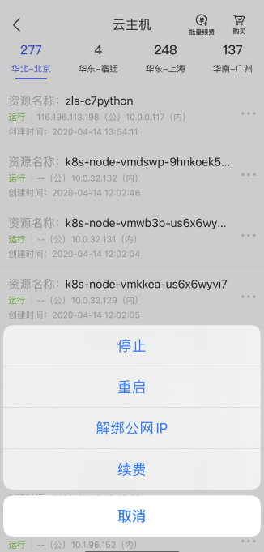
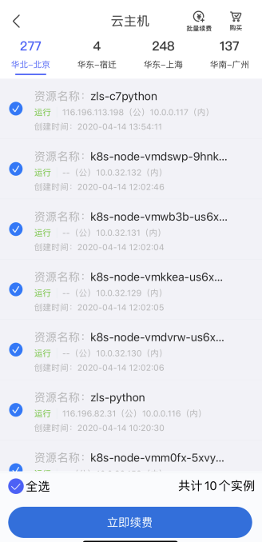
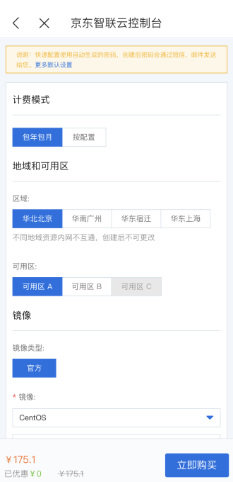
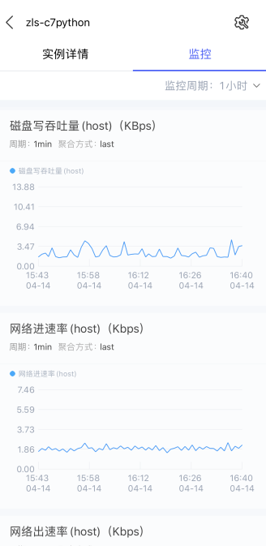

# 资源管理
当前支持操作的产品包括云主机、云硬盘、弹性公网IP、云数据库RDS、原生容器、云数据库MongoDB、分布式关系型数据库DRDS、物联网卡、云托管，更多产品线仍在不断接入中，敬请期待！
## 资源操作
每个云产品中支持的操作不一样，但基本操作都包括：启动、停止、重启，而产品线的特定操作，如云硬盘支持卸载、弹性公网IP支持绑定云主机等。

## 资源续费
云产品支持从资源侧进行批量续费和单一续费，也支持从续费管理进行续费。

## 资源购买
当前支持云主机的购买，其他云产品的购买还在陆续接入中，敬请期待。

## 资源监控
资源详情页支持查看其资源监控状态，包括基本的内存使用率、CPU使用率、磁盘吞吐量等多维指标。

