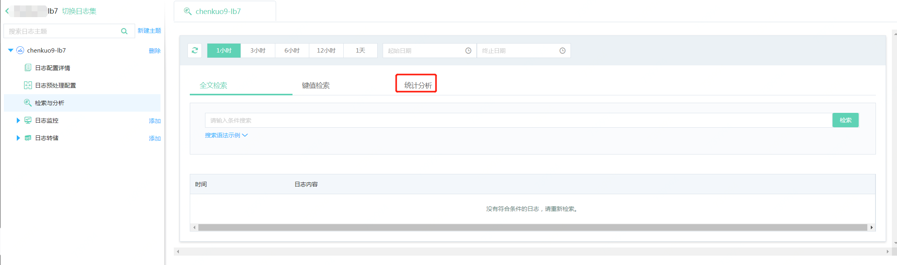
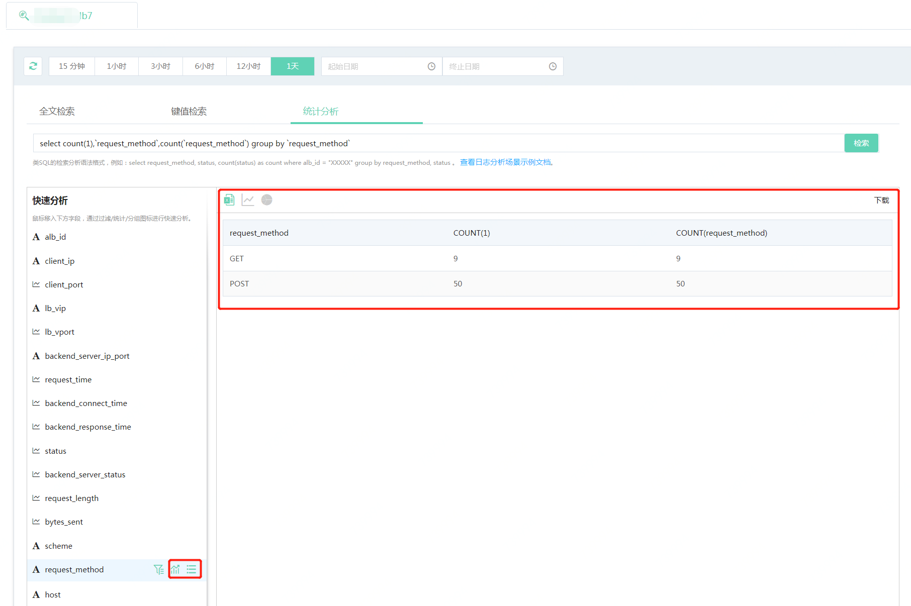
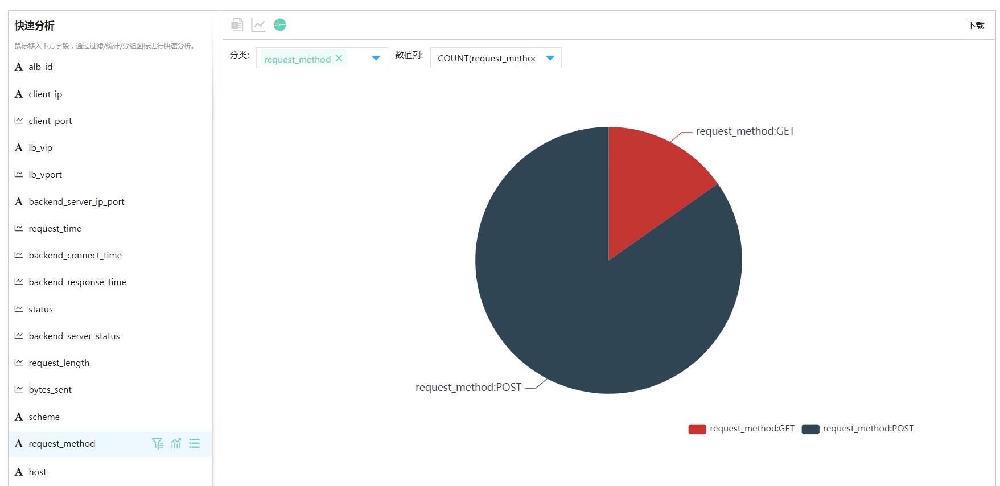
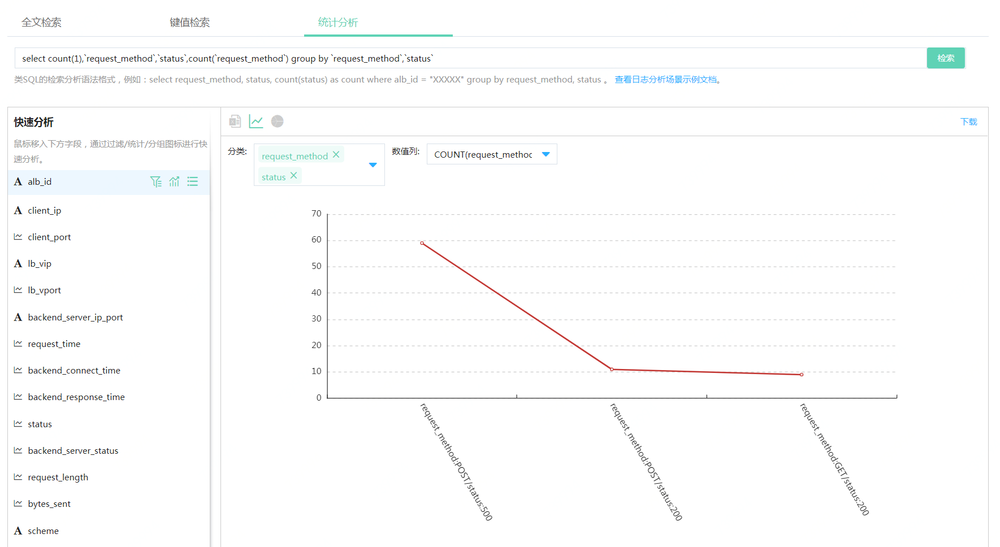

# 统计分析  
统计分析功能可以从大量日志中筛选出满足条件的日志，进行统计计数或对数字类型字段求和、求平均值等，同时提供表格、折线图、饼图3种展现形式，可以帮助用户快速查看分析结果。（注意：只有结构化结构化的日志才支持统计分析操作，针对自定义业务日志需要先进行日志预处理操作。）
## 应用场景
**场景一：分析请求分布情况**

以应用负载均衡7层访问日志中，将日志按照request_method分组，统计各个请求方法出现的次数。

```
select request_method,count(1) group by request_method
```

展示结果如下，在选定的时间内，POST方法有50条日志，GET方法有9条日志。

| request_method | COUNT(1) |
| -------------- | -------- |
| POST           | 50       |
| GET            | 9        |


**场景二：获取耗时较长时间的SQL执行语句句** 

在mysql的慢日志中，按照clienthost字段分组，统计query_time 大于1s 发生的次数。

```
select clienthost,count(1) where query_time > 1 group by clienthost
```

展示结果如下，在选定的时间内，192.168.0.29超过1秒的次数有16次，192.168.0.28超过1s的次数有4次。

| clienthost   | COUNT(1) |
| ------------ | -------- |
| 192.168.0.29 | 16       |
| 192.168.0.28 | 4        |

## 统计分析语法
聚合统计的查询语法支持基本的SQL语法，说明如下：

1. 只支持 select 语句，不支持update,insert,delete 等语句。select 语句包含{selectExpr}，{whereExpr}，{fileds}三个部分，语句整体结构如下，不需指定 from 字段，服务会默认添加日志主题所属的日志类型。

   ```
   select {selectExpr} where {whereExpr} goup by {fileds} 
   ```

2. 在 {selectExpr} 中至少需要包含 max,min,avg,sum,count 中的一种或多种聚合函数。例如：

   ```
   select count(1),max(score) group by username                    //正确
   
   select city group by city										//错误，未包含聚合函数
   ```

3. 在 {whereExpr} 中只支持 and 和 between 关键字，不支持or,is,not 等其他关键字。

   ```
   select count(1) where city= 'bj' and age = 18					//正确
   
   select count(1) where city= 'bj' or age = 18					//错误，不支持or关键字	 
   ```

4. 支持 >,>=,<,<=,=,!=,in 等比较运算符。字符值两端需要加单引号，且只有数值类型支持>,>=,<,<= 运算符。

   ```
   select count(1),max(score) where age > 5 and city = 'bj' group by username
   ```

5. 支持分组 group by，但是在{selectExpr} 中出现的非聚合字段需要在group by 后。例如下面语法是错误的，因为 feild 字段没有出现在group by 后。

   ```
   select feild,count(1) group by pin
   ```

6. 不支持order by 字段，也就是说统计结果不会按照某个字段排序。

7. 支持limit, 最多只能返回100条统计结果。

8. 不支持子查询。

9. 需要补充说明的是，在自动生成的语句中每个字段都会用反引号`` ,这是防止查询语句中的某些字段是SQL的关键字。用户在手动数据字段时候，需注意适当加上反引号。

## 快速分析
用户可以直接输入检索分析语法直接进行检索。同时我们提供快速分析功能， 自动填充检索分析语句，方便对SQL操作不熟悉的用户快速上手。在快速分析的字段栏，提供了过滤、统计和分组三个快捷图标，相关含义及功能如下：  
- 过滤：对该字段的值进行过滤，点击之后会自动填充到检索分析语句栏，统计分析时会根据过滤条件配置的日志进行进行筛选。  
- 统计：内置一些快捷统计分析方法，点击之后自动填充到统计分析栏。针对数字和非数字类型提供统计方式如下：  

| 类型           |支持统计方式 |
| -------------- | -------- |
| 数字（int/ integer、double、Float）| 计数、最大值、最小值、平均值和求和|
| 非数字（string、IP、time/datetime）| 计数  |

- 分组：统计结果按照value值进行分组，点击该图表之后，检索栏会将在GROUP BY后填充该字段，执行检索操作后，表格中会按照不同的value值分行展示统计结果。  
### 操作指南
以负载均衡7层访问日志为例，分析不同请求方法出现的次数。  

#### 前提条件 
1. 已经创建了【日志来源：云产品】-【所属产品：应用负载均衡】-【日志类型：7层访问日志】的日志主题。
2. 采集实例配置的应用负载均衡实例有访问信息。  

#### 操作步骤
1.	访问[日志服务控制台](https://logs-console.jdcloud.com/overview)，进入日志集列表。
2.	选择已创建好的日志主题所在的日志集，点击日志集名称或操作栏下的查看按钮，进入日志集详情页面。
 
3. 在统计分析页面，快速分析栏找到【request_method】字段，移入右侧的统计图标，点击【计数】选项，同时点击将该字段添加为GROUP BY。
4. 执行该操作后可以看到快速生成分析语句已在搜索栏中进行填充。选中查询时间段点击“检索”按钮，可以看到统计分析结果。
 
5. 默认展示为表格信息，点击饼图。默认会将表格第1列作为分类，最后1列作为数值列。如果统计结果有多列数据时，可以根据需要调整分类列和数值列。操作示例可以看到该快速分析展示的饼图示例如下：
  
6. 选中“Status”字段，点击将该字段添加为GROUP BY图标。 切换到表格列，可以查看到不同请求方法及返回码状态。
 
7. 切换至“折线图”图标。默认会将表格第1列作为分类，最后1列作为数值列。点开分类栏增加status列，查看到的折线视图如下：  
  


