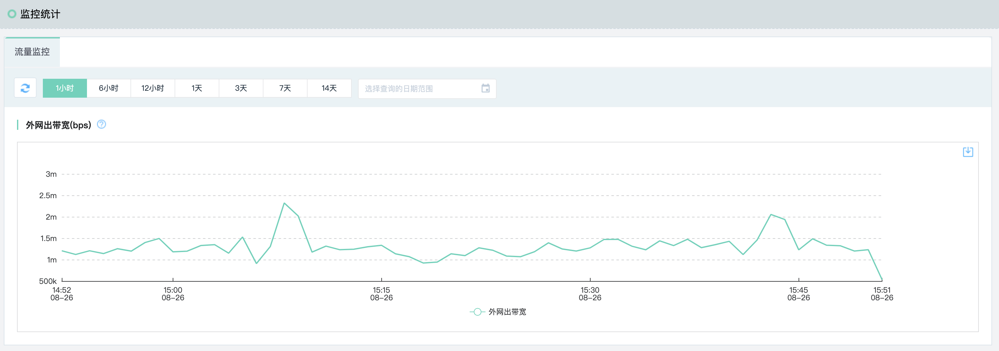

# 监控统计

目前云监控的主要功能是对线上云资源的实时监控。而对于某些云资源的特定监控项而言，统计值的监控比实时监控更具有实用性。因此监控统计是为了便于用户对名下所有某类资源的特定监控项进行监控。

## 流量监控

流量监控是针对用户名下全部地域的IP地址的“公网出速率”进行汇总求和统计。用户可以根据需求选择对应的时间段查看数据，并可下载导出对应时间段的统计数据。

### 操作步骤

1. 登录[云监控控制台](https://cms-console.jdcloud.com/overview)，点击左侧菜单目录【监控统计】，进入监控统计页面，当前仅支持公网出流量进行监控。

    

2. 点击顶部的时间切换按钮，可以查看近6小时，近1天、近7天的统计数据，自定义时间最多可查询近30天的监控数据，输入移入视图区域，可以查看到某一时刻的指标数据。

3. 点击监控图顶部的下载按钮，支持将查询的监控数据进行导出。

