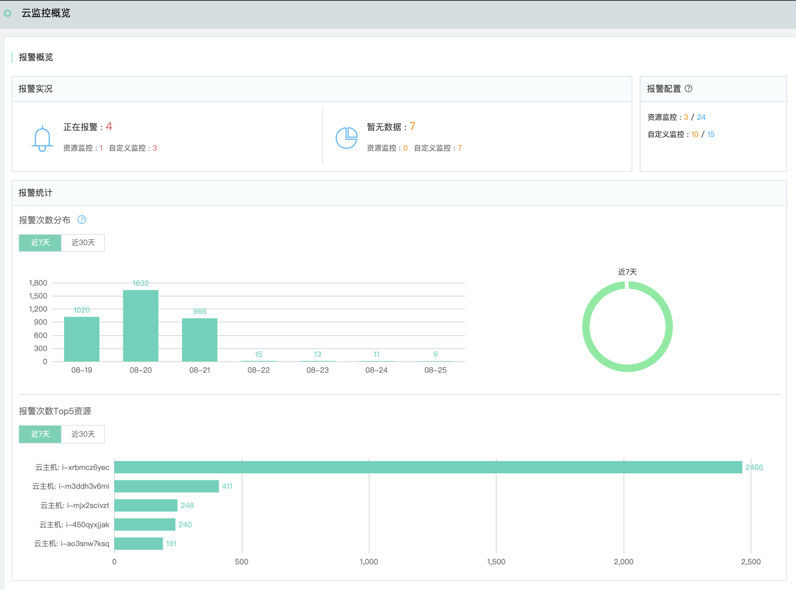
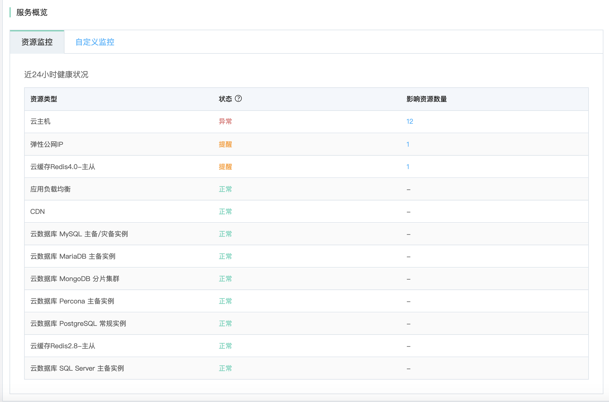

# 概览

云监控概览提供了报警实况、近7天、近30天的报警统计及服务健康状况信息。

## 报警概览

- 报警实况：主要针对正在报警的规则和无数据的报警规则进行统计。
- 报警次数分布：统计近7天或30天的报警次数，支持按照资源进行分布统计。柱状图支持下钻分析某天的报警分布。
- 报警次数Top5资源： 统计近7天或30天报警最多的资源，便于了解异常问题资源。

## 服务概览

统计云资源或自定义监控资源近24小时的健康状况。提供以下状态：

- 异常：报警已发生，尚未恢复。
- 提醒：表示近24小时发生过报警，但已恢复。
- 正常： 近24小时未产生过报警。

针对资源监控可以查看到云产品的健康状况，对于异常和提醒状态的云产品，支持查看受影响的云资源。

针对自定义监控，可以查看命名空间的健康状况，若状态异常支持查看异常监控指标及监控对象。

