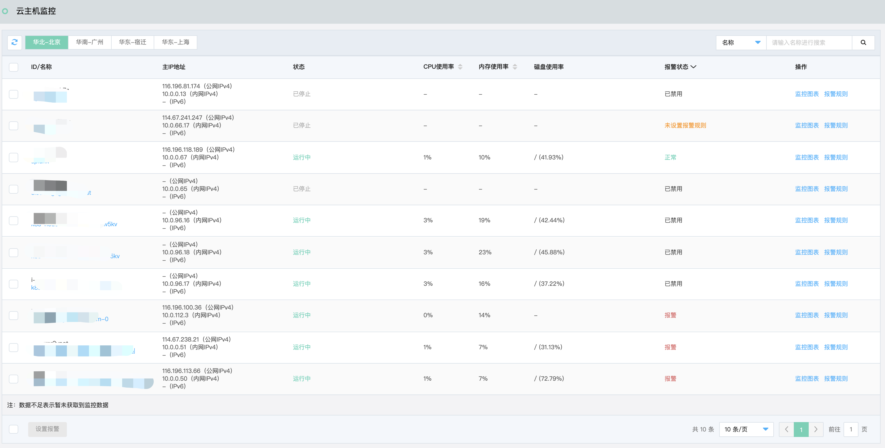
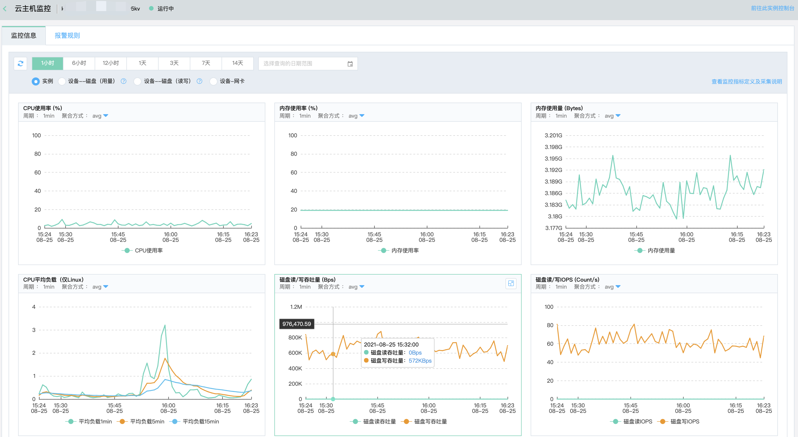
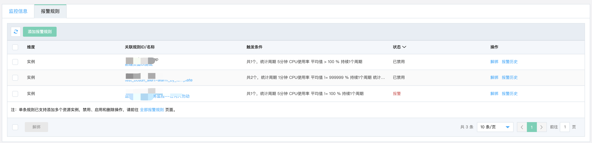
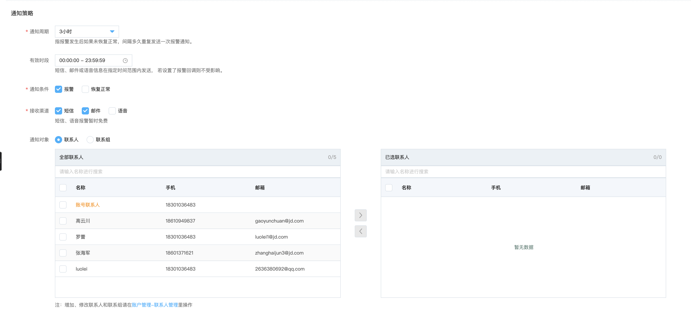

# 云资源监控

## 功能介绍

云资源监控是对您开通或者购买的各云资源服务性能指标集中展示。您可以在云监控控制台查看账号下的云资源列表，针对这些云资源支持监控图查询及报警配置等操作。

## 操作步骤

1. 登录[云监控控制台](https://cms-console.jdcloud.com/overview)。

2. 在左侧的导航菜单中，选择【资源监控】及查看的云资源类型，例如【云主机】。进入到云资源列表，可以查看到已购买或者创建的云资源。

   

3. 找到您需要查看监控的资源，点击名称或操作列下的监控图表按钮，进入监控页面。

   
4. 在上图中，点击【报警规则】，切换至报警规则列表页面。

   

5. 点击【添加报警规则】按钮，打开报警规则页面，配置如下信息：

   - 规则名称：自定义报警描述信息，方便识别报警。
   - 触发条件：配置监控指标、监控周期、统计方式、报警阈值等信息。
   - 通知对象：选择发生报警时，通知给谁，可以指定某个联系人，也可以选择某个联系组。

   

   

