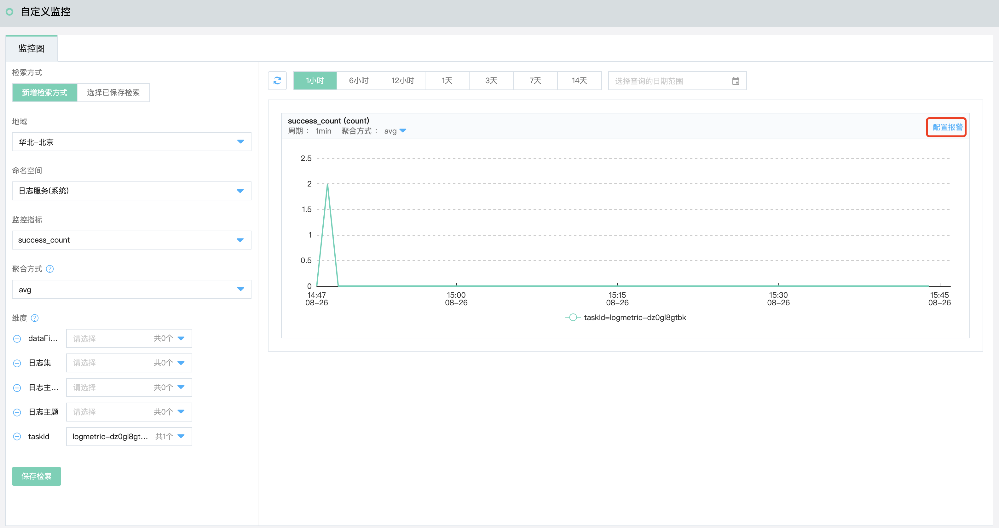

## 使用自定义监控
自定义监控是提供给用户自由定义监控项及报警规则的一项功能。通过此功能，用户可以针对自己关心的业务指标进行监控，将采集到监控数据上报至云监控，由云监控来进行数据的处理，并根据结果进行报警。
### 上报监控数据
自定义监控功能为您提供上报监控数据的接口，方便您将自己采集的时序数据上报到云监控。目前支持OpenAPI的方式进行上报，可上报原始数据和已聚合的统计数据。
点击查看如何[上报监控数据](http://docs.jdcloud.com/cn/monitoring/reporting-monitoring-data)。

### 查看监控图  
1.登录[云监控控制台](https://cms-console.jdcloud.com/overview)，点击左侧菜单目录【自定义监控】，进入监控图查询页面。    
  

2.根据需求配置地域、命名空间、监控指标、聚合方式、 指标维度的信息。各个字段的含义可查看[查看监控图](https://docs.jdcloud.com/cn/monitoring/chart-view)。

3.指定查询条件后，可在右侧查看该指标的监控数据。可以切换不同的时间查看其趋势图信息，同时可以更改聚合方式。  

### 配置报警

1.在上边步骤中查询的出的监控图中，点击“配置报警”按钮，打开“添加报警规则”页面。  

2.根据需求，配置如下信息：  
- 设置基本信息， 规则名称、地域、命名空间、监控指标、聚合方式及监控维度，同查询监控图中配置的一致，可根据需要调整。 
- 配置触发触发条件， 统计周期、统计方式、计算方法、报警阈值、持续周期.
- 设置通知策略， 通知周期、有效时段(接受通知的时间段)、通知条件、接受渠道、通知对象信息。

3.点击“确定”按钮，即可完成配置。在报警规则列表可查看到设置的报警规则，一旦该规则配置的监控指标其监控维度到达报警阈值时，则云监控按照设置通知策略进行通知。
