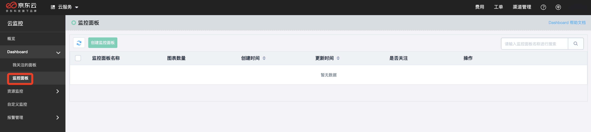
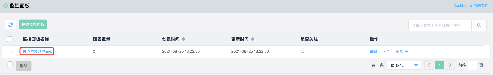
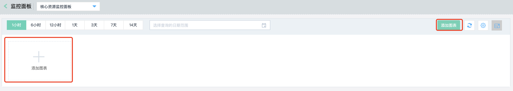
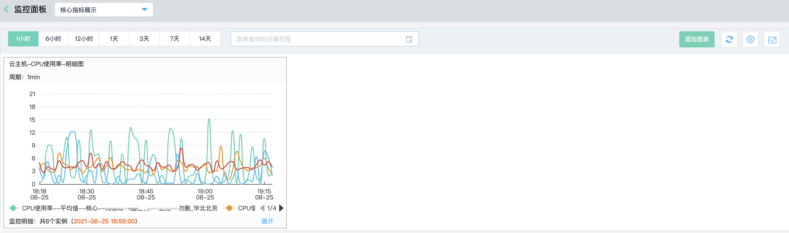

# 使用Dashboard监控面板
## 功能介绍

Dahsbaord提供用户自定义监控数据展示的功能。用户可以将关注的核心服务监控指标集中呈现在一张监控面板里，满足大盘盯屏展示，批量实例汇总展示、故障排障、数据对比分析等场景。

## 操作步骤

1. 登录[云监控控制台](https://cms-console.jdcloud.com/overview)。

2. 切换至【Dashboard】->【监控面板】，进入面板管理页面。

   

### 添加面板

点击【创建监控面板】按钮，在打开的添加监控面板页面，填写监控面板名称，点击“确定”按钮完成建。

### 添加监控图表
1. 在监控面板列表页面，点击名称或操作列下的“管理”按钮，进入监控面板详情页。

   

2. 点击右上角的【添加图表】或下边的添加图标，进入添加监控图表页面。

  

3. 进行图表配置，包括图表类型、视图维度、监控指标等信息，点击【确定】按钮，完成监控图表的创建。

  
### 查看dashboard监控图表
进入监控面板详情页，可查看到当前面板配置的全部监控图概览信息。针对单个监控图表，支持时间筛选、放大、下载等操作，可细粒度查看监控数据。

