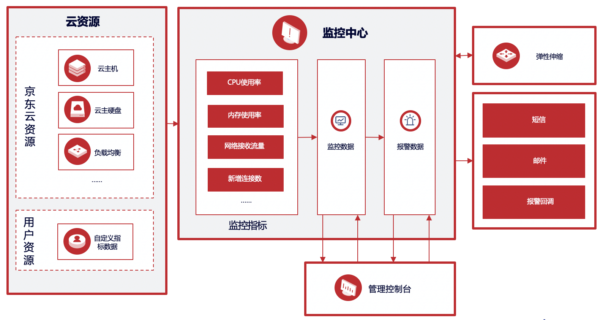

# 云监控概述

云监控（Monitoring）是对用户名下的云资源进行监控和报警的服务，展现各项监控指标情况并对指标设置报警，云监控会通过短信、邮件等方式发送报警通知，还提供当前报警状态和报警历史的查看。通过监控，方便客户了解在京东云上的资源使用情况、性能和运行情况；通过报警，客户可以及时作出反应，保障应用程序的稳定运行。

云监控服务主要包括以下功能服务：

- 云资源监控：云资源监控是对用户名下支持监控的云产品进行各项指标监控，用户可以在各类云资源列表中查看对应资源的监控图表和告警配置信息。
- 自定义监控：提供用户自定义上报监控指标数据的功能，通过此功能，用户可以针对自己关心的业务指标进行监控，将采集到的监控数据上报至云监控，由云监控来进行数据的处理，并根据结果进行报警。目前已经与kubernetes、日志服务打通，支持k8s 自定义指标数据及日志服务提取的监控指标的采集、上报、监控及报警。
- 告警服务：支持对云资源和自定义监控指标配置告警。针对资源监控用户既可以指定已有实例配置告警，也可根据标签进行配置，标签下新增资源之后，无需更改规则自动获取到新增资源；通知策略灵活多样：短信，邮件，报警回调，可以任意指定；同时通知周期、通知时间段均可自定义。
- 监控面板：提供用户自定义监控数据展示的功能。用户可以将关注的核心服务监控指标集中呈现在一张监控面板里，满足大盘盯屏展示，批量实例汇总展示、故障排障、数据对比分析等场景。

