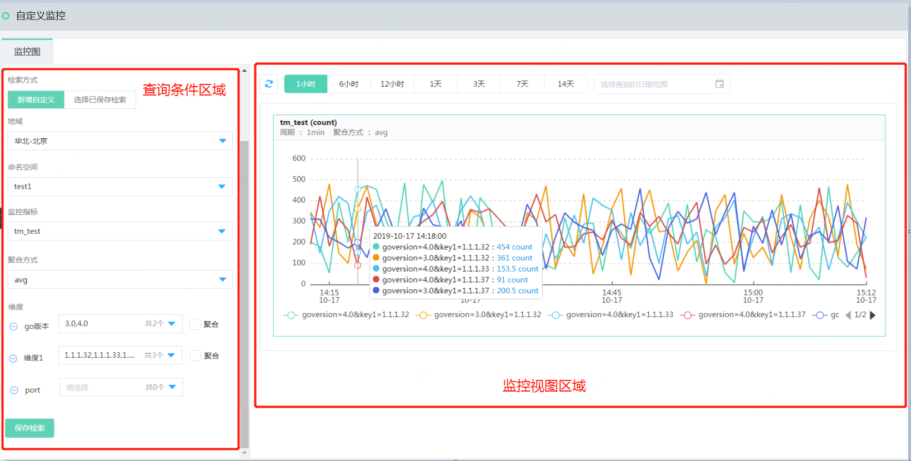

# 查看监控图

 指定维度查询监控数据， 支持查看上报的原始上报的监控数据，也支持查询聚合维度的监控数据。页面布局如下：  
 
   


### 查询条件区域  

**检索方式**  
“新增自定义”，即：用户自定义查询监控指标和维度， “选择已保存检索”，即：基于已保存的检索条件进行查询  
**地域**  
监控指标上报的地域，例如：华北-北京、华东-上海  

**命名空间**   
监控指标上报指定的命名空间。名称中标识（系统）的命名空间，属于产品线委托上报的命名空间。  

```
注意：
1）开启产品线自定义监控数据方法如下：
kubernetes集群(系统)： 需要创建kubernetes集群时，开启了“集群监控”。
日志服务(系统)： 需要在日志主题下创建了监控任务。
2）非系统的命名空间支持左前匹配搜索， 例如：命名空间为 Ns01， 输入N、Ns、Ns0，Ns01， 都可查询出该命名空间； 若输入其他则无法查询出。 
```

**监控指标**  
上报的监控，例如：CPU_Usage， error_count 等等
```
注意：
  上报指标较多时，可以使用搜索过滤功能。 指标名称支持左前匹配搜索， 例如： 指标名称为 Ercount， 输入E、Er、Erc、Erco、Ercou、Ercoun、Ercount， 都可查询出该命名空间； 若输入其他则无法查询出。
```


**聚合方式**   
多个维度聚合成1个维度时，多维度值之间的聚合方式。直观可以理解为多条上报的数据线合并为1条线时，多条线之间合并处理的统计方式，提供： avg、sum、max、min 4 中选项。包含如下两种场景。  
假设上报的了countError 这个监控指标，其上报维度如下：  
①env=sc, modules=management, service=monitor  
②env=yf,modules=management,service=monitor  
③env=cs,service=monitor  
④env=sc, modules=management, service=logs  
⑤env=yf,modules=management,service=logs  
⑥env=cs,service=logs   
- 去维度查询监控数据：  若仅指定env=sc，其他维度不指定。则将全部env=sc的监控数据聚合为1条数据， 即：①和④ 这两条数据同一时间点的数据合并时，其统计方法avg（求平均）、sum（求和）、max（最大值）、min（最小值）。

- 某个维度下选择多个值，且选择【**聚合**】： 若指定env=sc，yf，同时选中聚合选项。则会筛选出env =sc 和env= yf 的全部监控数据，聚合为1条数据，即：①、②、④和⑤这4条数据同一时间点的数据合并时，其统计方法avg（求平均）、sum（求和）、max（最大值）、min（最小值）。  

**维度**  
指定监控指标数查询的维度。按照上报的全量维度查询时，则监控图展示上报的原始时序序列；若指定部分维度进行查询，则满足条件的监控数据序列进行聚合处理；若某个维度指定多个值，且选中聚合时，则包含多个维度值不做区分，聚合为1条数据。
```
注:指定监控数据的查询维度，多维度之间是且的关系；同一维度支持指定多个维度值，多个值之间可指定是否聚合。
```

**保存检索**  
支持将已配置的查询条件保存为快捷检索，后续查询时从以保存的快捷检索中选择即可。


### 监控视图  

**时间选项**  
支持 1小时、6小时、1天、3天、7天和14天快捷查询， 自定义时间可指定的范围为近30天。  

**周期**  
选择不同的查询时间周期，监控数据展示的粒度。选择不同的监控周期，云监控系统内置内置的展示粒度如下： 

监控周期 | 展示粒度
---|---
1小时 | 1分钟
6小时 | 5分钟
12小时|10分钟
1天|20分钟
3天|2小时
7天|2小时
30天|3小时

**聚合方式**  
指定时间周期内，多个时间点的数据聚合为1个数据点的聚合方式，例如： 监控数据上报周期是1分钟上报1个数据点。查询数据选择6小时，是将5分钟内5个数据点汇总为1个数据，这5个数据点采用的统计方式。提供：avg（求平均）、sum（求和）、max（最大值）、min（最小值），last（最新一个数据点）。默认选中avg，可切换聚合方式查看。

**监控图表操作**  
①鼠标在监控图中的时间轴上移动，弹出提示框汇总，可查看到对应查询对象的监控数据。  
②若监控线数量较多时，多可点击图表下方的标识线，可以关闭其他查询对象的监控数据，再次点击展示全部监控数据。

