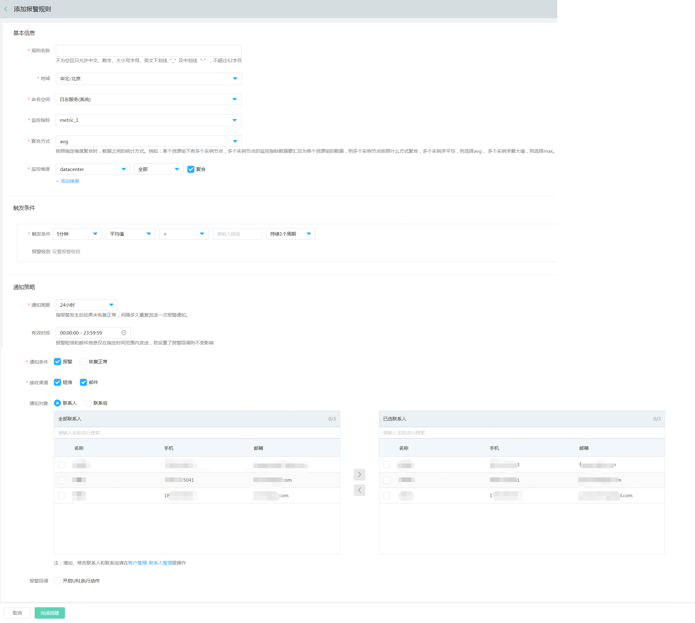

# 添加报警规则

1. 登录[云监控控制台](https://cms-console.jdcloud.com/overview)，点击左侧菜单【报警管理】-【全部报警规则】，进入全部报警规则列表页面, 切换至【自定义监控】页签.  

      

2.	点击列表上方的【添加报警规则】按钮，打开添加报警规则页面。      
3.	 按照如下步骤配置信息：  

* **基本信息**

   - 配置规则名称、地域、命名空间、监控指标和聚合方式。

   - 监控维度，需要选择维度的key， 维度对应的value，支持选择“全部”或“指定维度值”

     ```
     注： 
     ①维度值选择“全部”时，当前维度下已有的维度值和后续新增上报的维度值都会监控。 
     ②维度值选择“指定维度值”时，可以指定单个或多个已有的维度值进行监控。
     ③若维度值选中“全部”或“指定多个维度值”时， 可以指定是否聚合，选中聚合时，会把配置的这些维度值合并为1条数据。 
     ```

* **触发条件** 
  
  选择监控项、统计周期、统计方法、计算方式、阈值、持续周期，同时可根据需求配置报警级别。   

* **通知策略**

    -  通知周期：表示如果资源一直处于告警状态，未恢复正常，间隔多久发送下一次通知。提供5分钟、10分钟、15分钟、30分钟、1小时、3小时、6小时、12小时和24小时几种选项。  
    -  有效时段：报警短信和邮件信息仅在指定时间范围内发送，默认是全天都发送。
    -  通知条件：提供“报警”和“恢复正常”两种场景，默认仅报警状态发送，必须要指定通知条件。  
    -  接收渠道：提供“短信”和“邮件”两种选型，默认都发送，可根据需要选择。 
    -  通知对象：支持选择联系人或联系组。添加联系人和联系组击选择框底部的“账户管理-联系人管理”进入用户中心进行配置。  
    -  报警回调：当资源发生告警时，京东云主动按照您配置的URL地址和POST参数进行回调。

4. 点击页面底部的【完成创建】按钮，则完成报警规则的创建。

