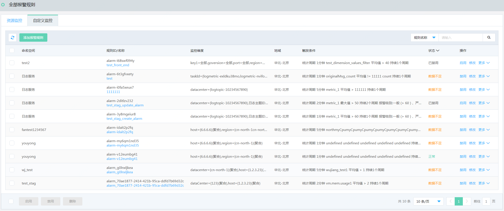
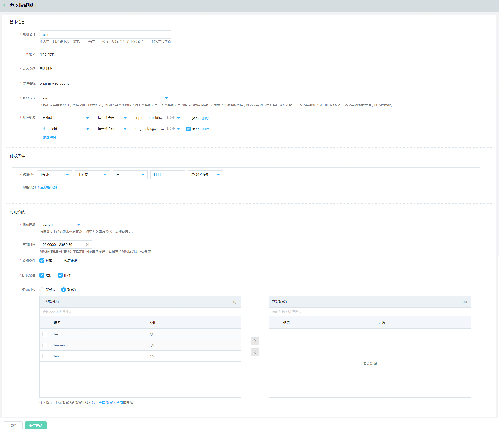
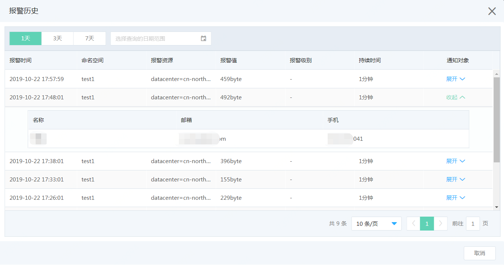

# 查看报警规则

1. 登录[云监控控制台](https://cms-console.jdcloud.com/overview)。点击左侧菜单【报警管理】-【全部报警规则】，进入全部报警规则列表页面, 切换至【自定义监控】页签。可查看已创建的全部自定义监控的报警规则。  

    

2. 支持根据命名空间、规则名称和规则ID进行过滤筛选。

# 修改规则

1. 登录[云监控控制台](https://cms-console.jdcloud.com/overview)。点击左侧菜单【报警管理】-【全部报警规则】，进入全部报警规则列表页面, 切换至【自定义监控】页签。可查看已创建的全部自定义监控的报警规则。    

     

2. 选中需要更改的报警规则，点击“修改”按钮。  

     

3. 可根据修改，修改 规则名称、监控指标、监控维度、 触发条件和通知策略信息。

# 启用/禁用规则

1. 登录[云监控控制台](https://cms-console.jdcloud.com/overview)。点击左侧菜单【报警管理】-【全部报警规则】，进入全部报警规则列表页面, 切换至【自定义监控】页签。可查看已创建的全部自定义监控的报警规则。  

     

2. 选中需要禁用或启用的报警规则，点击【禁用】或【启用】按钮， 即可。规则被禁用后，当前规则就停止工作，不会监控规则下指标及维度信息；规则启用后，规则重新开始生效。  

3. 多选规则进行批量启用/禁用时，请确保所选择的规则都处于非禁用/禁用状态。

# 查看规则详情  

1. 登录[云监控控制台](https://cms-console.jdcloud.com/overview)。点击左侧菜单【报警管理】-【全部报警规则】，进入全部报警规则列表页面, 切换至【自定义监控】页签。
     
2. 选中待查看的报警规则，点击更多操作下的【查看详情】按钮，或者点击列表中规则名称，打开查看详情页面。可查看到规则配置的基本信息、报警资源、触发条件和通知策略信息。

# 查看报警历史  

1. 登录[云监控控制台](https://cms-console.jdcloud.com/overview)。点击左侧菜单【报警管理】-【全部报警规则】，进入全部报警规则列表页面, 切换至【自定义监控】页签。
     
2. 选中待查看的报警规则，点击更多操作下的【报警历史】按钮，打开查看报警历史页面。 
   
3. 默认展示近3天的报警历史，可以切换时间段进行查询。

# 删除规则  

1. 登录[云监控控制台](https://cms-console.jdcloud.com/overview)。点击左侧菜单【报警管理】-【全部报警规则】，进入全部报警规则列表页面, 切换至【自定义监控】页签。  

   

2. 选中待删除的报警规则，点击更多操作下的【删除】或者选中多条规则，点击列表底部的批量【删除】按钮，即可。
