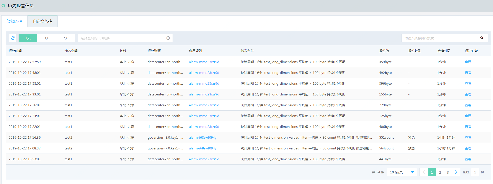

## 查看历史报警  
1.	登录[云监控控制台](https://cms-console.jdcloud.com/overview)。选择菜单目录【报警管理】-【历史报警信息】，进入全部报警历史页面, 切换至【自定义监控】页签。  

2.	默认展示近1天的报警历史，可以更换查询时间段进行查看，同时支持根据命名空间或报警资源进行过滤查询。  
3.  报警历史记录中，可以查看到报警资源、所属规则、报警值、报警级别、持续报警的时间及通知联系人情况。

