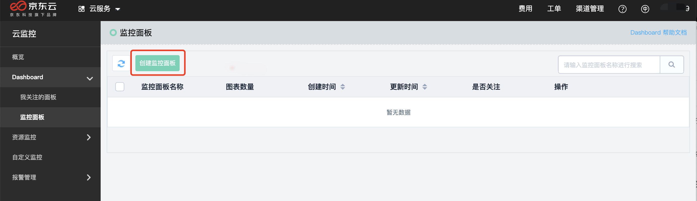
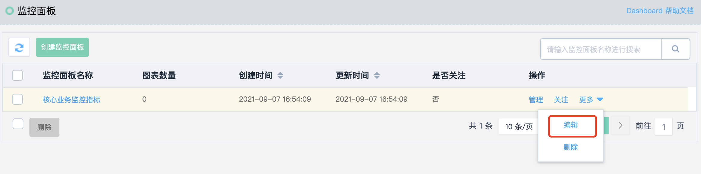
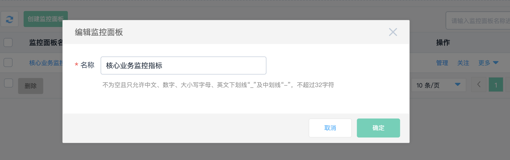
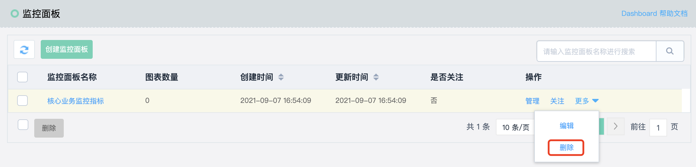
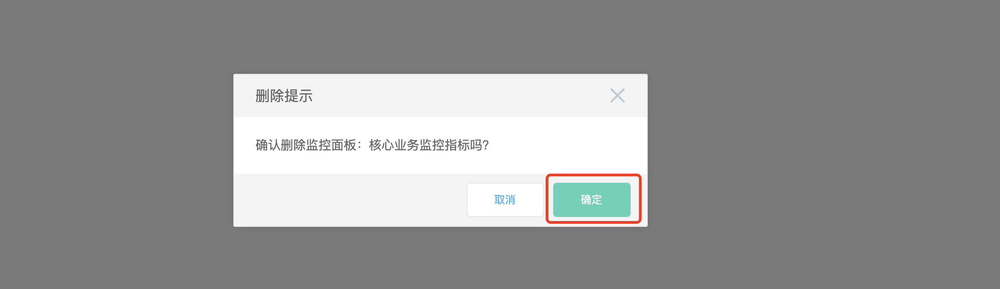

# 管理监控面板

## 添加监控面板

1. 登录[云监控控制台](https://cms-console.jdcloud.com/overview)。点击左侧菜单目录【Dashboard】-【监控面板】进入面板管理列表。点击左上角的【创建面板】按钮。

2. 在打开的创建监控面板页面，填写监控面板名称，点击确定完成创建。

## 编辑监控面板

1. 点击监控面板列表操作栏中的“更多操作”，点击【删除】按钮。

   

2. 在打开的编辑监控面板页面，修改监控面板名称，点击确定完成修改。

   

## 关注监控面板

点击监控面板列表操作栏中的【关注】按钮，即可关注当前选择的监控面板。  

注：我关注的面板只支持一个，如果其他监控面板已经被设置为“关注”，则会被自动取消关注。

## 删除监控面版

1. 点击监控面板列表操作栏中的“更多操作”，点击【删除】按钮。
   

2. 弹出弹框提示，选择“确定”成功删除监控面板。
   
