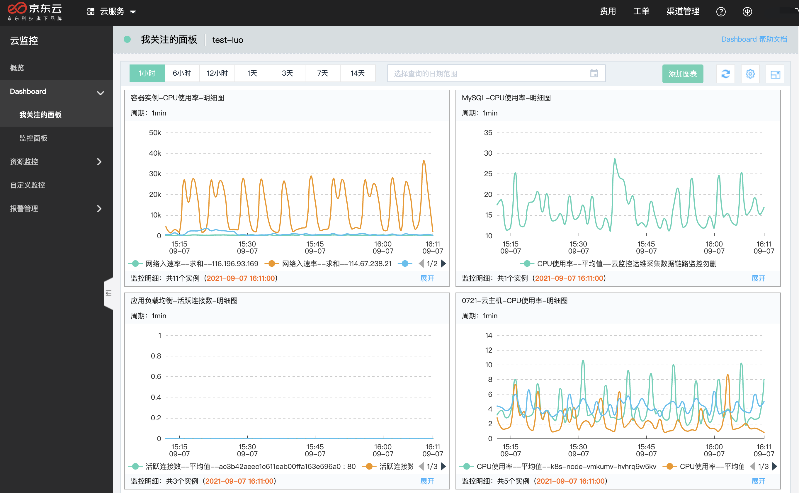

# 我关注的面板

用户可根据自身业务需要，将自己最关心的监控面板（dashboard）设置为关注的面板。

## 操作指南

1. 登录[云监控控制台](https://cms-console.jdcloud.com/overview)。

2. 在左侧菜单目录点击【Dashboard】-【监控面板】进入面板管理页面。

   

3. 点击操作列下的【关注】按钮，即可将面板设置为关注的面板。将任意一面板关注后，先前选中的关注面板自动置为取消关注。

4. 左侧目录菜单切换至【我关注的面板】，可以查看到设置的关注面板。

   

5. 在面板详情中国呢可以查看关注的指标数据。

