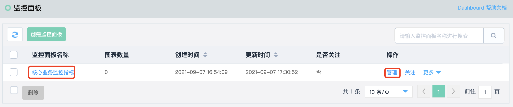
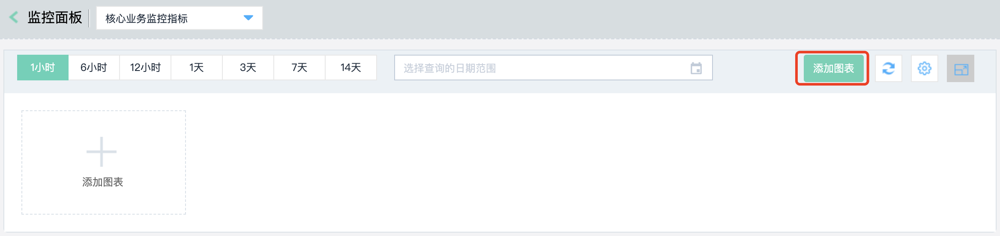
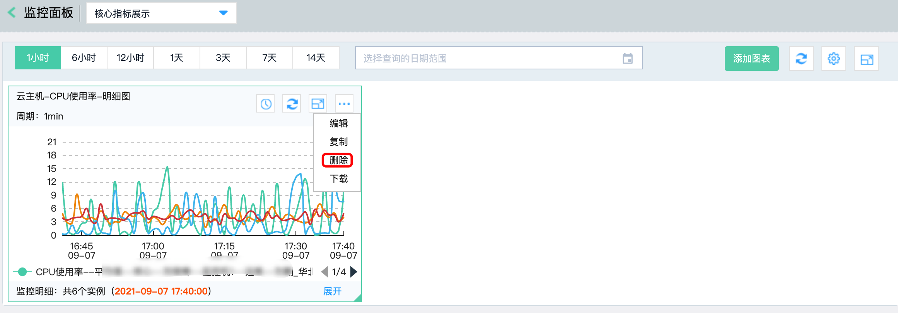
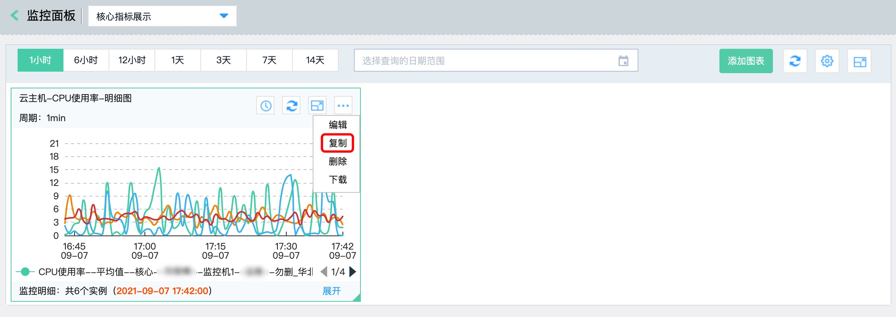
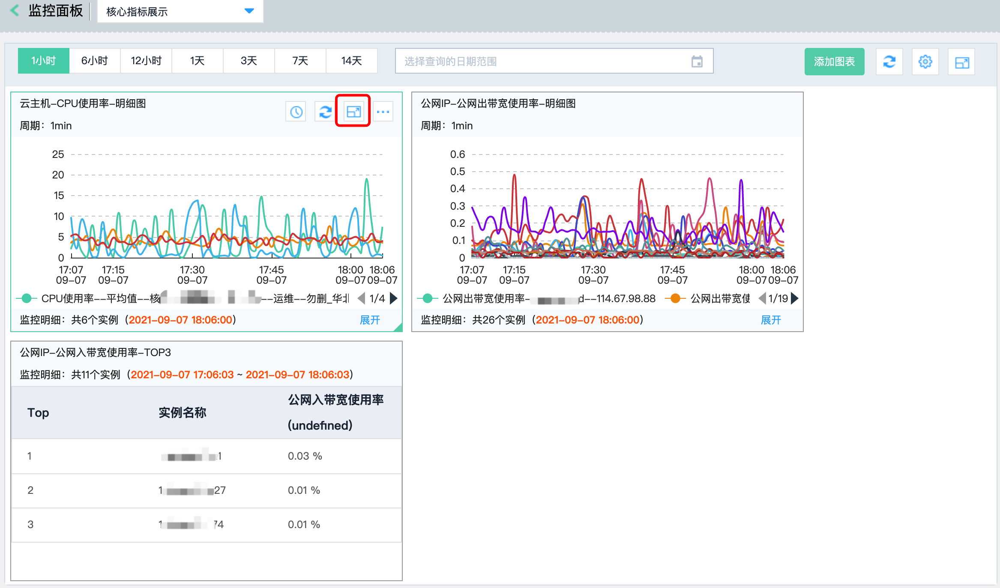
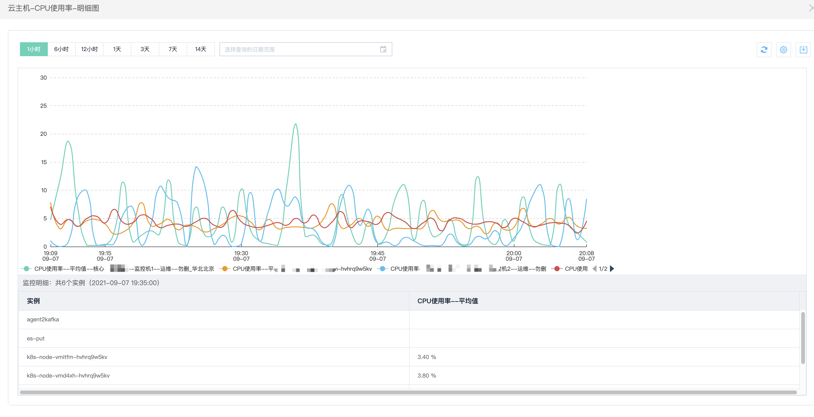
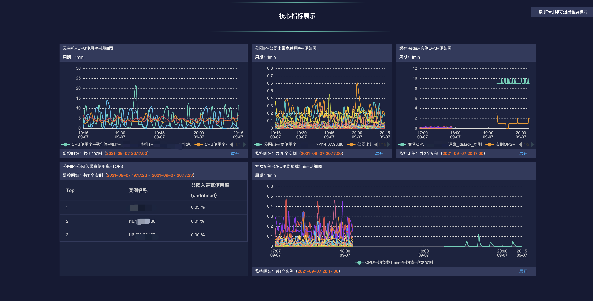
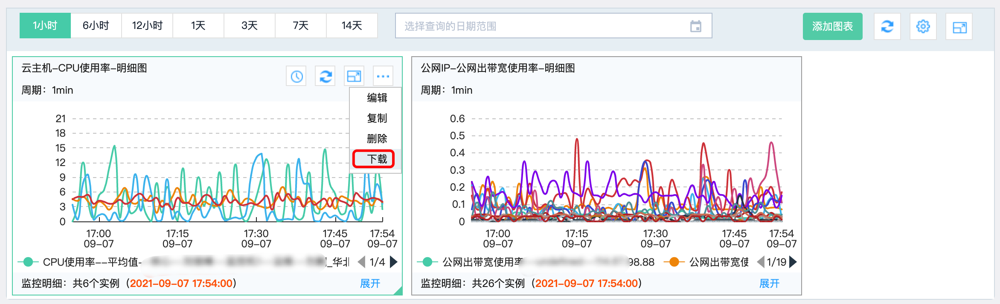
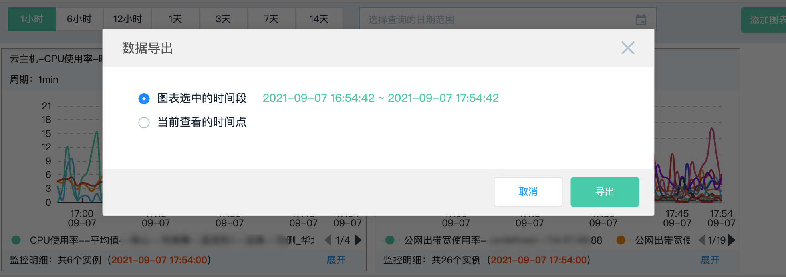

# 管理监控图表

## 图表配置说明

### 图表类型

目前Dashboard支持折线图和TopN表格两种展示类型。

**折线图：** 满足用户绝大部分的监控需求。按照时间的顺序展示。例如某标签下的所有云主机实例在当天13：00-15：001的CPU使用率的变化情况。折线图可添加多个监控项。

**TopN表格：** 实时显示监控项数据值由大到小的排序。例如某标签下的所有云主机实例的 CPU 使用率从大到小的排序。TopN表格只能添加一个监控项。

### 视图维度

目前dashboard支持的数据展示维度包括明细和汇总。

**明细：** 一个云资源的一个监控项为一条数据线。在同一张图表中显示多个云资源以及对应的所有监控项。图表中的数据线的条数等于所监控的云资源的数量乘以监控项的数量。

**汇总：** 多个云资源的相同监控项汇总为一条数据线。在同一张图表中显示多个监控项的汇总数据。图标中的数据线的条数等于所监控的监控项的数量。聚合方式包括：最大值、最小值和平均值。

### 高级配置

设置高级配置后，所选维度下全部资源，包括新增资源的监控数据将会直接在该图表中显示，无需手动添加。
当前高级配置仅有标签，标签仅支持“云主机”、“云硬盘”和“云数据库-SQLSERVER”，若产品类型选择为其他资源时，则没有高级配置选项。

## 添加监控图表

1. 登录[云监控控制台](https://cms-console.jdcloud.com/overview)。点击左侧菜单目录【Dashboard】-【监控面板】进入面板管理列表。

   

2. 选中一个面板，点击面板名称，进入监控面板详情页，点击右上角的【添加图表】。
   

3. 选择图表类型、产品类型、视图维度、监控项（支持添加多个监控项）、图表名称，选择监控资源，点击“确定”按钮，完成监控图表的创建。
   

## 删除监控图表

1. 登录[云监控控制台](https://cms-console.jdcloud.com/overview)。点击左侧菜单目录【Dashboard】-【监控面板】进入面板管理列表。
2. 选中一个面板，点击面板名称，进入监控面板详情页，鼠标移入要删除的图表点击操作栏下【删除】按钮。
   

3. 弹框提示是否删除监控图表，点击确定，删除监控图表完成。
   

## 复制监控图表

1. 登录[云监控控制台](https://cms-console.jdcloud.com/overview)。点击左侧菜单目录【Dashboard】-【监控面板】进入面板管理列表。

2. 选中一个面板，点击面板名称，进入监控面板详情页，鼠标移入要复制的图表点击操作栏下【复制】按钮。

   

3. 在复制打开的添加监控图页面与原监控图表各项配置及监控资源完全相同的监控图表，可以对图表的配置及监控资源进行调整，点击确定，生成一张新的监控图表。

## 时间筛选

1. 登录[云监控控制台](https://cms-console.jdcloud.com/overview)。点击左侧菜单目录【Dashboard】-【监控面板】进入面板管理列表。

2. 选中一个面板，点击面板名称，进入监控面板详情页，切换面板的时间按钮，如下图所示，则将整张面板的全部监控图时间进行调整。支持快捷时间区间选择，也支持自定义时间日期范围。

   

3. 如果只需要对某张图的时间进行调整，则选中一个图表，点击时间设置按钮，再弹出的时间选择控件修改时间，支持快捷时间选择，也支持自定义时间日期范围。

   

   

## 刷新图表

1. 登录[云监控控制台](https://cms-console.jdcloud.com/overview)。点击左侧菜单目录【Dashboard】-【监控面板】进入面板管理列表。

2. 选中一个面板，点击面板名称，进入监控面板详情页，点击面板的刷新按钮，则整个面板新加载一下数据；如果期望开启自动刷新操作，则选中自动刷新时间间隔即可。

   

3. 单张图也支持刷新操作，鼠标移入要刷新的监控图表，点击刷新按钮，则所选图表的数据重新加载。

## 放大图表

1. 登录[云监控控制台](https://cms-console.jdcloud.com/overview)。点击左侧菜单目录【Dashboard】-【监控面板】进入面板管理列表。

2. 选中一个面板，点击面板名称，进入监控面板详情页。选中要放大的监控图表，点击放大展示图标。

   

3. 所选图表放大至整个浏览器展示。点击顶部的关闭按钮，可返回至面板详情页。

   

## 全屏展示

1. 登录[云监控控制台](https://cms-console.jdcloud.com/overview)。点击左侧菜单目录【Dashboard】-【监控面板】进入面板管理列表。

2. 选中一个面板，点击面板名称，进入监控面板详情页。点击顶部的放大操作按钮，可将整个面板全屏展示。

   

3. 退出全屏展示，按esc键即可。

### 导出数据

1. 登录[云监控控制台](https://cms-console.jdcloud.com/overview)。点击左侧菜单目录【Dashboard】-【监控面板】进入面板管理列表。

2. 选中一个面板，点击面板名称，进入监控面板详情页，鼠标移入要导出数据的图表点击操作栏下【下载】按钮。

   

3. 若为折线图在弹出的数据导出弹窗中，选择导出数据的时间范围，默认为图表选中的时间段， 也可以只导出某个时间点的监控数据。若为TopN表格图，则直接导出监控图设置的时间段。

   

