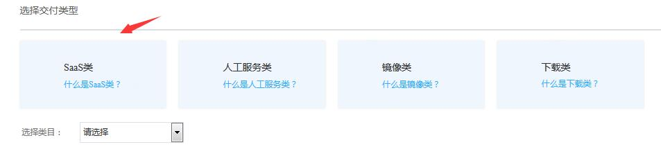
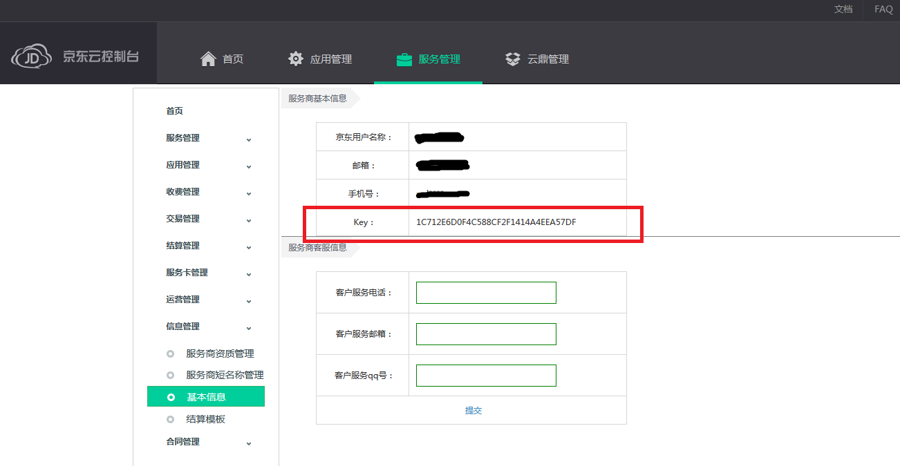
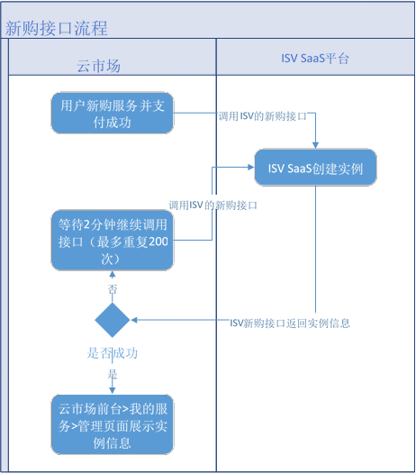
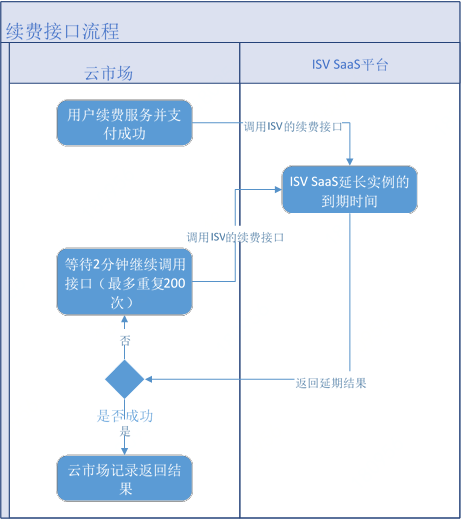
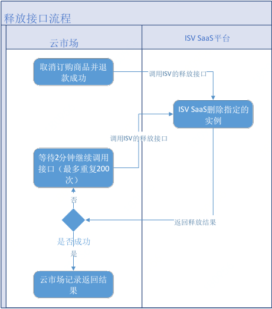
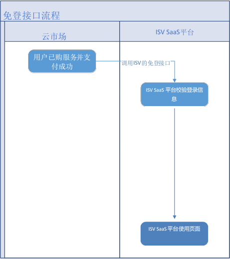
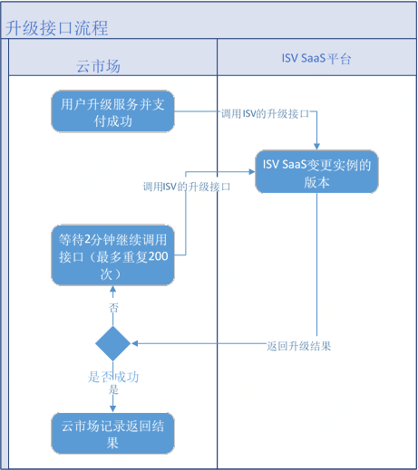
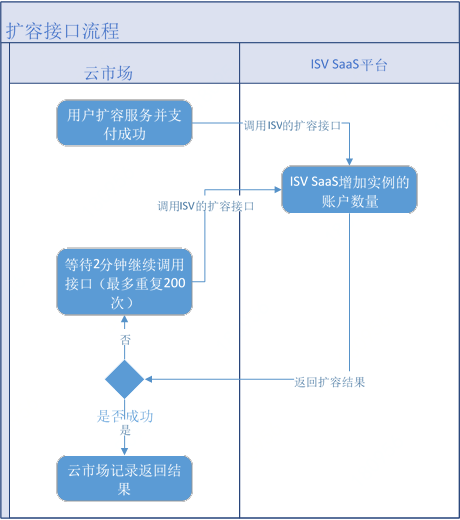
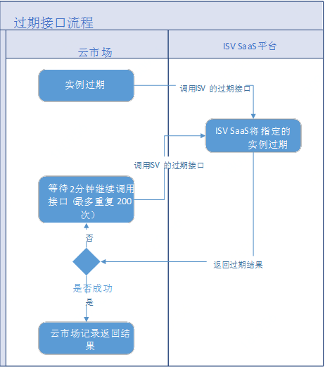

1简介
=====

本文档描述了第三方应用接入到京东智联云·云市场需要实现的接口定义，当客户在京东智联云·云市场购买商品后，
京东智联云·云市场会将购买者购买商品的信息以及账号信息，通过调用本文档中提供的接口，发送给服务商。服务商即可获得商品订购、续费、过期、停用等信息。同时服务商根据该信息对购买者信息进行处理。文档
中涉及到的所有接口都以 HTTP GET 方式调用，消息传输以 JSON 格式。

2适用范围
=========

软件类的应用，一般有独立可访问的网站地址，客户无需购买独立的云资源，可以通过互联网在网站进行注册、登录、操作功能等。
商品接入类型选择应用软件类：

3安全
=====

3.1描述
-------

为保证京东智联云·云市场和第三方应用之间的通信安全，云市场每次调用应用接口时参数中会添加一个token作为安全令牌。应用接口收到请求后根据生成规则生成
token 值，并与接口参数中获取的 token
值进行比较，完全相同即为校验通过。token值由每次传递的参数和云市场为服务商分配的key共同构成。

3.2Key值获取
------------

在服务商管理后台（http://i-market.jdcloud.com/）信息管理\>基本信息页面获取。

3.3token值生成
--------------

### 3.3.1 说明

token值作为云市场与服务商之间进行安全校验必有参数，云市场每次调用服务
商接口的参数中都会带有 token 值。服务商根据生成规则生成
token值，并与接口中获取的 token 值进行比较。完全相同即为校验通过。

###  3.3.2生成规则

取每次http get
请求参数中除token以外的其它所有参数，对参数名进行字典排序，在排序后的字符串最后加上
&key=[isv的key值]，然后对整个字符串进行 md5 加密，加密后的字符串作为token值。

### 3.3.3示例

-   服务商收到的请求示例：

| http://www.isvwebsite.com?p1=1&p2=2&p3=3&token=xxxx |
|-----------------------------------------------------|

-   进行排序操作： 不用url encode

| sort（P1，P2，P3）； |
|----------------------|

-   token值： URLEncoder.encode(拼接后字符串, "utf-8");

| “p1=1&p2=2&p3=3&key=isvkey”.toMD5()                                                                                                                                                                                                                                                                               |
|-------------------------------------------------------------------------------------------------------------------------------------------------------------------------------------------------------------------------------------------------------------------------------------------------------------------|
| 文档最后有实例代码 测试key: qweqeqeqe123123123131 测试参数： accountNum=1&action=createInstance&email=bujiaban\@jd.com&expiredOn=2018-06-30 23:59:59&jdPin=bujiaban&mobile=&orderBizId=444181&orderId=556596&serviceCode=FW_GOODS-500232&skuId=FW_GOODS-500232-1&template=&token=9512df22a941f172a9f28068b758ee3e |

4接口描述
=========

-   客户购买商品并付款成功，云市场将调用本接口通知服务商客户购买商品的信息和客户信息。

-   服务商需要返回此订单对应的交付实例唯一 ID（instanceId）。建议此 ID
    直接使用云市场传入 的 orderBizId。

-   请不要阻塞此接口，若耗时较长**(京东智联云·云市场端设置的超时时间为10s)**，可使用队列做缓冲，设置
    instanceId=0，然后立即返回。若操作失败也请设置instanceId=0，云市场都会再次调用，直到获取到有效
    instanceId。如果一直没有获取到有效 instanceId，云市场会持续调用到 200
    次后停止调用，如服务商接口问题已解决，需要重新请求调用，请服务商登录服务商管理后台（http://i-market.jdcloud.com/）--**交易管理—订购记录查询**页面中点击“重置实例”。
    当instanceId=0或异常该接口可能会被多次调用，如果被重复调用，请保证接口的幂等性。

注意：
按数量售卖的服务产生的订单，会根据购买数量多次调用接口，传参orderBizId会不同，每次调用处理请返回一个交付实例。

-   服务商对外只提供一个接口，通过请求参数action的值区分，处理不同的业务逻辑。如action=createInstance，则代表新购。

4.1新购商品
-----------

### 4.1.1描述

-   用户下单并支付成功后，云市场调用新购服务接口，传入用户信息和订单信息。服务商按照传入的参数，在其系统中进行交付动作，并通过Json格式将实例信息返回给云市场。云市场接收到返回值后会保存信息并反馈给用户。接口调用流程如下图：

-   服务商返回值中需要包含此订单所创建实例的唯一 ID（instanceId）。 建议此 ID
    直接使用云市场传入的 orderBizId。

-   请不要阻塞此接口，若耗时较长，可使用队列做缓冲，设置
    instanceId=0，然后立即返回。 若操作失败也请设置
    instanceId=0，云市场都会再次调用，直到获取到 instanceId。

-   该接口可能会被多次调用，如果被重复调用，请保证接口的幂等性

### 4.1.2请求参数

| 参数名       | 类型                                                             | 长度 | 必选 | 说明                                                                                        |                  |
|--------------|------------------------------------------------------------------|------|------|---------------------------------------------------------------------------------------------|------------------|
| token        | String                                                           | 32   | 是   | 安全校验令牌                                                                                |                  |
| action       | String                                                           | 20   | 是   | “createInstance”                                                                            |                  |
| jdPin        | String                                                           | 50   | 是   | 用户在京东智联云云的账号标识，具有唯一性                                                    |                  |
| orderBizId   | String                                                           | 20   | 是   | 服务商后台订购列表中的订购关系ID                                                            |                  |
| orderId      | String                                                           | 20   | 是   | 对应云市场订单的ID,已弃用，请用orderNumber                                                  |                  |
| orderNumber  | String                                                           | 30   | 是   | 对应云市场订单号，此单号与openApi创建订单接口参数对应，以后统一用此参数。529107885755794112 |                  |
| serviceCode  | String                                                           | 50   | 是   | 服务对应的编码，可在服务商后台的服务列表中查看到,例如：FW_GOODS-500232                      |                  |
| skuId        | String                                                           | 50   | 是   | 收费项目编码；例如：FW_GOODS-500232-1                                                       |                  |
| mobile       | String                                                           | 20   | 否   | 用户的手机号                                                                                |                  |
| email        | String                                                           | 50   | 否   | 用户的邮箱                                                                                  |                  |
| template     | String                                                           | 20   | 否   | 模板ID，适用于模板类建站商品                                                                |                  |
| expiredOn    | DateTime                                                         |      | 否   | 对应订单的到期时间，格式：yyyy-MM-dd HH:mm:ss；                                             |                  |
| accountNum   | Integer                                                          | 10   | 否   | 交付类型为软件类，计费方式为按周期的服务，交付时支持的账户数量。此参数默认值为1             |                  |
| extraInfo    | Json,生产参数不在前台展示，配置项仅用作服务商生产交付使用        | 255  |      | Key                                                                                         | 说明             |
|              |                                                                  |      | 否   | specification                                                                               | 产品规格,如10    |
|              |                                                                  |      | 否   | Key1                                                                                        | Key1，如test     |
| additionInfo | Json，额外计费项参数，配置项会在前台展示，用户购买后会传给服务商 | 255  |      | Key                                                                                         | 说明             |
|              |                                                                  |      |      | yangbenshu                                                                                  | 例如：样本数:100 |
|              |                                                                  |      |      | diyu                                                                                        | 例如：地域：北京 |
| appCode      | 应用编码                                                         |      | 否   |                                                                                             | ME+参数          |
| tenantCode   | 企业编码                                                         |      | 否   |                                                                                             | ME+参数          |
| userCode     | 用户编码                                                         |      | 否   |                                                                                             | ME+参数          |

**说明：**extraInfo：Json格式
key-value动态字段，可扩展，用于用户下单后传递一些非通用的字段给服务提供商，比如某些产品的规格10G、100M；用户购买账号数：5；

additionInfo：Json格式
key-value动态字段，可扩展，用于用户下单后传递一些非通用的计费字段给服务提供商，比如某些产品的样本数1个10元；北京地区5元。

### 4.1.3返回参数

| 参数名     | 类型   | 必选 | 说明                                                                                                                                     |                                                                                                                                                                                        |
|------------|--------|------|------------------------------------------------------------------------------------------------------------------------------------------|----------------------------------------------------------------------------------------------------------------------------------------------------------------------------------------|
| instanceId | String | 是   | 服务商系统创建的实例ID，建议直接用传入orderBizId的值，该ID云市场需要保存； 返回值为0，表示创建中或创建失败； 返回值不为0，表示创建成功； |                                                                                                                                                                                        |
| appInfo    | Json   |      | Key                                                                                                                                      | 说明                                                                                                                                                                                   |
|            |        | 否   | frontEndUrl                                                                                                                              | 前台地址：用户购买商品后，可以访问的网站地址                                                                                                                                           |
|            |        | 否   | adminUrl                                                                                                                                 | 管理地址：用户购买商品后，可以访问的管理后台地址                                                                                                                                       |
|            |        | 否   | username                                                                                                                                 | 管理员帐号：用户购买商品后，访问管理后台的账号，一般为邮箱或手机号                                                                                                                     |
|            |        | 否   | password                                                                                                                                 | 管理员密码：客户购买商品后，访问管理后台的密码，一般由服务商生成。                                                                                                                     |
|            |        | 否   | authUrl                                                                                                                                  | 免登地址： 服务商系统的免登陆地址。如果该Url不为空，用户在云市场使用购买的服务时，云市场通过调用该地址，将免登参数传递给服务商系统校验，校验通过后实现免登陆进入服务商交付的系统实例。 |
|            |        | 否   | authCode                                                                                                                                 | 软件序列号（license）：客户购买商品后，可用于注册使用的授权码                                                                                                                          |
| info       | Json   | 否   | key-value格式                                                                                                                            |                                                                                                                                                                                        |

**说明：**appInfo
字段包含客户购买商品后，登录服务地址（网站地址）进行后续操作，或者实现客户免登陆访问（需要返回免登地址）所需的相关信息。

Info 字段是当 appinfo 无法满足服务商特殊登录要求时，可以自定义 key-value
字段，以提供给客户新购商品后的操作方法。

### 4.1.4示例

请求：

| http://www.isvwebsite.com?action=createInstance&email=&expiredOn=2017-01-08+00%3A00%3A00&jdPin=test_jdb22&mobile=&orderBizId=423499&orderId=519801&serviceCode=FW_GOODS-409717&skuId=FW_GOODS-409717-1&template=&token=7e8970385f7f263074a48852aeda12a5&extraInfo={"key1":"1","key1","2"}&additionInfo ={"key1":"1","key1","2"} |
|---------------------------------------------------------------------------------------------------------------------------------------------------------------------------------------------------------------------------------------------------------------------------------------------------------------------------------|

返回：

| { "instanceId": "1001", "appInfo": { "frontEndUrl": "http://xxx.com/", "adminUrl": "http://xxx.com/admin", "username": "admin", "password": "admin_password" … }, "info": { "key1": "自定义信息" } } |
|------------------------------------------------------------------------------------------------------------------------------------------------------------------------------------------------------|

4.2续费
-------

### 4.2.1描述

用户续费并支付成功后，云市场调用续费接口，传入实例ID、新到期日。服务商将其系统中维护的到期日进行更新，并返回是否成功标识。云市场接收到返回值后，对服务实例做相应处理。接口调用流程如下图：

### 4.2.2请求参数

| **参数名**  | **类型** | **必选** | **说明**                                                                                    |
|-------------|----------|----------|---------------------------------------------------------------------------------------------|
| token       | String   | 是       | 安全校验令牌                                                                                |
| action      | String   | 是       | “renewInstance”                                                                             |
| orderId     | String   | 是       | 对应云市场订单ID,已弃用，请用orderNumber                                                    |
| orderNumber | String   | 是       | 对应云市场订单号，此单号与openApi创建订单接口参数对应，以后统一用此参数。529107885755794112 |
| instanceId  | String   | 是       | 续费服务对应的实例ID                                                                        |
| expiredOn   | DateTime | 是       | 续费订单的到期时间                                                                          |

### 4.2.3返回参数

| **参数名** | **类型** | **必选** | **说明**                                                  |
|------------|----------|----------|-----------------------------------------------------------|
| success    | Boolean  | 是       | true或false                                               |
| authCode   | String   | 否       | 软件序列号（license）：客户续费后，可用于注册使用的授权码 |
| message    | String   | 否       | 服务商接口返回的说明信息                                  |

### 4.2.4示例

-   请求

| http://www.isvwebsite.com? action=renewInstance&expiredOn=2017-12-06+00%3A00%3A00&instanceId=1002&orderId=520801&token=475f28682b5d0d1af820ffd477c1188f |
|---------------------------------------------------------------------------------------------------------------------------------------------------------|

-   返回

| {‘success’:true’, ‘authCode:’123456789’, ‘message’:’renew suecess’} |
|---------------------------------------------------------------------|

4.3释放（当前未使用）
---------------------

### 4.3.1描述

云市场将在取消订购商品并退款成功后调用该接口，服务商在该接口的实现中可以删除指定的实例。接口调用流程如下图：

### 4.3.2请求参数

| **参数名** | **类型** | **必选** | **说明**           |
|------------|----------|----------|--------------------|
| token      | String   | 是       | 安全校验令牌       |
| action     | String   | 是       | “releaseInstance”  |
| instanceId | String   | 是       | 需要释放的实例的ID |

### 4.3.3返回参数

| **参数名** | **类型** | **必选** | **说明**                 |
|------------|----------|----------|--------------------------|
| success    | Boolean  | 是       | true或false              |
| message    | String   | 否       | 服务商接口返回的说明信息 |

### 4.3.4示例

-   请求

| http://www.isvwebsite.com? action=releaseInstance&instanceId=424499_520001_FW_GOODS-409717-1&token=cb0a8e6348de9d12e74a085a28bf00fe |
|-------------------------------------------------------------------------------------------------------------------------------------|

-   返回

| {‘success’: true,’message’:’release success’} |
|-----------------------------------------------|

4.4免登
-------

### 4.4.1描述

客户购买商品后，可通过免登接口登录到服务商系统。云市场会根据“新购商品”接口返回的
appInfo 中的 authUrl，结合下面参数组织一个用于免登的 url 地址，ISV 接到此url
的请求后，验证 token 是否合法，确认 timeStamp 是否符合 ISV 约束的时间，来进行
ISV 管理后的自动登录。流程如下图

### 4.4.2请求参数

| **参数名** | **类型** | **必选** | **说明**                        |
|------------|----------|----------|---------------------------------|
| token      | String   | 是       | 安全校验令牌                    |
| action     | String   | 是       | “verify”                        |
| instanceId | String   | 是       | 实例ID                          |
| timeStamp  | DateTime | 是       | 当前时间（yyyy-MM-dd HH:mm:ss） |

### 4.4.3示例

-   请求

| http://www.isvwebsite.com?token=9560d4d52cab35689fd5d472f28119ab&action= verify&instanceId=1001&timeStamp=2016-12-01+10%3A30%3A01 |
|-----------------------------------------------------------------------------------------------------------------------------------|

-   返回

登陆成功页面

4.5升级
-------

### 4.5.1描述

用户升级并支付成功后，云市场调用升级接口，传入实例ID、新版本。服务商将其系统中维护的版本进行更新，并返回是否成功标识。云市场接收到返回值后，对服务实例做相应处理。接口调用流程如下图：

### 4.5.2请求参数

| **参数名**   | **类型**            | **必选** | **说明**                                                                                    |                  |
|--------------|---------------------|----------|---------------------------------------------------------------------------------------------|------------------|
| token        | String              | 是       | 安全校验令牌                                                                                |                  |
| action       | String              | 是       | “upgradeInstance”                                                                           |                  |
| orderId      | String              | 是       | 对应云市场订单ID,已弃用，请用orderNumber                                                    |                  |
| orderNumber  | String              | 是       | 对应云市场订单号，此单号与openApi创建订单接口参数对应，以后统一用此参数。529107885755794112 |                  |
| instanceId   | String              | 是       | 升级服务对应的实例ID                                                                        |                  |
| skuId        | String              | 是       | 服务的收费项目ID；                                                                          |                  |
| extraInfo    | Json                |          | Key                                                                                         | 说明             |
|              |                     | 否       | specification                                                                               | 产品规格,如20    |
| additionInfo | Json 额外计费项参数 | 否       | Key                                                                                         | 说明             |
|              |                     |          | yangbenshu                                                                                  | 例如：样本数:100 |
|              |                     |          | diyu                                                                                        | 例如：地域：北京 |

说明：extraInfo：Json格式
key-value动态字段，用于用户下单后传递一些非通用的字段给服务提供商，比如某些产品的规格升级到20G；

additionInfo：Json格式
key-value动态字段，可扩展，用于用户下单后传递一些非通用的计费字段给服务提供商，比如某些产品的样本数升级到1个15元；北京地区10元。

### 4.5.3返回参数

| **参数名** | **类型** | **必选** | **说明**                                                  |
|------------|----------|----------|-----------------------------------------------------------|
| success    | Boolean  | 是       | true或false                                               |
| authCode   | String   | 否       | 软件序列号（license）：客户升级后，可用于注册使用的授权码 |
| message    | String   | 否       | 服务商接口返回的说明信息                                  |

### 4.5.4示例

-   请求

| http://www.isvwebsite.com?action=upgradeInstance&skuId=FW-123-1instanceId=1002&orderId=520801&token=475f28682b5d0d1af820ffd477c1188f&extraInfo={"key1":"1","key1","2"}&additionInfo ={"key1":"1","key1","2"} |
|--------------------------------------------------------------------------------------------------------------------------------------------------------------------------------------------------------------|

-   返回

| {‘success’:true’, ‘authCode:’123456789’, ‘message’:’renew suecess’} |
|---------------------------------------------------------------------|

4.6 扩容
--------

### 4.6.1描述

用户扩容并支付成功后（按周期账号数量售卖的服务），云市场调用扩容接口，传入实例ID、新版本。服务商将其系统中维护的版本进行更新，并返回是否成功标识。云市场接收到返回值后，对服务实例做相应处理。接口调用流程如下图：

### 4.6.2请求参数

| 参数名      | 类型    | 必选 | 说明                                                                                        |               |
|-------------|---------|------|---------------------------------------------------------------------------------------------|---------------|
| token       | String  | 是   | 安全校验令牌                                                                                |               |
| action      | String  | 是   | “dilateInstance”                                                                            |               |
| orderId     | String  | 是   | 对应云市场订单ID,已弃用，请用orderNumber                                                    |               |
| orderNumber | String  | 是   | 对应云市场订单号，此单号与openApi创建订单接口参数对应，以后统一用此参数。529107885755794112 |               |
| instanceId  | String  | 是   | 扩容服务对应的实例ID                                                                        |               |
| accountNum  | Integer | 是   | 本次扩容增加的数量                                                                          |               |
| extraInfo   | Json    |      | Key                                                                                         | 说明          |
|             |         | 否   | specification                                                                               | 产品规格,如20 |
|             |         | 否   | Key1                                                                                        | Key1，如test  |

说明：extraInfo：Json格式
key-value动态字段，用于用户下单后传递一些非通用的字段给服务提供商，比如某些产品扩容的规格20G；用户扩容账号数：5；

### 4.6.3返回参数

| **参数名** | **类型** | **必选** | **说明**                                                  |
|------------|----------|----------|-----------------------------------------------------------|
| success    | Boolean  | 是       | true或false                                               |
| authCode   | String   | 否       | 软件序列号（license）：客户扩容后，可用于注册使用的授权码 |
| message    | String   | 否       | 服务商接口返回的说明信息                                  |

### 4.6.4示例

-   请求

| http://www.isvwebsite.com?action=dilateInstance&accountNum=1&instanceId=1002&orderId=520801&token=475f28682b5d0d1af820ffd477c1188f&extraInfo={"key1":"1","key1","2"} |
|----------------------------------------------------------------------------------------------------------------------------------------------------------------------|

-   返回

| {‘success’:true’, ‘authCode:’123456789’, ‘message’:’ dilate success’} |
|-----------------------------------------------------------------------|

4.7过期
-------

### 4.7.1描述

云市场将在订购商品过期后、退款成功后调用该接口，服务商在该接口的实现中可以将指定的实例置为过期。接口调用流程如下图：

### 4.7.2请求参数

| **参数名** | **类型** | **必选** | **说明**          |
|------------|----------|----------|-------------------|
| token      | String   | 是       | 安全校验令牌      |
| action     | String   | 是       | “expiredInstance” |
| instanceId | String   | 是       | 过期实例的ID      |

### 4.7.3返回参数

| **参数名** | **类型** | **必选** | **说明**                 |
|------------|----------|----------|--------------------------|
| success    | Boolean  | 是       | true或false              |
| message    | String   | 否       | 服务商接口返回的说明信息 |

### 4.7.4示例

-   请求

| http://www.isvwebsite.com? action= expiredInstance &instanceId=424499_520001_FW_GOODS-409717-1&token=cb0a8e6348de9d12e74a085a28bf00fe |
|---------------------------------------------------------------------------------------------------------------------------------------|

-   返回

| {‘success’: true,’message’:’ expiredInstance success’} |
|--------------------------------------------------------|

5接口调试
=========

5.1描述
-------

为了保证软件类服务自动开通功能接入的正确性，在服务商管理平台搭建了应用接入调试界面。服务商可以在此页面调试以上接口的正确性。

注：调试数据非正式数据，京东智联云·云市场不做业务处理。

5.2接口SDK
----------

为了简化接入开发流程，提供了java版sdk：

https://cloudmarket-product.oss.cn-north-1.jcloudcs.com/jdcloud-market-sdk-master-3478a0171c88aff8334384f5113bd36a955001e6.zip
